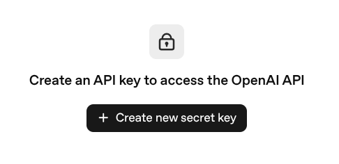
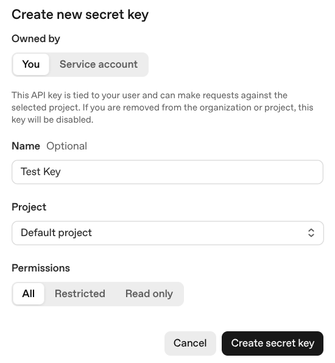
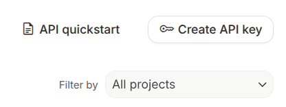
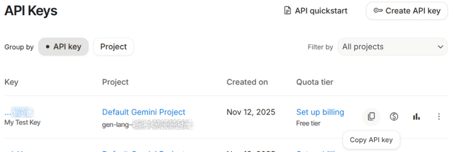

===========
AI API keys
===========

.. |AI| replace:: :abbr:`AI (artificial intelligence)`
.. |API| replace:: :abbr:`API (application program interface)`

Odoo's *AI* application settings contain options to control which |AI| provider the app utilizes,
manage |API| credentials, and define the default prompts. Odoo supports both Gemini and OpenAI
(ChatGPT) as providers in the *AI* application.

Some |AI| features can be used without the *AI* app installed. However, to use custom |API|
credentials or to alter the |AI| provider used for a specific agent, the app **must** be installed.

.. important::
   While users can add their own |API| keys, it is **not** required. However, some organizations may
   prefer to use their own keys for greater control over permissions, version updates, or internal
   policy compliance.

.. _ai/apikeys/chatgpt:

Create API key for ChatGPT
==========================

To create an |API| key for ChatGPT, visit `API Key Page <https://platform.openai.com/api-keys>`_.
Click :guilabel:`Login` and enter the login information for the OpenAI account.

On the *API Keys* page, click :guilabel:`Create new secret key`.

This opens the :guilabel:`Create new secret key` pop-up. Select the owner of the new key:

- :guilabel:`You`: the new key is tied to the user account and can make requests against the
  selected project. If the user is removed from the organization or project, this key is disabled.
- :guilabel:`Service account`: creates a new bot member, or service account, of the project. The key
  is attached to the bot member.

Next, enter a :guilabel:`Name` for this key. This is optional, but recommended. Then, select the
:guilabel:`Project` from the drop-down menu. Finally, select the appropriate
:guilabel:`Permissions`.

.. note::
   Setting the :guilabel:`Permissions` to :guilabel:`Restricted` requires setting the read and write
   permissions to multiple resources individually. For more information, see `OpenAI Platform Docs
   <https://platform.openai.com/docs/overview>`_.

Click :guilabel:`Create secret key`. On the resulting pop-up, click :guilabel:`Copy` to copy the new
key.

.. warning::
   Once this pop-up closes, the key **cannot** be viewed again. If it is lost, a new key will need
   to be created.

   .. image:: apikeys/save-openai-key.png
      :alt: The popup displaying the newly created OpenAI key.

Return to Odoo, and navigate to :menuselection:`AI app --> Configuration --> Settings`. Under
*Providers*, tick the checkbox for :guilabel:`Use your own ChatGPT account`, and paste the new key
in the :guilabel:`Key` field. Click :guilabel:`Save` when finished.

.. _ai/apikeys/gemini:

Create an API key for Google Gemini
===================================

To create an |API| key for Google Gemini, visit `API Keys
<https://aistudio.google.com/app/api-keys>`_. Enter the login information for the Google account,
and click :guilabel:`Next` to open Google |AI| Studio. In the top right corner, click
:guilabel:`Create API Key`.

On the *Create a new key* pop-up, enter a title in the :guilabel:`Name your key` field. Next, use
the :guilabel:`Choose an imported project` drop-down to select a project, or import a new one. Click
:guilabel:`Create key`.

On the *API Keys* page, find the appropriate key and click the copy icon.

Return to Odoo, and navigate to :menuselection:`AI app --> Configuration --> Settings`. Under
*Providers*, tick the checkbox for :guilabel:`Use your own Google Gemini account`, and paste the new
key in the :guilabel:`Key` field. Click :guilabel:`Save` when finished.

Pricing
=======

Utilizing |API| keys for |AI| may require additional fees through the provider. The exact costs
depend on the |AI| model used and the account type with each provider.

For additional information on :ref:`ChatGPT <ai/apikeys/chatgpt>` pricing, visit `OpenAI API Pricing
<https://openai.com/api/pricing/>`_.

For additional information on :ref:`Google Gemini <ai/apikeys/gemini>` pricing, visit `Gemini API
Pricing <https://ai.google.dev/gemini-api/docs/pricing>`_.
