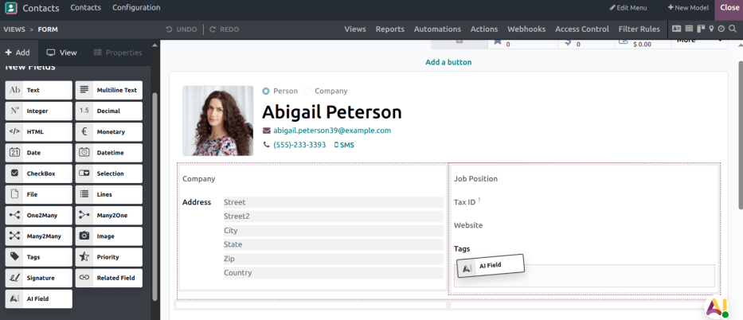
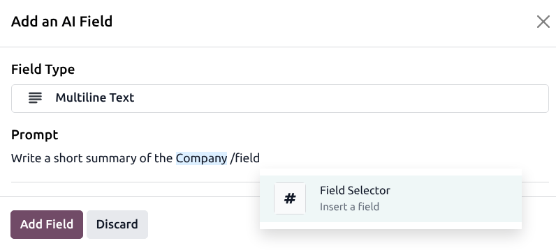
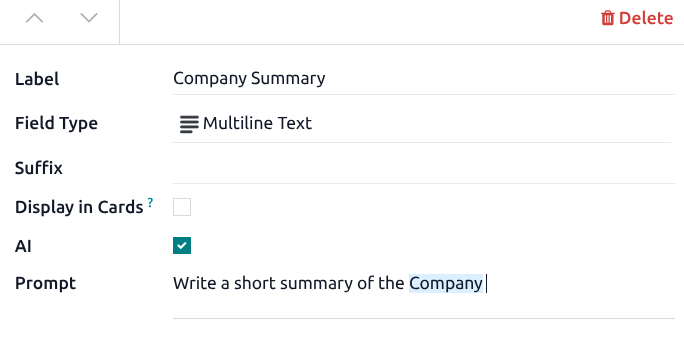

=========
AI fields
=========

.. |AI| replace:: :abbr:`AI (Artificial Intelligence)`

|AI| fields allow users to utilize Odoo's built-in AI capabilities directly in forms and records.
When an |AI| field is configured, the system can generate or suggest values automatically based on
the record's context, existing data, or external information.

This feature is especially useful for creating product descriptions, summarizing notes, or
generating structured content from unstructured data.

.. _ai/add-a-new-field:

Adding a new AI field
=====================

|AI| fields can be added to a record through the Studio app or property field.

.. warning::
   :ref:`Installing Studio <general/install>` may impact the current pricing plan for a database.
   For more information, refer to `Odoo's pricing page <https://www.odoo.com/pricing-plan>`_ or
   contact your account manager.

First, navigate to the page in the database where a new field is needed. Then, click on the
:icon:`oi-studio` :guilabel:`studio` icon to open the app. On the left sidebar, click and drag the
:guilabel:`AI Field` option and place it in the desired location on the record.

After the field is placed, an :guilabel:`Add an AI Field` pop-up opens. Use the :guilabel:`Field
Type` drop-down menu to select a  :doc:`field type <../../studio/fields>`:

 - Text
 - Multiline Text
 - HTML
 - Integer
 - Decimal
 - Monetary
 - Date
 - Datetime
 - Checkbox
 - Many2one
 - Tags

Next is the :guilabel:`Prompt` field. In Odoo, :ref:`prompts <ai/agents/prompts-in-odoo>` define the
instructions that guide the |AI| when generating or improving the content of the |AI| field. The
prompt tells the system what kind of information to produce, how to format it, and what tone or
style to use.

When creating a prompt, use the `/field` command to reference specific fields in the database. For
example, to reference the :guilabel:`Company` field on a record, enter `/field`, and click the
:guilabel:`Field Selector` option. Type `Company` in the search bar, and select :guilabel:`Company`
from the list.

Once the prompt is complete, click :guilabel:`Add Field`. Before closing **Studio**, click on the
left sidebar and update the :guilabel:`Label` field with a title for the new |AI| field. Then click
:guilabel:`Close` to exit **Studio**.

After the field is added, click the |AI| icon to refresh the field value.

.. tip::
   If the |AI| is unable to complete the request, a warning message is generated. This could mean
   that the prompt is asking for information that is not available, in the given context, or that
   the prompt is providing unclear instructions. Use this as an indication to revisit the prompt and
   add additional context or instructions.

   .. image:: fields/warning.png
      :alt: A warning message indicating the AI was unable to complete the request.

Add via edit properties
-----------------------

|AI| fields can also be added as property fields without opening the **Studio** app. Click on the
:icon:`fa-cog` :guilabel:`Actions` icon and select :icon:`fa-cogs` :guilabel:`Edit Properties`. Tick
the :guilabel:`AI` checkbox, confirm the field should be |AI|-enabled, then follow the steps
:ref:`above <ai/add-a-new-field>` to define the field type and enter the prompt.

.. note::
   :ref:`Property fields <property_field/add>` can only be added to form views.

Computing AI fields
===================

To compute, or refresh, an |AI| field, click on the |AI| icon next to the field. Clicking the button
updates the field based on the prompt.

Additionally, a scheduled action runs once a day to compute all |AI| fields. This action is active
by default.

.. tip::
   To run the scheduled action manually, navigate to :menuselection:`Settings app --> Technical -->
   Automation --> Scheduled Actions`. Click on :guilabel:`AI Fields\:\ Compute AI fields` to open
   it, then click :guilabel:`Run Manually`.
