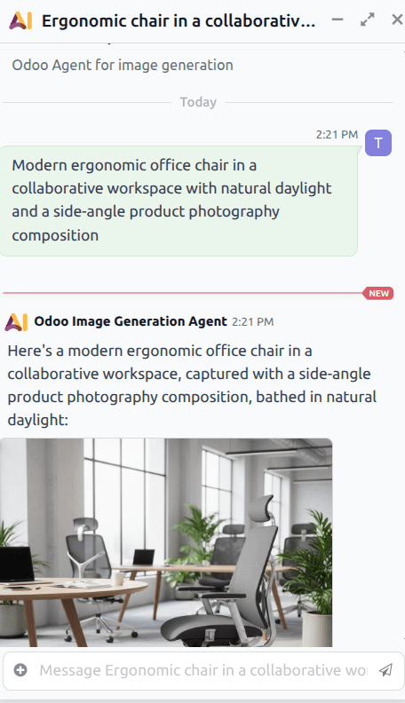
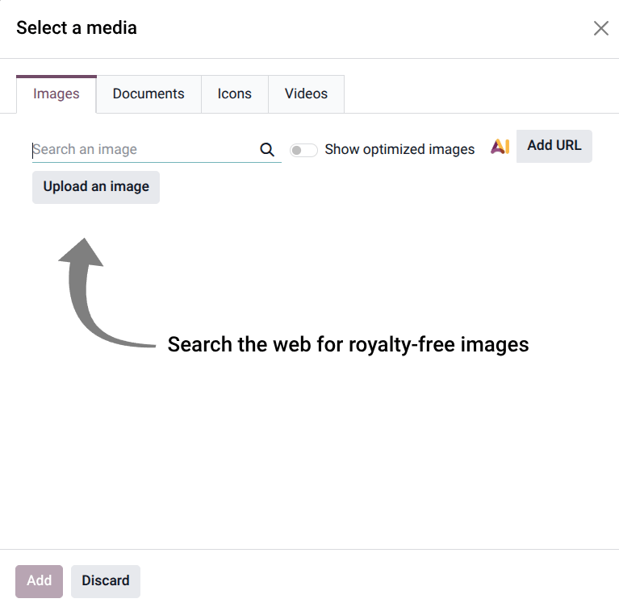

=======================
Generate images with AI
=======================

.. |AI| replace:: :abbr:`AI (Artificial Intelligence)`

Odoo |AI| can generate images directly from natural language prompts. AI-generated images can be
used throughout the database for product visuals, website content, marketing campaigns, *Knowledge*
articles, and other business workflows.

Image generation is available in supported image fields and editors, allowing visuals to be created
and refined directly within Odoo.

Generate an image
=================

To generate an image, navigate to the :menuselection:`AI app` and click on the :guilabel:`Odoo Image
Generation Agent` to open a conversation. Enter a :ref:`prompt <ai/effective-prompts>` describing the
desired image, then click enter.

The prompt can describe the subject, environment, lighting, perspective, style, or intended usage
scenario. More detailed prompts generally produce more accurate and consistent results.

After processing is complete, the generated image appears directly in the conversation window. If
the generated image does not match the intended result, the prompt can be refined and the image
regenerated.

.. important::

   If text, branding, or logos are required in the generated image, these elements must be
   **explicitly** included in the prompt. Otherwise, generated images exclude visible text by
   default, according to the rules defined in both the image generation agent and the *Generate
   Images* topic.

Generate an image on a webpage
------------------------------

To generate an image to add directly to a webpage, navigate to the :menuselection:`Website` app and
click :guilabel:`Edit`. Either click on an existing block or add a new one.

In the webpage editor, under the *Image* drop-down menu, click :guilabel:`Replace` next to the
:guilabel:`Media` field to open the :guilabel:`Select a media` pop-up. On the pop-up, click the AI
icon.

On the resulting conversation window, either click one of the :doc:`default prompts
<default_prompts>`, or enter a custom :ref:`prompt <ai/effective-prompts>`.

.. _ai/effective-prompts:

Write effective prompts
-----------------------

Prompts describe the subject and context of the generated image. More detailed prompts generally
produce more accurate and consistent results.

Effective prompts often include:

- The subject of the image.
- The environment or setting.
- The perspective or composition.
- The intended visual style.

For example, instead of using a short prompt such as, `Office Chair` a more descriptive prompt may
produce stronger results:

`Modern ergonomic office chair in a collaborative workspace with natural daylight and a side-angle
product photography composition`

When generating variations from an existing image, prompts work best when describing how the subject
should be presented or used, rather than redefining the subject itself.

How AI image generation works
=============================

AI image generation in Odoo is powered by a dedicated AI agent called the *Odoo Image Generation
Agent*. This agent interprets prompts, generates images, and applies the rules that guide image
quality, consistency, and behavior.

The image generation agent works together with a topic called *Generate Images*. The agent prompt
defines the high-level behavior of the image generation workflow, while the topic instructions
provide more detailed guidance regarding how images should be generated and refined.

The agent prompt primarily controls how text and branding are handled in generated images. By
default, generated images do not contain visible text, labels, logos, signage, or watermarks unless
these are explicitly requested in the prompt. This helps reduce unintended visual artifacts and
improves overall image consistency.

The *Generate Images* topic contains the detailed image-generation instructions used during the
creation process. These instructions guide how the AI should preserve the identity of a subject, how
new environments should be generated, and how each image variation should remain visually distinct
from previous generations.

Together, the agent and topic ensure that generated images remain both visually coherent and
contextually relevant while still allowing for creative variation.
