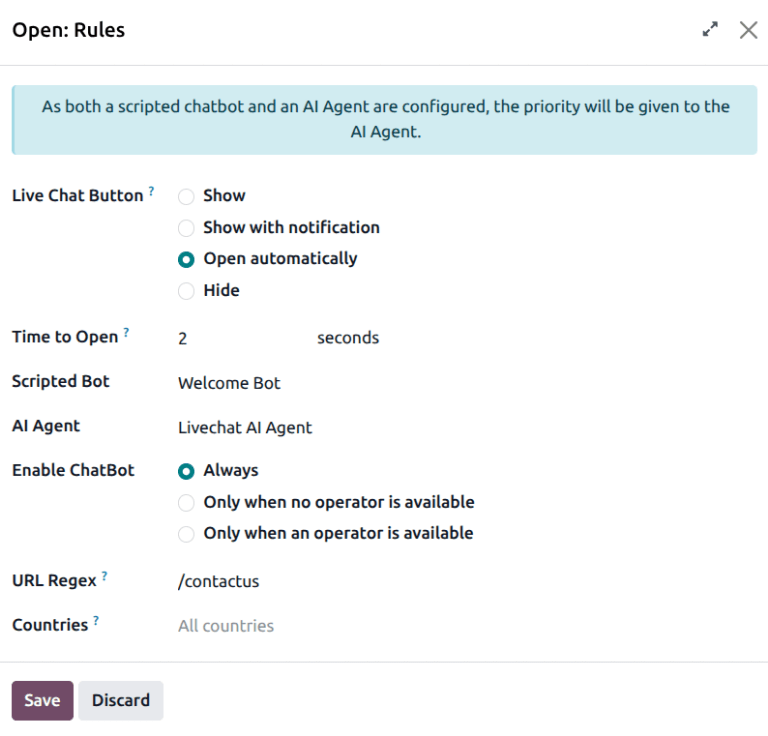

============
AI live chat
============

Odoo's **AI** application can be integrated with **Live Chat** to enable agents to automatically
respond to customer inquiries, qualify conversations, and generate leads. When connected to a live
chat channel, an AI agent can answer common questions, request additional information, and determine
when a conversation needs to be escalated to a human operator.

AI responses are generated in real-time and follow the rules and instructions defined in the
assigned agent and topics.

Connecting an agent to live chat
================================

First, confirm that both the **Live Chat** and **AI** applications are installed.

.. note::
   When both the **AI** and **Live Chat** apps are installed, a *Livechat AI Agent* is added to the
   **AI** app. Other agents can be created and used for live chat conversations, if desired.

    .. image:: live-chat/livechat-agent.png
       :alt: The preconfigured AI Live Chat agent in the AI app.

Navigate to the **Live Chat** application and select a live chat channel. On the channel card,
click the :icon:`fa-ellipsis-v` :guilabel:`(vertical ellipsis)` icon, then click
:guilabel:`Configure Channel`.

On the channel page, click on the :guilabel:`Rules` tab. Click on an existing rule, or click
:guilabel:`Add a line` to add a new rule. On the *Open: Rules* pop-up, click in the :guilabel:`AI
Agent` field, and select an agent from the drop-down.

.. note::
   If a channel has both a chatbot and an AI Agent assigned, the priority is given to the AI agent
   workflow.

Configuring AI behavior in live chat
====================================

The behavior and actions of the AI agent during a live chat conversation are controlled through the
agent's settings.  To configure the :doc:`agent <agents>`, navigate to the :menuselection:`AI app
--> Agents`. On the agent card, click the :icon:`fa-ellipsis-v` :guilabel:`(vertical ellipsis)`
icon, then click :guilabel:`Configuration`.

As the default *Livechat AI Agent* is configured to work with live chat, this section lays out how
the agent's prompt is used in a live chat conversation.

Agent identity and goals
------------------------

The *Livechat AI Agent* identity helps define the agent's communication style and conversation
goals. At a high level, the agent is focused on answering customer questions accurately, while also
being responsible for initiating lead creation when a request cannot be handled confidently.

Rather than reacting message-by-message, the agent evaluates each interaction against its defined
priorities.

How the agent answers questions
-------------------------------

During a conversation, each incoming message is evaluated against the agent's decision rules. When
sufficient information is available, the agent responds directly with a clear and concise answer.

If the available information is incomplete or uncertain, the agent does not guess or fabricate a
response. Instead, it acknowledges the limitation and prepares to transition the conversation toward
human follow-up.

This ensures that automated responses remain accurate and trustworthy.

How escalation is triggered
---------------------------

Escalation to human follow-up is defined explicitly in the agent's prompt and delegated to a
dedicated topic.

Conversations are escalated when one of the following occurs:

- The request requires custom pricing, contracts, or implementation work.
- The request involves account changes or troubleshooting.
- The user explicitly asks to be contacted or requests a demo.
- The agent cannot respond with high confidence.

When one of these conditions is met, the agent activates the *Lead Creation* :ref:`topic
<ai/topics>`.

Lead creation topic
~~~~~~~~~~~~~~~~~~~

The Lead creation topic defines a structured, multi-step workflow that governs how contact
information is collected and how a lead is created.

This topic specifies:

- when lead creation is appropriate
- what information must be collected
- how the conversation should progress
- what language the agent may and may not use

Rather than immediately creating a lead, the agent completes the following steps:

#. Suggests human follow-up when appropriate
#. Collects missing contact details one at a time
#. Confirms known details before proceeding
#. Calls the lead creation tool exactly once

The topic also enforces strict constraints to prevent system-centric language, duplicate lead
creation, or premature promises of follow-up.

To view the detailed instructions for the lead creation topic, navigate to the :menuselection:`AI
app --> Agents --> Topics`, and click :guilabel:`Create Leads`.

.. seealso::
   :doc:`AI Agents <agents>`
