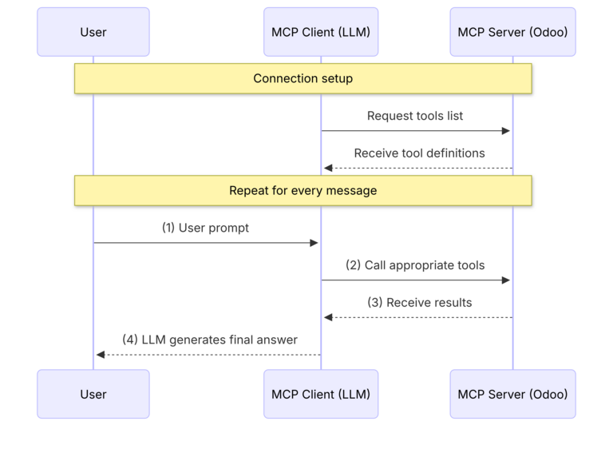
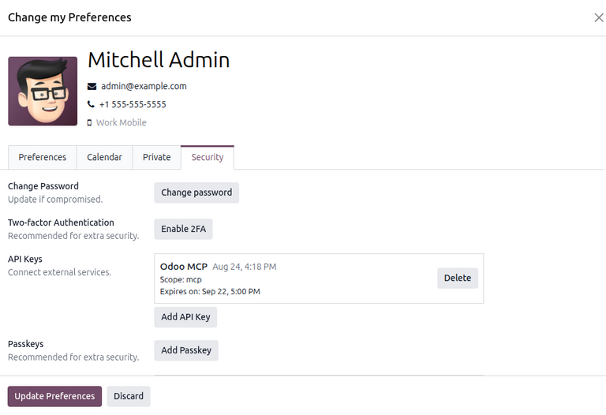
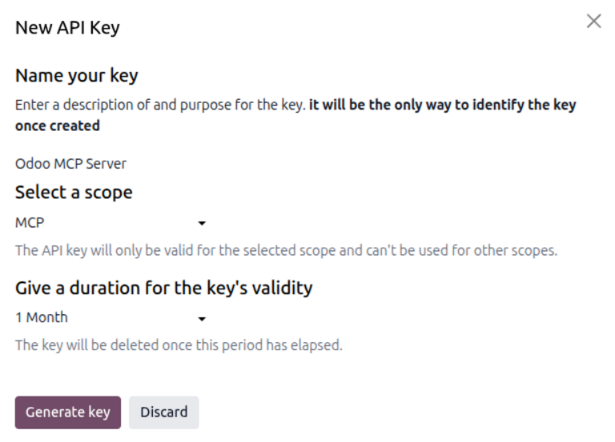

=============
AI MCP server
=============

.. |AI| replace:: :abbr:`AI (artificial intelligence)`
.. |MCP| replace:: :abbr:`MCP (Model Context Protocol)`
.. |LLM| replace:: :abbr:`LLM (large language model)`

Model Context Protocol (MCP) is an open-source standard that allows large language models (LLMs) to
securely interact with external applications and access their data. In Odoo **AI**, users can
connect an external |AI| agent directly to their Odoo database through an Odoo |MCP| server in order
to read or modify the database using their own local |AI| workflows.

The following documentation provides an overview of Odoo |MCP| servers, how to connect |AI| agents
to them, and how to read or write data through the server.

.. note::
   This documentation uses the following terms with some flexibility and may differ from their
   proper technical usage, either in Odoo or externally:

   - *Client*: Refers broadly to the |AI| application with which the user interacts. For example,
     the |LLM| prompted by the user is also referred to as the *client*.

.. _ai/mcp/overview:

MCP workflow
============

In the |MCP| workflow, an Odoo database acts as a remote |MCP| *server* that communicates with the
|MCP| *client* (the user's external |AI| agent) to execute :doc:`tools <server-actions>` such as
reading data or editing records in the database. This process occurs internally and is invisible to
the user, who interacts with the |MCP| client **only** by prompting it with specific tasks.

The following sequence outlines the |MCP| workflow in Odoo:

#. The user :ref:`configures the client <ai/mcp/configuration>` with server details and an
   authentication key. Once connected, the client automatically makes an initial request to the
   server for any available :ref:`AI tools <ai/mcp/available-tools>` (or *Server Actions*) exposed
   to it in the database. If successful, the client caches the tools for the remainder of the
   session.
#. The user prompts the client in plain language. A list of :ref:`example prompts
   <ai/mcp/use-cases>` is provided in this documentation.
#. The client requests that the server invoke the correct tools.
#. After executing the tool, the server returns the results to the client.
#. The client responds to the user's prompt in plain language.

.. seealso::
   See the :doc:`server-actions` documentation for more information about tools in Odoo.

.. _ai/mcp/configuration:

Configuration
=============

The configuration process includes the following steps:

#. :ref:`Set up authentication <ai/mcp/authentication>` via API key.
#. :ref:`Configure the MCP server details <ai/mcp/server-settings>` and connect via the client.
#. :ref:`Expose server actions <ai/mcp/expose-tools>` to the client from Odoo.

.. important::
   Before configuring the AI client settings in step two, ensure that the following are installed:

   - An |MCP|-compatible AI agent (e.g., *Claude Code*, *Antigravity*, *Codex*)
   - `Node.js <https://nodejs.org/en/download>`_ (required to run the `npx` command)

.. _ai/mcp/authentication:

Set up authentication
---------------------

To connect the |MCP| client to the server, users must first set up authentication to the server via
a static API key. Every time the |MCP| client sends a request to the server, it uses the key to
authenticate the user's identity and permissions in the Odoo database.

To generate the API key, click the user icon in the upper corner, then select :guilabel:`My
Preferences`.

On the *Change my Preferences* pop-up window, open the *Security* tab. Then, click :guilabel:`Add
API Key`. On the *Access Control* pop-up window, confirm the database password.

After confirming the password, configure the API key in the *New API Key* pop-up window. To start,
in the *Name your key* section, enter a brief name or descriptor for the key.

Next, in the *Select a scope* section, select the :guilabel:`MCP` scope from the drop-down menu.

In the *Give a duration for the key's validity* section, select the period of time for which this
key is valid (e.g., `1 Month`).

Finally, click :guilabel:`Generate key` to create the key.

.. important::
   Be sure to save the key elsewhere. Once generated, the key is only shown to the user once and
   remains hidden thereafter.

.. _ai/mcp/server-settings:

Configure server settings
-------------------------

After generating an authentication key in Odoo, the user must properly configure their client with
the following:

- The API key generated in the previous section
- The server URL, or *endpoint*, to which the client connects. This URL is formed by taking the
  user's database URL and concatenating `/mcp` (e.g., `https://example.odoo.com/mcp`).

.. important::
   Be sure to replace the following placeholders with the appropriate values:

   - `server_name`: Enter a custom name to identify the |MCP| server.
   - `database_url`: Enter the URL of the Odoo database.
   - `API_KEY`: Enter the API key generated in the previous section.

.. tabs::

   .. tab:: Claude

      Connecting to Odoo |MCP| with Claude can be done either via *Claude Desktop* or *Claude Code*
      CLI.

      **Via Claude Desktop**

      Open *Claude Desktop*. Navigate to :menuselection:`Settings --> Developer`. The *Local MCP
      Servers* section lists all configured |MCP| servers along with their statuses.

      To add a new server, click :guilabel:`Edit Config`. In the file explorer, open
      `claude_desktop_config.json` and paste the following JSON snippet between the outermost
      ellipses:

      .. code-block:: none

         {
           ...
           "mcpServers": {
             "<server_name>": {
               "command": "npx",
               "args": [
                 "-y",
                 "mcp-remote",
                 "<database_url>/mcp",
                 "--header",
                 "Authorization: Bearer <API_KEY>"
               ]
             }
           },
           ...
         }

      After saving the configuration file, the newly added server should appear in the *Local MCP
      Servers* section along with its connection status.

      **Via Claude Code CLI**

      In the terminal, paste the following command to add the |MCP| server:

      .. code-block:: none

         claude mcp add --transport stdio <server_name> -- npx -y mcp-remote <database_url>/mcp --header "Authorization: Bearer <API_KEY>"

      .. note::
         To add the server to the system's global (user-wide) configuration (i.e., the server is
         accessible for all projects), include the `--scope user` flag in the command above.

      Finally, run ``claude mcp list`` to check the connection status of the newly added server.

   .. tab:: Antigravity

      Connecting to Odoo |MCP| with Google Antigravity can be done through *Antigravity 2.0* or
      *Antigravity CLI*.

      **Configure via Antigravity 2.0**

      Open *Antigravity 2.0*. Navigate to :menuselection:`Settings --> Customizations`. The
      *Installed MCP Servers* section lists all configured |MCP| servers along with their statuses.

      To add a new server, click :guilabel:`Open MCP Config`. In the file explorer, open
      `mcp_config.json` and paste the following JSON snippet between the outermost ellipses:

      .. code-block:: none

         {
           ...
           "mcpServers": {
             "<server_name>": {
               "command": "npx",
               "args": [
                 "-y",
                 "mcp-remote",
                 "<database_url>/mcp",
                 "--header",
                 "Authorization: Bearer <API_KEY>"
               ]
             }
           },
           ...
         }

      After saving the configuration file, the newly added server should appear in the *Installed
      MCP Servers* section along with its connection status.

      **Connect via Antigravity CLI**

      Before connecting using *Antigravity CLI*, configure the server in *Antigravity 2.0*.

      To check the connection status, run ``agy`` in the terminal to start *Antigravity*. Then, run
      ``/mcp``. The newly added server should appear along with its connection status.

   .. tab:: Codex

      Configuring an Odoo |MCP| server in *Codex* can be done either by directly editing the
      configuration file or via the *Codex CLI*.

      **Via config file**

      Open the `config.toml` file, located in the root directory (`~/.codex/config.toml`). Then,
      paste the following into the configuration file:

      .. code-block:: none

         [mcp_servers.<server_name>]
         command = "npx"
         args = ["-y", "mcp-remote", "<database_url>/mcp", "--header", "Authorization: Bearer <API_KEY>"]

      .. note::
         While the `config.toml` is located globally in the system's root directory, it can also be
         created for trusted, local projects by configuring a `.codex/config.toml` file in the
         directory.

      **Via Codex CLI**

      In the terminal, paste the following command to add the |MCP| server:

      .. code-block:: none

         codex mcp add <server_name> -- npx -y mcp-remote <database_url>/mcp --header "Authorization: Bearer <API_KEY>"

      To check the connection status, run ``codex`` in the terminal to start *Codex*. Then, run
      ``/mcp``. The newly added server should appear.

.. seealso::
   See the following documentation for more information about configuring clients:

   - `Connect to MCP servers using Claude Code <https://code.claude.com/docs/en/mcp-quickstart>`_
   - `Connect to MCP servers using Antigravity <https://antigravity.google/docs/mcp/>`_
   - `Connect to MCP servers using Codex <https://learn.chatgpt.com/docs/extend/mcp?surface=cli>`_

.. _ai/mcp/expose-tools:

Expose tools to client
----------------------

After connecting to the server, the |MCP| client reads and writes data to the Odoo database by
invoking the appropriate tool according to the user's query.

These tools are accessed by turning on developer mode, then navigating to :menuselection:`Settings
--> Technical --> Server Actions` to open the dashboard of server actions, or tools.

By default, an Odoo database exposes the following tools to the client:

- `AI Tool: Get Fields`
- `AI Tool: Get Models`
- `AI Tool: MCP Retrieve initial context`
- `AI Tool: Search`
- `AI Tool: Read group`

The remaining tools are hidden from the client and must be manually exposed to be invoked.

To expose a tool, click on the tool entry. In the *Usage* tab of the server action form, select the
checkbox next to :guilabel:`Available in MCP`. Optionally, select the checkbox next to
:guilabel:`Readonly Tool` to mark that the tool does not write or modify existing data and can be
automatically invoked without user approval.

.. note::
   Enabling the :guilabel:`Readonly Tool` checkbox does not "hide" the tool from the AI client. It
   only advises the client that the tool is safe to invoke without explicit user approval.

.. seealso::
   See the :ref:`available tools <ai/mcp/available-tools>` section for a full list of available
   tools in the database.

.. _ai/mcp/use-cases:

Example use cases
=================

An Odoo |MCP| server can be used to complete the following use cases, including example user
prompts.

Data analysis and reporting
---------------------------

.. list-table::
   :header-rows: 1

   * - Use case
     - Example prompt
   * - Sales pipeline review
     - "Show me my open opportunities grouped by stage, then chart the pipeline value by
       salesperson."
   * - Manufacturing/inventory planning
     - "Which products on my Master Production Schedule have no forecast data, and what's my total
       forecasted demand this month?"
   * - Historical reporting
     - "How much did we invoice last quarter compared to this quarter?"

Navigation and UI interaction
-----------------------------

.. list-table::
   :header-rows: 1

   * - Use case
     - Example prompt
   * - Bulk record creation
     - "Create contacts for these five leads I'm pasting in."
   * - Filtering and grouping open views
     - "Filter this current view to my team and group by month instead."
   * - Data lookup and edit
     - "Does Azure Interior have a Tax ID on file? If not, set it to XX0123456789."

Custom styling
--------------

.. list-table::
   :header-rows: 1

   * - Use case
     - Example prompt
   * - Website content editing
     - "Add a banner to my homepage announcing our summer sale, using a stock photo of a beach."
   * - Custom site styling
     - "Round the corners on all my product images site-wide."
   * - AI image generation
     - "Generate an image of a mountain at dusk and put it in the hero section."

.. _ai/mcp/available-tools:

Available tools
===============

The following AI tools are supported by the Odoo |MCP| server. Each tool is listed below with its
name, description, and suggested *Readonly* status.

Setup/context retrieval
-----------------------

.. list-table::
   :header-rows: 1

   * - Tool
     - Description
     - Readonly
   * - `AI Tool: MCP Retrieve initial context`
     - Returns context about the currently authenticated user's database, including the user,
       timezone, active company, and available companies.
     - True

.. note::
   `AI Tool: MCP Retrieve initial context` runs automatically at the beginning of a user's session
   and is **only** invoked by the client.

Data querying
-------------

.. list-table::
   :header-rows: 1

   * - Tool
     - Description
     - Readonly
   * - `AI Tool: Get Models`
     - Lists every Odoo model the current user can access, including their technical names and
       descriptions.
     - True
   * - `AI Tool: Get Fields`
     - Lists the searchable and usable fields on a given model, including type and relations.
     - True
   * - `AI Tool: Get Menus`
     - Lists every menu the current user can access, with its linked action, model, and available
       view types.
     - True
   * - `AI Tool: Get Menu Details`
     - Returns detailed information for specific menu IDs, such as action, domain, default filters
       and groupings, and searchable fields.
     - True
   * - `AI Tool: Search`
     - Searches records on a model using a domain and returns the requested fields.
     - True
   * - `AI Tool: Read group`
     - Groups records by one or more fields and computes aggregates (sums, counts, averages, etc.)
       over them.
     - True
   * - `AI Tool: Update Records`
     - Updates one or more existing records matching a domain with new field values.
     - False
   * - `AI Tool: Create Records`
     - Creates new records on a model with specified fields, optionally linking a preview menu to
       show the result.
     - False

Navigation
----------

.. list-table::
   :header-rows: 1

   * - Tool
     - Description
     - Readonly
   * - `AI Tool: Open Menu List`
     - Redirects the UI to a menu's List view, optionally filtered and grouped.
     - True
   * - `AI Tool: Open Menu Kanban`
     - Redirects the UI to a menu's Kanban view, optionally filtered and grouped.
     - True
   * - `AI Tool: Open Menu Graph`
     - Redirects the UI to a menu's Graph view with a chosen measure, chart mode, grouping, and
       sorting options.
     - True
   * - `AI Tool: Open Menu Pivot`
     - Redirects the UI to a menu's Pivot view with row and column groupings and measures.
     - True
   * - `AI Tool: Run view action`
     - Opens client or report actions (e.g., Discuss, printed reports) tied to a menu.
     - True
   * - `AI Tool: Compute Report Measures`
     - Returns the measures available for aggregation on a given model or action. This tool is meant
       to be called before opening a pivot or graph view.
     - True
   * - `AI Tool: Prepare Record Previews`
     - Prepares metadata so that specific records render as rich preview cards in the Odoo Chat.
     - True
   * - `AI Tool: Adjust Search`
     - Adjusts the search filters, groupings, active measures, or view type of the current view.
     - True
   * - `AI Tool: Compute Date`
     - Computes an exact date or datetime from a relative expression (e.g., "start of last week").
     - True

Website styling
---------------

.. list-table::
   :header-rows: 1

   * - Tool
     - Description
     - Readonly
   * - `AI Tool: Get Snippets`
     - Fetches the HTML markup for named website-builder snippets so they can be edited and inserted
       into a page.
     - True
   * - `AI Tool: Read Custom CSS`
     - Reads the current contents of the website's custom SCSS rules.
     - True
   * - `AI Tool: Write Custom CSS`
     - Overwrites the website's custom SCSS rules with new styling.
     - False
   * - `AI Tool: Apply HTML to Page`
     - Applies HTML edits (e.g., replace, insert) to a specific website page.
     - False

Media generation
----------------

.. list-table::
   :header-rows: 1

   * - Tool
     - Description
     - Readonly
   * - `AI Tool: Generate an Image`
     - Generates a new image from a text prompt. This tool is **only** invoked on explicit user
       request.
     - False
   * - `AI Tool: Search Images`
     - Searches *Unsplash* for stock photos matching a query.
     - True
   * - `AI Tool: Get user image URLs`
     - Converts uploaded chat attachment IDs into permanent Odoo image URLs for use in content.
     - True

Additional tools
----------------

.. list-table::
   :header-rows: 1

   * - Tool
     - Description
     - Readonly
   * - `AI Tool: Web Search`
     - Delegates a factual question or research task to a web search agent.
     - True
   * - `AI Tool: Load Skills`
     - Loads detailed instructions and tools for specific registered AI skills by ID.
     - True

.. seealso::
   - :doc:`server-actions`
