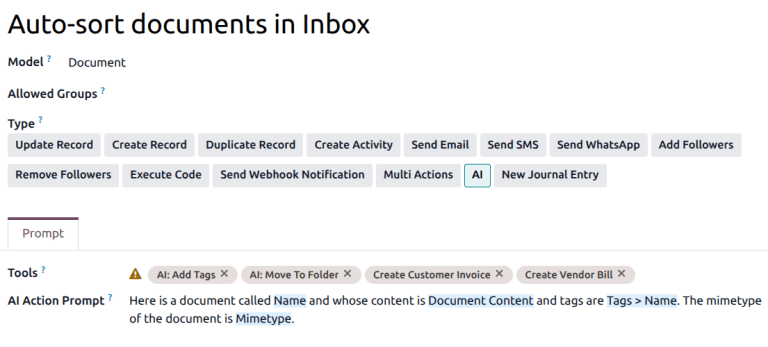

=================
AI server actions
=================

.. |AI| replace:: :abbr:`AI (artificial intelligence)`

|AI| server actions extend Odoo's automation framework by allowing artificial intelligence to make
decisions during a workflow.

They are designed for cases where logic cannot be expressed entirely through fixed conditions, but
still requires controlled execution through standard server actions.

How AI server actions work
--------------------------

AI-driven workflows in Odoo are built around a clear separation of responsibilities between the |AI|
server action, or *the Manager*, and the tool, or *the Worker*.

AI server action: the manager
~~~~~~~~~~~~~~~~~~~~~~~~~~~~~

An |AI| server action acts as a decision maker, or a manager. It reads the record and its context.
It interprets the |AI| prompt. And it decides which tool to call, and what arguments to use.

The server action does not enforce business rules, modify records directly, or guarantee the
correctness of the operation. Its role is limited to decision-making.

AI tool: the worker
~~~~~~~~~~~~~~~~~~~

A tool is a standard server action with the *Use in AI* option enabled in its *Usage* tab. Tools
contain all execution logic and perform record updates, moves, or writes. Tools **must** enforce
business rules explicitly in Python code.

If a tool is called by the |AI| server action, it will execute unconditionally, unless the code
itself prevents it.

AI server action workflow
~~~~~~~~~~~~~~~~~~~~~~~~~

The |AI| server action workflow follows this sequence:

#. A record triggers an |AI| server action.
#. The |AI| prompt is evaluated, using the record as context.
#. The |AI| selects one of the available tools.
#. The |AI| provides arguments expected by the tool.
#. The selected tool executes its Python code.

.. important::
   |AI| server actions work without custom logic only when the underlying behavior already exists in
   Odoo, such as moving a document to a folder. In these cases, the |AI| selects parameters, and
   Odoo executes the action.

Use case walkthrough
--------------------

The *Auto-sort documents in Inbox* example demonstrates the full |AI| Server Action pattern.
Navigate to the *Server Actions* menu by going to :menuselection:`Settings --> Technical --> Server
Actions`.

.. note::
   This server action is designed to review documents for their content, and add tags. The action
   itself does **not** move documents or add tags, it only decides which tool should be used, based
   on the documents' content.

   The :guilabel:`Model` for the action is listed as *Document*, and the :guilabel:`Type` is *AI*.

The prompt for this action provides context about the document, as well as intent of the action.

The :guilabel:`Tool` field includes several actions that may be taken based on this prompt,
including moving a document, adding tags, or creating invoices or bills.

.. note::
   *AI: Add Tags*, *AI: Move to Folder*, and *AI: Rename Document* are all *Execute Code* server
   actions, meaning they trigger python code.

For example, if the action determines, based on the content of the document, that the most
appropriate tool is *AI: Move to Folder*, the Python code performs the following operation:

.. code-block:: python

   ai['result'] = record._ai_action_move_in_folder(folder_id)

This code, executes unconditionally when called and performs the move using an existing method.

.. note::
   The |AI| does not infer arguments from the Python code or from the method signature. Instead,
   arguments passed to a tool are determined entirely by the tool's configuration.

   For the *AI: Move to Folder* tool, the Python code expects a variable named `folder_id`. The |AI|
   knows to provide `folder_id` because it is explicitly declared as an argument in the
   configuration. This can be found on the *Usage* tab of the server action, in the :guilabel:`AI
   Schema` field. The :guilabel:`Name` column under *AI Schema* must match the variable name used in
   the Python code exactly.

   The |AI| uses the argument description to understand what the parameter represents, what type of
   value is expected, and when it is appropriate to supply it.

   If an argument is not defined in the Usage tab, the AI cannot provide it, even if the Python code
   references it.

   .. image:: server-actions/ai-move-to-folder.png
      :alt: The usage tab of the AI move to folder server action.

Creating custom AI tools
------------------------

The same pattern in the *Auto-sort documents in Inbox* example above can be implemented using
standard Odoo logic. For example, to create an action that can update a task description, an
*Execute Code* action could be created with the following code:

.. code-block:: python

    record.write({'description': content})

To function correctly, `content` **must** be defined as an argument in tool's *Usage* tab.

.. seealso::
   :ref:`Server Actions <reference/actions/server>`

Common issues
-------------

Why is the Tools field empty?
~~~~~~~~~~~~~~~~~~~~~~~~~~~~~

- Confirm that at least one server action has :guilabel:`Use in AI` enabled.
- Confirm that at least one tool is assigned to the same model :guilabel:`Model` as the server
  action.

Why did the tool run but nothing happened?
~~~~~~~~~~~~~~~~~~~~~~~~~~~~~~~~~~~~~~~~~~

- The Python code exited without changes.
- Required arguments were missing or empty.
- Business conditions were not implemented in the tool logic.

Why did the AI choose an unexpected tool?
~~~~~~~~~~~~~~~~~~~~~~~~~~~~~~~~~~~~~~~~~

- The prompt lacked sufficient context.
- Multiple tools matched the same intent.
- No constraints were enforced at the tool level.
