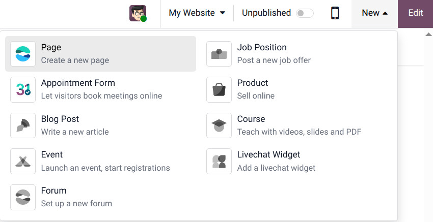
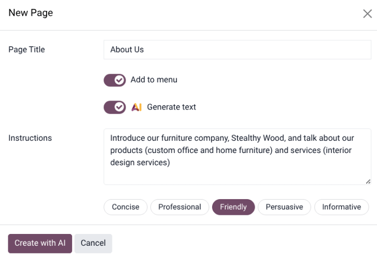

====================
AI webpage generator
====================

.. |AI| replace:: :abbr:`AI (Artificial Intelligence)`

Within Odoo's **Website** application, |AI| can be utilized to generate original webpages. By
providing Odoo with a prompt, the |AI| agent generates a design and content that suits the
business's needs, style, and tone.

.. note::
   The **AI** application does **not** need to be installed on the database to use the webpage
   generator, only the **Website** app.

Generating a new webpage
========================

First, navigate to the :menuselection:`Website app`. In the top-right of the page, click
:guilabel:`New`, then click :guilabel:`Page`.

On the :guilabel:`New Page` pop-up, select the desired page type.

.. note::
   The |AI| webpage generator is not available on the *Blank* page type.

Clicking on a page type opens a :guilabel:`New Page` pop-up. Enter a :guilabel:`Page Title`, then
slide the :guilabel:`AI Generate Text` toggle to active to reveal the :guilabel:`Instructions`
field. Here, enter a short description of the page being created. This should include a few
important keywords that help define the focus and scope of the page.

Next, select one of the tone options for the page:

 - :guilabel:`Concise`
 - :guilabel:`Professional`
 - :guilabel:`Friendly`
 - :guilabel:`Persuasive`
 - :guilabel:`Informative`

When finished, click :guilabel:`Create with AI`. It may take a few moments for the webpage to load.
Content created by the |AI| generator can be edited. Click :guilabel:`Edit` on the toolbar on the
right side of the page, then click on a block of text to make changes. Click :guilabel:`Save` when
finished.

.. tip::
   The webpage generator may have created buttons. Before publishing the webpage, confirm that all
   buttons are linked to an active webpage.

After reviewing the page, slide the :guilabel:`Unpublished` toggle to active to publish the page.

.. seealso::
   :doc:`Web design <../../websites/website/web_design>`
