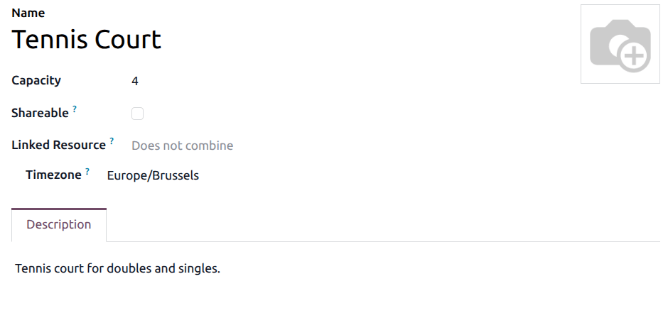

=================
Appointment types
=================

The main :menuselection:`Appointments` app dashboard displays all appointment types in a default
Kanban view. Each row shows the appointment title, duration, the assigned users or resources, and
counters for upcoming and total meetings or bookings.

.. note::
   User-based appointment types display their counters as :guilabel:`Meetings`, while resource-based
   types display them as :guilabel:`Bookings`.

Each appointment type has two action buttons on the right:

- :guilabel:`Share`: Click this button to copy the appointment link to the clipboard, which can be
  shared.
- :guilabel:`Configure`: Click this to open the appointment type form to edit its settings.

Published appointment types display a :guilabel:`Published` ribbon. Unpublished types do not have a
ribbon and are not visible to customers on the website.

Click :guilabel:`New` to create a new appointment type, or click :guilabel:`Share` in the top
toolbar to share multiple appointment types at once.

.. _appointments/appointment-types:

Appointment types
=================

**Appointment types** represent a bookable service. An appointment type defines *what* can be
booked, *when* it is available, *who* (or which resource) handles it, and what information the
customer must provide.

To create or manage appointment types, open the :menuselection:`Appointments` app dashboard and
click :guilabel:`New`.

.. _appointments/resources:

Resources
=========

The **Appointments** app allows new appointments to be scheduled based on user or resource
availability, such as meeting rooms or seating areas. To create a new resource, or manage existing
resources, navigate to :menuselection:`Appointments --> Configuration --> Resources`.

Click :guilabel:`New` to create a resource. On the blank record, enter a :guilabel:`Name` for the
new resource (e.g., ``Court 1``). In the :guilabel:`Capacity` field, enter the maximum number of
people the resource can accommodate.

The :guilabel:`Opening Hours` field defines the working calendar for this resource. By default, it
is set to :guilabel:`Appointment Resource Default Calendar`. Select a different calendar to
customize the resource's own availability independently from the appointment type's Availabilities
tab.

.. note::
   The :guilabel:`Opening Hours` field only appears when :ref:`developer mode
   <developer-mode/activation>` is activated.

In the :guilabel:`Linked Resource` field, select how this resource combines with others. By default,
a resource is set to :guilabel:`Does not combine`, meaning it operates independently. To allow the
resource to be used in combination with others to handle larger groups, select one or more resources
to link.

.. important::
   Linked resources are only used when the appointment type's :guilabel:`Assignment` is set to
   :guilabel:`Automatically`.

Lastly, in the :guilabel:`Description` tab, add a description for this resource. The contents of
this tab are visible to customers when booking an appointment online and can be used to describe the
space, amenities, or equipment available.

.. _appointments/resources/capacity:

Increase the maximum displayed capacity
---------------------------------------

When booking an appointment based on resource availability, the website only displays capacity up to
``20``. This occurs even if the resource has a higher capacity. To raise this limit, a new system
parameter needs to be added to the database.

First, ensure that :ref:`developer mode <developer-mode>` is enabled. Then, navigate to
:menuselection:`Settings app --> Technical --> Parameters --> System Parameters`. Click
:guilabel:`New` to add a new parameter.

In the :guilabel:`Key` field, enter ``appointment.resource_max_capacity_allowed``. In the
:guilabel:`Value` field, enter the desired maximum capacity. Click the :guilabel:`Save` button when
finished.

.. _appointments/configure:

Appointment settings
====================

On the new record, enter an :guilabel:`Appointment Title`, then set a :guilabel:`Duration` for this
appointment type (e.g., ``1h``).

In the :guilabel:`Location` field, select where the appointment takes place. For user-based
appointments, this defaults to :guilabel:`Online Meeting`. Select a different option to switch to an
in-person venue. The :guilabel:`Video Link` field defines which videoconference provider is used for
online meetings; leave it as :guilabel:`None` to let attendees join without a pre-generated link via
Odoo's **Discuss** app.

Next, designate whether this appointment type is based on :guilabel:`Users` or
:guilabel:`Resources`, by selecting the appropriate option in the :guilabel:`Book` field.

- If set to :guilabel:`Users`, select one or more users in the field below. Their calendar
  availability determines the open slots.
- If set to :guilabel:`Resources`, select one or more :ref:`resources <appointments/resources>`
  (e.g., rooms, equipment).

.. tip::
   User-based appointment types can be used for scheduling sales meetings and demos, as well as
   recruiting interviews.

   Resource-based appointment types can be used for scheduling time in specific rooms or locations.

The :guilabel:`Assignment` field determines how a user or resource is matched to the booking:

- :guilabel:`Automatically`: Odoo assigns a user or resource based on availability.
- :guilabel:`By visitor`: the customer picks a specific user or resource themselves.

When :guilabel:`Assignment` is set to :guilabel:`By visitor`, and more than one option is selected
in the :guilabel:`Users` field the :guilabel:`Starts with` field controls the booking flow order:

- :guilabel:`Date`: the customer first selects a date and time, then chooses from the available
  users or resources.
- :guilabel:`User / Resource`: the customer first picks a person or resource, then selects an
  available time slot.

Lastly, tick the :guilabel:`Manage Capacities` checkbox to limit how many simultaneous appointments
each user can have in the same time slot.

.. _appointments/appointment-types/availabilities-tab:

Availabilities tab
------------------

The :guilabel:`Availabilities` tab is used to define when this appointment type can be booked. Each
row represents a recurring time window.

Click :guilabel:`Add a line` to create an availability window. Select a day of the week from the
:guilabel:`Every` drop-down, then set the :guilabel:`From` and :guilabel:`To` times. Optionally, use
the :guilabel:`Restrict to Users` column to limit a specific time window to one or more users; if
left empty, the window applies to all assigned users.

Multiple entries per day are supported. Click the :icon:`fa-trash-o` :guilabel:`(trash)` icon to
delete an entry.

.. tip::
   To block out a lunch break, create two entries for the same day: one before the break (e.g.,
   ``9h`` to ``12h``) and one after (e.g., ``14h`` to ``17h``).

.. note::
   If the :guilabel:`Employee Schedule` option is enabled in the :ref:`Options tab
   <appointments/appointment-types/options-tab>`, availability is the **intersection** of the time
   windows defined here and the user's working schedule in the **Employees** app. A slot is only
   bookable if it falls within both. For example, if the Availabilities tab allows Monday ``9h`` to
   ``17h`` but the employee's schedule is Monday ``10h`` to ``16h``, only ``10h`` to ``16h`` is
   shown to customers.

.. _appointments/questions:

Questions tab
-------------

The :guilabel:`Questions` tab can be used to collect customer information during the booking
process.

Click :guilabel:`Add a line` to add a question directly in the list, and an *Add: Questions* pop-up
window loads. Click :guilabel:`Create New`, and a *Create Questions* pop-up window loads. Enter the
:guilabel:`Question` text, then select an :guilabel:`Answer Type` (e.g., :guilabel:`Text`,
:guilabel:`Phone Number`, :guilabel:`Email`). Configure predefined :guilabel:`Answers` if the answer
type requires them. Tick the :guilabel:`Mandatory` checkbox to require an answer before the customer
can confirm the booking.

.. _appointments/appointment-types/communication-tab:

Communication tab
-----------------

The :guilabel:`Communication` tab is used to manage the messages shown to customers on the booking
page and the automated notifications sent around the appointment.

.. important::
   The content in the :guilabel:`Introduction Page` and :guilabel:`Confirmation Page` fields is
   visible to customers and website visitors.

In the :guilabel:`Introduction Page` field, add a short description displayed on the booking page
before the customer selects a time slot. This can include the topic of the appointment, a meeting
agenda, or an introduction to the team.

The :guilabel:`Confirmation Page` field is displayed to a customer after they have booked a meeting.
Add any additional information here that the customer should be aware of. This can include parking
instructions, preparation steps, or venue-specific rules.

The :guilabel:`Reminders` field is used to set how customers are to be contacted before the
appointment time. Select one or more options from the drop-down, based on the communication channel
(e.g., :guilabel:`Email`, :guilabel:`SMS Text Message`) and the lead time (e.g., ``3 Hours``).

The :guilabel:`Booking Email` field sets the email template sent to attendees when a booking is
confirmed. The :guilabel:`Cancellation Email` field sets the email template sent when a booking is
canceled.

.. tip::
   Internal users who need to be notified whenever a booking is created or canceled can **follow**
   the appointment type using the :guilabel:`Follow` button in the chatter at the bottom of the
   record. Followers receive Odoo notifications (and optionally emails) for each new booking and
   cancellation, without being listed as attendees.

.. seealso::
   For information on configuring the :guilabel:`Google Bookings` tab, see :doc:`google_reserve`.

.. _appointments/appointment-types/options-tab:

Options tab
-----------

The :guilabel:`Options` tab is used to configure advanced settings for the appointment type.

Tick the :guilabel:`Allow invitations` checkbox to let users send appointment invitations directly
to contacts.

The :guilabel:`Auto Confirm` checkbox, when enabled, automatically accepts bookings up to the
specified percentage of total capacity. For example, if set to ``100%``, all bookings within
available capacity are accepted immediately. If set to ``50%``, only half the available slots are
auto-confirmed; the remaining bookings require manual approval. Disable :guilabel:`Auto Confirm`
entirely to require manual confirmation for every booking. While awaiting confirmation, the time
slot is still considered *reserved* and is not shown as available to other customers.

Tick :guilabel:`Display pictures` to publish the default photos of the assigned users or resources
on the booking page.

Enable :guilabel:`Up-front Payment` to require customers to pay at the time of booking.

The :guilabel:`Create Opportunity` checkbox adds an opportunity to the **CRM** app for each
scheduled appointment, which is assigned to the responsible user.

.. important::
   The :guilabel:`Create Opportunity` field is only visible if the **CRM** app is installed on the
   database.

.. seealso::
   :doc:`create-opps`

The :guilabel:`Website` field selects which website this appointment type is published on, in a
multi-website environment.

The :guilabel:`Schedule` field offers two modes: :guilabel:`Weekly` for fixed recurring
availability, and :guilabel:`Flexible` for custom date ranges.

The :guilabel:`Allow Bookings` field is used to control the booking window. Set how many days into
the future customers can book, and the minimum lead time before the start time (e.g., ``Within the
next 15 days, at least 1h before start time``).

.. example::
   An appointment type is created for `Tennis Courts`, with a :guilabel:`Duration` of ``1h``, and
   the :guilabel:`Allow Bookings` field set to ``at least 1h before start time``. At ``02:00`` PM, a
   customer attempts to book an appointment for the same day at ``02:45`` PM. The first available
   time is ``04:00`` PM.

The :guilabel:`Create slot every` field sets the interval between available time slots (e.g.,
``1h``). This determines the granularity of the booking calendar shown to customers.

The :guilabel:`Cancellation` field is used to set the minimum time before the appointment at which
customers can still cancel on their own (e.g., ``up to 1h before the booking``). If a customer
attempts to cancel within the restricted window, they see an error message with contact information.

The :guilabel:`Timezone` field sets the timezone used for displaying available slots on the booking
page. For resource-based appointments, this is populated automatically based on the resource.

Use the :guilabel:`Allowed Countries` field to restrict bookings to customers from specific
countries. Leave it empty to allow bookings from anywhere.

Tick the :guilabel:`Employee Schedule` checkbox to additionally constrain user availability by their
working schedule defined in the **Employees** app. When enabled, a slot is only bookable if it falls
within **both** the time windows in the :ref:`Availabilities tab
<appointments/appointment-types/availabilities-tab>` and the user's employee working schedule.

Publishing an appointment
=========================

To publish a bookable appointment, follow these steps:

#. Open the :menuselection:`Appointments` app and click :guilabel:`New`.
#. Choose the appointment preset that matches the desired format. All options remain accessible, no
   matter the preset.
#. Enter an :guilabel:`Appointment Title` and set a :guilabel:`Duration`.
#. In the :guilabel:`Book` field, select :guilabel:`Users` and pick one or more team members. Or
   select :guilabel:`Resources` and select the relevant rooms or equipment.
#. In the :guilabel:`Availabilities` tab, ensure at least one time window appears.
#. Click the :guilabel:`Go to Website` smart button at the top of the record, then toggle the switch
   to :icon:`fa-toggle-on` :guilabel:`Published`.

The appointment is now live. Share the booking link with customers using the :guilabel:`Share`
button on the appointment Kanban card, or let them find it on the website.
