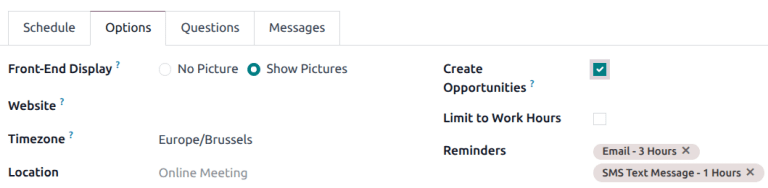

======================================
Create opportunities from appointments
======================================

When creating a new appointment type in the **Appointments** application, users have the option to
create new *opportunities* with information from new bookings. This option captures information from
scheduled appointments and creates opportunities in the **CRM** app.

.. important::
   This option is only available if the **CRM** application is installed on the database.

Configuration
=============

Navigate to the **Appointments** app dashboard. Click :guilabel:`New` to :doc:`create a new
appointment type <../appointments>`. To edit an existing appointment type, click
:icon:`fa-cog` :guilabel:`Action` at the far-right of the appointment line, to open the drop-down
menu, then click :icon:`fa-pencil` :guilabel:`Edit`.

On the appointment type record, click the :guilabel:`Options` tab, and tick the :guilabel:`Create
Opportunities` checkbox.

Add questions
-------------

The :guilabel:`Questions` tab allows users to :ref:`add questions <appointments/questions>` to the
appointment booking page. When customers are booking an appointment slot, they are prompted to
answer these questions. The information provided by customers is available in the :ref:`new
opportunity <appointments/new-opp>`. Adding questions to the appointment type is optional. However,
the additional information captured by the questions can be useful later in the sales pipeline.

.. example::
   A furniture company creates a new appointment type for sales demos. Customers reserve time with
   salespeople to discuss their furniture and design needs. However, because the time is limited to
   only thirty minute increments, salespeople do not have the time to show all of the available
   furniture styles in every call. They add questions to the appointment type to prompt customers to
   provide additional information about the products and services they are interested in. Not only
   does this help when preparing for the demo, it also provides clarity further along in the sales
   process.

   .. image:: create-opps/custom-questions.png
      :alt: An appointment booking form with custom questions.

.. _appointments/new-opp:

Viewing the new opportunity
===========================

To view opportunities created from appointments, navigate to the :menuselection:`CRM` app dashboard.
If necessary, remove any filters from the search bar. Then, click the Kanban card for the
appropriate opportunity to open it.

The contact information from the appointment is added to the opportunity record. The answers the
customer provided to the optional questions are included in the :guilabel:`Internal Notes` tab. The
scheduled appointment is listed in the *Chatter* of the record, and can be edited from there.

.. note::
   If an opportunity is created from a :ref:`resource based <appointments/resources>` appointment
   type, the user who created the appointment type is listed as the :guilabel:`Salesperson` for the
   opportunity. If it is created from a user based appointment, the user the appointment is
   scheduled with is assigned as the :guilabel:`Salesperson`.
