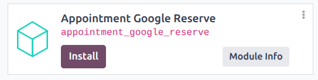
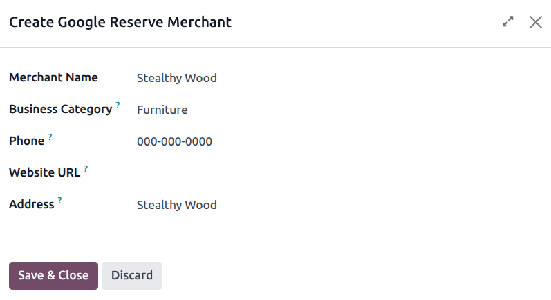

==========================
Google reserve integration
==========================

Google Reserve lets customers book appointments directly from Google Search, Google Maps, and the
Google Assistant. By connecting Odoo **Appointments** to Google Reserve, bookings are added directly
into Odoo without customers needing to visit the company website.

.. _appointments/google-reserve/setup:

Configuration
-------------

First, navigate to the :guilabel:`Apps` application. Then, remove the :guilabel:`Apps` filter from
the search bar and type in `Google`. Click :guilabel:`Install` on the :guilabel:`Appointment Google
Reserve` module.

Next, navigate to the :menuselection:`Appointments` application. Open an existing appointment type,
or click :guilabel:`New` to :ref:`create a new one <appointments/configure>`. Then click the
:guilabel:`Google Bookings` tab.

Click the :guilabel:`Google Reserve Merchant` field, and select an option from the drop-down, or
click :guilabel:`Create` to open the :guilabel:`Create Google Reserve Merchant` form.

On the form, enter all required information. The business address **must** match exactly what
appears on Google Maps. Click :guilabel:`Save & Close`.

Once the new merchant has been created, click :guilabel:`Synchronize with Google Reserve`. The
initial synchronization can take up to 24 hours to propagate to Google's systems.

.. important::
    Ensure that the business address matches the Google Maps listing precisely, including formatting
    and unit numbers. Mismatches may cause synchronization to fail or prevent the listing from
    appearing on Google.
