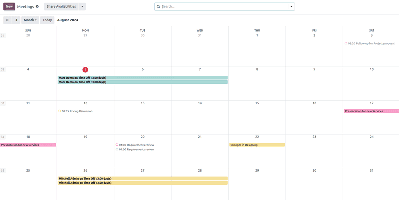
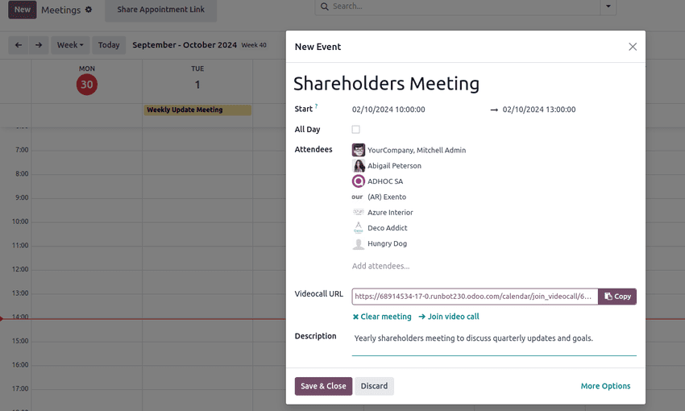
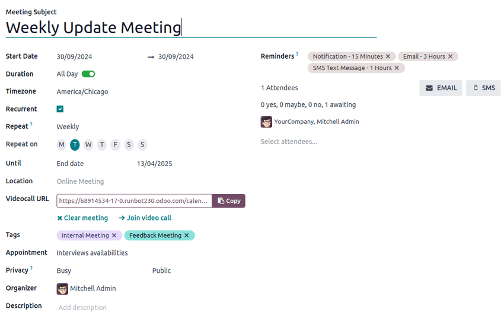
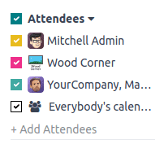
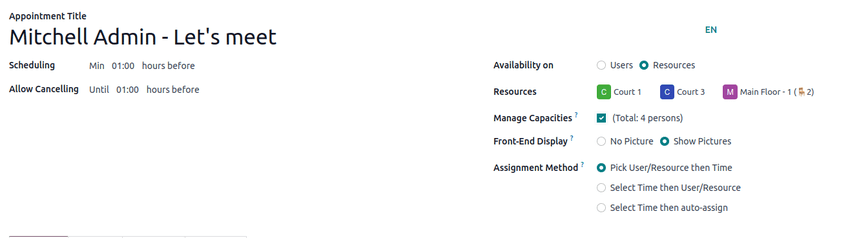

:show-content:

========
Calendar
========

Odoo **Calendar** is a scheduling app that allows users to integrate a company's business flow into
a single management platform. By integrating with the other apps in Odoo's ecosystem, **Calendar**
allows users to schedule and organize meetings, schedule events, plan employee appraisals,
coordinate projects, and more – all from the same platform.

Upon opening the :menuselection:`Calendar app`, users have an overview of their current meetings.
The selected view option appears as a :guilabel:`Day`, :guilabel:`Week`, :guilabel:`Month`, or
:guilabel:`Year` drop-down menu. Under the view options drop-down menu, users can also enable or
disable :guilabel:`Show weekends`.

.. tip::
   Depending on the selected view option, users can click the :icon:`oi-arrow-left`
   :icon:`oi-arrow-right` :guilabel:`(left or right arrow)` buttons to switch between days, weeks,
   etc., and switch back to the current day with the :guilabel:`Today` button.

Sync third-party calendars
--------------------------

Users can sync Odoo with existing :doc:`Outlook <calendar/outlook>` and/or
:doc:`Google <calendar/google>` calendars, by heading to
:menuselection:`Calendar app --> Configuration --> Settings`. From here, enter
:guilabel:`Client ID` and :guilabel:`Client Secret`. There is also an option to pause
synchronization by ticking the checkbox, or automating synchronization by keeping it blank.

Once the desired configurations are complete, be sure to click :guilabel:`Save` before moving on.

Events created in synced calendars automatically appear across the integrated platforms.

.. seealso::
   - :doc:`Synchronize Outlook calendar with Odoo <calendar/outlook>`
   - :doc:`Synchronize Google calendar with Odoo <calendar/google>`

Create activities from chatter
------------------------------

Instantly create new meetings anywhere in Odoo through an individual record's chatter, like
in a **CRM** opportunity card or task in the **Projects** app.

From the chatter, click on the :guilabel:`Activities` button. In the :guilabel:`Schedule Activity`
pop-up window, select the desired :guilabel:`Activity Type`, which populates a set of buttons,
depending on the activity.

Activities that involve other schedules, like :guilabel:`Meeting` or :guilabel:`Call for Demo`, link
to the **Calendar** app. Select one of these activities to link to the **Calendar** app, then hit
:guilabel:`Open Calendar` to navigate back to the app. Alternatively, it is also possible to
:guilabel:`Schedule & Mark as Done` to close out the activity, or select :guilabel:`Done & Schedule
Next` to keep the :guilabel:`Schedule Activity` window open to create another.

.. seealso::
   :doc:`Schedule activities in Odoo <../essentials/activities>`

Plan an event
-------------

To put an event on the calendar, open the :menuselection:`Calendar app`, and click into the target
date. On the :guilabel:`New Event` pop-up window that appears, start by adding the event title.

The target date auto-populates in the :guilabel:`Start` field. This can be changed by clicking
into the date section, and selecting a date from the calendar. For multi-day events, select the end
date in the second field, then click :guilabel:`Apply`.

Tick the :guilabel:`All Day` checkbox if there is no specific start or end time.

For events with specific start and stop times, ensure the :guilabel:`All Day` checkbox is unticked
to enable time selection. With the :guilabel:`All Day` checkbox unticked, time selections appear in
the :guilabel:`Start` field.

The signed-in user auto-populates as the first attendee. Additional :guilabel:`Attendees` can be
added or created from here, as well.

For virtual meetings, copy and paste the URL into the space provided in the
:guilabel:`Videocall URL` field. Or, click :icon:`fa-plus` :guilabel:`Odoo meeting` to create a
link.

Next, either create the event by clicking :guilabel:`Save & Close`, or select :guilabel:`More
Options` to further configure the event.

.. tip::
   Once the event is created, users can click into the virtual meeting directly from the calendar
   event to access more configuration options.

The :guilabel:`Description` field allows users to add additional information and details about the
meeting.

Click :guilabel:`More Options` to navigate to the meeting form, which provides additional
configurations for the event:

- :guilabel:`Duration`: Define the length of the meeting in :guilabel:`hours`, or toggle the
  :guilabel:`All Day` switch.
- :guilabel:`Recurrent`: Tick the checkbox to create a recurring meeting. Once selected, this
  opens new fields:

  - :guilabel:`Timezone`: Select the timezone for which this meeting time is specified.
  - :guilabel:`Repeat`: Select the recurring period of this meeting. Depending on what type of
    recurrence has been selected, a subsequent field appears, in which users can indicate when the
    meeting should recur. For example, if :guilabel:`Monthly` is selected as the :guilabel:`Repeat`
    option, a new field appears, in which the user decides on what :guilabel:`Day of Month` the
    meeting should recur.
  - :guilabel:`Until`: Select the limited :guilabel:`Number of repetitions` this meeting should
    recur, the :guilabel:`End date` of when the recurrences should stop, or if the meetings should
    recur :guilabel:`Forever`.
- :guilabel:`Tags`: Add tags to the event, like `Customer Meeting` or `Internal Meeting`. These can
  be searched and filtered in the **Calendar** app when organizing multiple events.
- :guilabel:`Appointment`: Link existing or new appointments. These can be configured through the
  :ref:`Share Availabilities <calendar/share-availabilities>` button from the main **Calendar**
  dashboard.
- :guilabel:`Privacy`: Toggle between visibility options to control who can view the event.
- :guilabel:`Organizer`: This is defaulted to the current Odoo user. Select a new one from
  existing users, or create and edit a new user.
- :guilabel:`Description`: Add additional information or details about the meeting.
- :guilabel:`Reminders`: Select notification options to send to attendees. Choose a default
  notification, or configure new reminders.

Coordinate with teams' availability
-----------------------------------

When scheduling an event for multiple users, on the **Calendar** app dashboard, tick the checkbox
next to :guilabel:`Attendees` to view team members' availability. Tick (or untick) the checkbox next
to listed users to show (or hide) individual calendars.

.. _calendar/share-availabilities:

Share Availabilities
--------------------

On the **Calendar** app main dashboard, click the :guilabel:`Share Availabilities` button at the top
of the page. Next, click and drag to select the available times and dates on the calendar to add
them as options in the invitation.

.. tip::
   To remove a selected time range, hover over the availability to click the :icon:`fa-trash`
   :guilabel:`(trash)` icon.

.. note::
   Within the :guilabel:`Share Availabilities` feature, selecting times is only possible on the
   *Day* calendar views.

Once availability has been selected, click the :icon:`fa-external-link` :guilabel:`Open` button to
navigate to the associated appointment.

Several configuration options are available on the appointment form:

In the :guilabel:`Scheduling` field, set a minimum hour window to ensure appointments are confirmed
a specified amount of time in advance. For example, set `01:00` to require attendees to confirm at
least one hour before their appointment time.

In the :guilabel:`Allow Cancelling` field, set a maximum hour window before the appointment that
attendees are able to cancel.

The :guilabel:`Availability on` field enables attendees to book :guilabel:`Users` or
:guilabel:`Resources`, such as meeting rooms or tables. After selecting :guilabel:`Users` or
:guilabel:`Resources`, type in the desired user or resource in the space below.

The :guilabel:`Front-End Display` field is used to choose :guilabel:`No Picture` or
:guilabel:`Show Pictures` related to the selected user or resource on the appointment page.

If :guilabel:`Resources` has been selected in the :guilabel:`Availability on` field, users have an
option to :guilabel:`Manage Capacities`.

Tick the checkbox to limit the maximum amount of people that can use the resource at the same time.

The :guilabel:`Assignment Method` field enables the order in which attendees book their time and
user/resource:

- :guilabel:`Pick User/Resource then Time`
- :guilabel:`Select Time then User/Resource`

If :guilabel:`Resources` has been selected in the :guilabel:`Availability On` field, a third option
is available, :guilabel:`Select Time then auto-assign`.

Optionally, configure the following tabs:

- :ref:`calendar/appointment-schedule`
- :ref:`calendar/appointment-options`
- :ref:`calendar/appointment-questions`
- :ref:`calendar/appointment-messages`

Click the :guilabel:`Preview` button to see how the appointment link looks for attendees.

Once the configurations are finished, click the :guilabel:`Share` button to generate a link to send
directly, or click :guilabel:`Publish` to publish the appointment selection on the connected Odoo
website.

.. _calendar/appointment-schedule:

Schedule tab
~~~~~~~~~~~~

In the :guilabel:`Schedule` tab of the appointment form, time slots can be managed. The target date
and time populate as the first time slots.

To add a new time slot, hit :guilabel:`Add a line`. Click into the new blank space under the
:guilabel:`From` field, then select and enter the new target start date and time, respectively.
Repeat under the new blank space under :guilabel:`To` to select and enter the new target end date
and time.

.. _calendar/appointment-options:

Options tab
~~~~~~~~~~~

The :guilabel:`Options` tab provides additional configurations:

- :guilabel:`Website`: Specify which website this meeting invitation will be published on.
- :guilabel:`Timezone`: This defaults to the company's timezone selected in the **Settings** app.
  To change the timezone, select the desired option from the drop-down menu.
- :guilabel:`Location`: Select or create new locations from the drop-down menu. If this field is
  left empty, the meeting is considered to be taking place online.
- :guilabel:`Videoconference Link`: Select from :guilabel:`Odoo Discuss` or :guilabel:`Google Meet`
  to include a video conference link in the meeting invitation, or leave it blank to prevent
  generating a meeting URL.
- :guilabel:`Manual Confirmation`: Only shown if :guilabel:`Resources` has been selected in the
  :guilabel:`Availability On` field. Tick the checkbox and enter a maximum percentage of the
  selected resource(s)' total capacity to create a manual confirmation requirement to finalize the
  meeting.
- :guilabel:`Up-front Payment`: Tick the checkbox to require users to pay before confirming their
  booking. Once this is ticked, a link appears to :icon:`oi-arrow-right` :guilabel:`Configure
  Payment Providers`, which enables online payments.
- :guilabel:`Limit to Work Hours`: If :guilabel:`Users` has been selected in the
  :guilabel:`Availability On` field, tick the checkbox to limit meeting time slots to the selected
  :doc:`users' working hours <../hr/employees/new_employee>`.
- :guilabel:`Create Opportunities`: When this is selected, each scheduled appointment creates
  a new **CRM** opportunity.
- :guilabel:`Reminders`: Add or delete notification reminders in this field. Select the blank space
  for additional options.
- :guilabel:`Confirmation Email`: Tick the checkbox to automatically send a confirmation email to
  attendees once the meeting is confirmed. Select from the email templates or click
  :guilabel:`Search More...`, then :guilabel:`New` to create a custom template.
- :guilabel:`Cancelation Email`: Tick the checkbox to automatically send a cancelation email to
  attendees if the meeting is canceled. Select from the email templates or click
  :guilabel:`Search More...`, then :guilabel:`New` to create a custom template.
- :guilabel:`CC to`: Add contacts to be notified of meeting updates in this field, regardless if
  they attend the meeting.
- :guilabel:`Allow Guests`: Tick the checkbox to allow attendees to invite guests.

.. _calendar/appointment-questions:

Questions tab
~~~~~~~~~~~~~

In the :guilabel:`Questions` tab, add questions for the attendee to answer when confirming their
meeting. Click :guilabel:`Add a line` to configure a :guilabel:`Question`. Then select a
:guilabel:`Question Type`, optionally add a :guilabel:`Placeholder` answer, and choose whether it is
a :guilabel:`Required Answer`.

To learn how to create more comprehensive questionnaires, head to the **Survey** app
documentation on :doc:`creating and configuring data-capturing questions
<../marketing/surveys/questions>`.

.. _calendar/appointment-messages:

Messages tab
~~~~~~~~~~~~

In the :guilabel:`Introduction Message` field of the :guilabel:`Messages` tab, add additional
meeting information that appears on the invitation.

Information added to the :guilabel:`Extra Message on Confirmation` field appears once the meeting is
confirmed.

.. toctree::
   :titlesonly:

   calendar/outlook
   calendar/google
