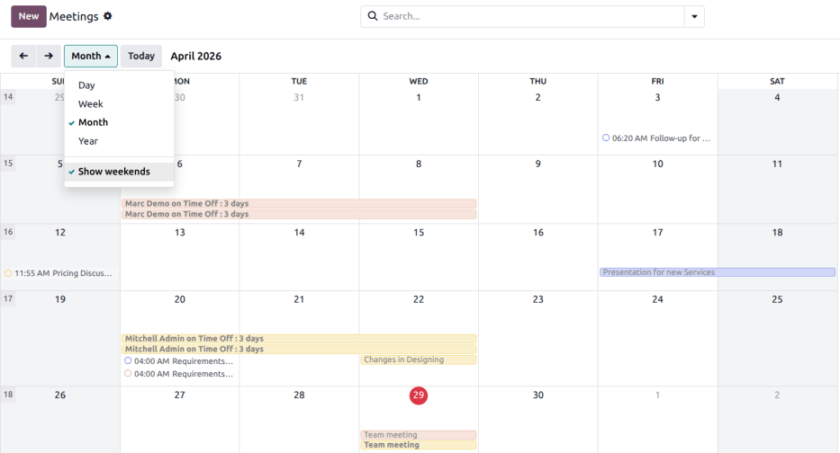
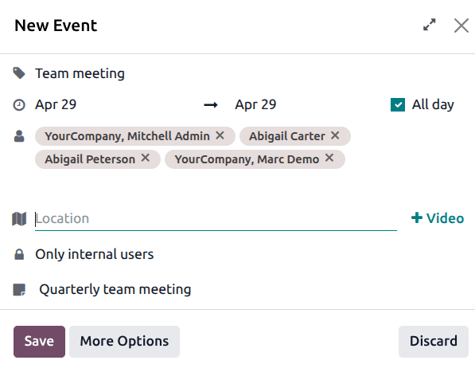
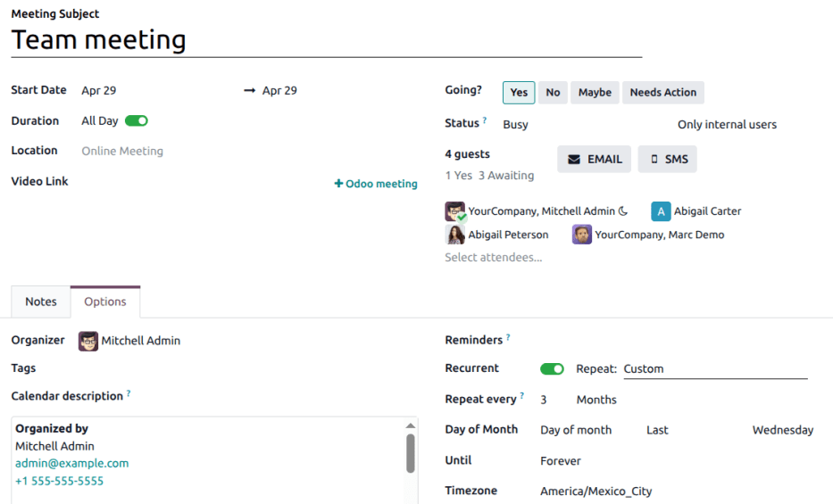
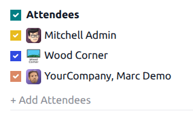
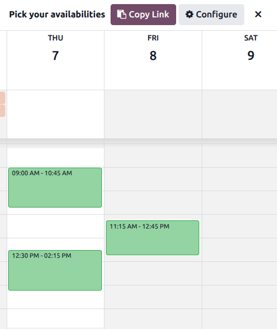
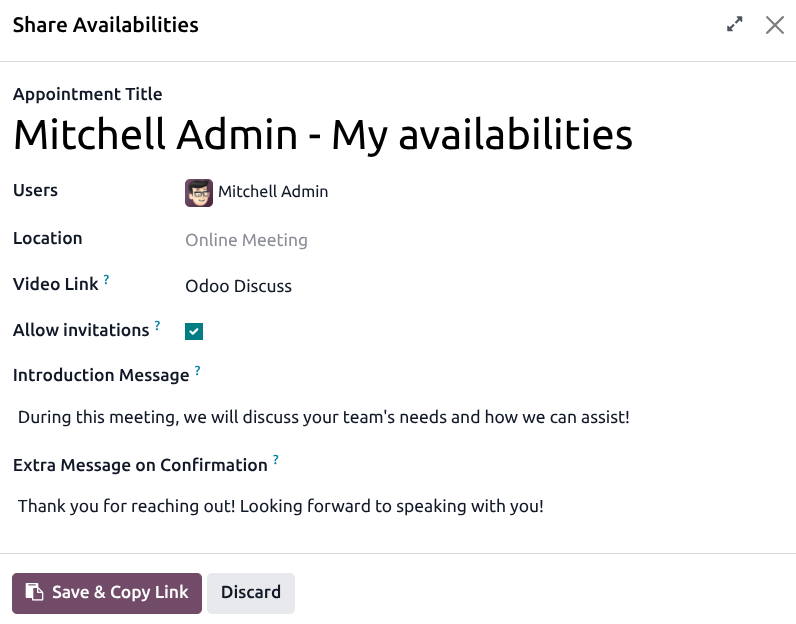

:show-content:

========
Calendar
========

Odoo **Calendar** is a scheduling app that allows users to integrate a company's business flow into
a single management platform. By integrating with the other apps in Odoo's ecosystem, **Calendar**
allows users to schedule and organize meetings, schedule events, plan employee appraisals,
coordinate projects, and more.

Upon opening the :menuselection:`Calendar app`, users have an overview of their current meetings.
The selected view option appears as a :guilabel:`Day`, :guilabel:`Week`, :guilabel:`Month`, or
:guilabel:`Year` drop-down menu. Under the view options drop-down menu, users can also enable or
disable :guilabel:`Show weekends`.

.. tip::
   Depending on the selected view option, users can click the :icon:`oi-arrow-left`
   :icon:`oi-arrow-right` :guilabel:`(left or right arrow)` buttons to switch between days, weeks,
   etc., and switch back to the current day with the :guilabel:`Today` button.

Sync third-party calendars
--------------------------

Users can sync Odoo with existing :doc:`Outlook <calendar/outlook>` and/or :doc:`Google
<calendar/google>` calendars, by heading to :menuselection:`Calendar app --> Configuration -->
Settings`. From here, enter :guilabel:`Client ID` and :guilabel:`Client Secret`. There is also an
option to pause synchronization by ticking the checkbox, or automating synchronization by keeping it
blank.

Once the desired configurations are complete, click :guilabel:`Save` before moving on.

Events created in synced calendars automatically appear across the integrated platforms.

.. seealso::
   - :doc:`Synchronize Outlook calendar with Odoo <calendar/outlook>`
   - :doc:`Synchronize Google calendar with Odoo <calendar/google>`

Create activities from chatter
------------------------------

Instantly create new meetings anywhere in Odoo through an individual record's chatter, like in a
**CRM** opportunity card or task in the **Project** app.

From the chatter, click on the :guilabel:`Activity` button. In the :guilabel:`Schedule Activity`
pop-up window, select the desired :guilabel:`Activity Type`, which populates a set of buttons,
depending on the activity.

Activities that involve other schedules, like :guilabel:`Meeting` or :guilabel:`Call for Demo`, link
to the **Calendar** app. Select one of these activities to link to the **Calendar** app, then hit
:guilabel:`Schedule` to navigate back to the app.

.. seealso::
   :doc:`Schedule activities in Odoo <../essentials/activities>`

Plan an event
-------------

To put an event on the calendar, open the :menuselection:`Calendar app`, and click into the target
date. On the :guilabel:`New Event` pop-up window that appears, start by adding the event title.

The target date auto-populates in the :guilabel:`Start` field. This can be changed by clicking into
the date section, and selecting a date from the calendar. For multi-day events, select the end date
in the second field, then click :guilabel:`Apply`.

Tick the :guilabel:`All Day` checkbox if there is no specific start or end time.

For events with specific start and stop times, ensure the :guilabel:`All Day` checkbox is unticked
to enable time selection. With the :guilabel:`All Day` checkbox unticked, time selections appear in
the :guilabel:`Start` field.

The signed-in user auto-populates as the first attendee. Additional :guilabel:`Attendees` can be
added or created from here, as well.

For virtual meetings, copy and paste the URL into the space provided in the :guilabel:`Videocall
URL` field. Or, click :icon:`fa-plus` :guilabel:`Video` to create a link.

Next, either create the event by clicking :guilabel:`Save & Close`, or select :guilabel:`More
Options` to further configure the event.

.. tip::
   Once the event is created, users can click into the virtual meeting directly from the calendar
   event to access more configuration options.

The :guilabel:`Description` field allows users to add additional information and details about the
meeting.

Click :guilabel:`More Options` to navigate to the meeting form, which provides additional
configurations for the event:

- :guilabel:`Duration`: Define the length of the meeting in :guilabel:`hours`, or toggle the
  :guilabel:`All Day` switch.
- :guilabel:`Organizer`: This is defaulted to the current Odoo user. Select a new one from existing
  users, or create and edit a new user.
- :guilabel:`Tags`: Add tags to the event, like `Customer Meeting` or `Internal Meeting`. These can
  be searched and filtered in the **Calendar** app when organizing multiple events.
- :guilabel:`Calendar description`: Add additional information or details about the meeting.
- :guilabel:`Reminders`: Select notification options to send to attendees. Choose a default
  notification, or configure new reminders.
- :guilabel:`Recurrent`: Tick the checkbox to create a recurring meeting. Once selected, this opens
  new fields:

  - :guilabel:`Repeat`: Select the recurring period of this meeting. Depending on what type of
    recurrence has been selected, a subsequent field appears, in which users can indicate when the
    meeting should recur. For example, if :guilabel:`Monthly` is selected as the :guilabel:`Repeat`
    option, a new field appears, in which the user decides on what :guilabel:`Day of Month` the
    meeting should recur.
  - :guilabel:`Until`: Select the limited :guilabel:`Number of repetitions` this meeting should
    recur, the :guilabel:`End date` of when the recurrences should stop, or if the meetings should
    recur :guilabel:`Forever`.
  - :guilabel:`Timezone`: Select the timezone for which this meeting time is specified.

Coordinate with teams' availability
-----------------------------------

When scheduling an event for multiple users, on the **Calendar** app dashboard, tick the checkbox
next to :guilabel:`Attendees` to view team members' availability. Tick (or untick) the checkbox next
to listed users to show (or hide) individual calendars.

.. _calendar/share-availabilities:

Share Availabilities
--------------------

On the **Calendar** app main dashboard, click the :guilabel:`Share` button at the top of the page,
then select :guilabel:`Specific Slots` from the drop-down. Next, click and drag to select the
available times and dates on the calendar to add them as options in the invitation.

.. tip::
   To remove a selected time range, hover over the availability to click the :icon:`fa-trash`
   :guilabel:`(trash)` icon.

Once availability has been selected, click :icon:`fa-clipboard` :guilabel:`Copy Link` to copy a
sharable link to the clipboard. Or, click :icon:`fa-cog` :guilabel:`Configure` icon button to
navigate to the associated appointment.

On the **Share Availabilities** form, enter an :guilabel:`Appointment Title`. Confirm the correct
user is selected in the :guilabel:`Users` field. To add a meeting room to the appointment, click the
:guilabel:`Location` field.

.. note::
   If nothing is selected in the :guilabel:`Location` field, the appointment defaults to an *Online
   Meeting*.

In the :guilabel:`Video Link` field, select the type of video call link that will be used for the
generated appointments. If this field is left blank, no meeting URLs will be created.

To allow attendees to invite others to the event, tick the :guilabel:`Allow invitations` checkbox.

Add a message in the :guilabel:`Introduction Message` field. This is used as a description for the
event. Add a message to the :guilabel:`Extra Message on Confirmation` field to be displayed after
the appointment is booked.

Click :icon:`fa-clipboard` :guilabel:`Save & Copy Link`. To futher customize the appointment, click
the :icon:`fa-expand` :guilabel:`(expand)` icon at the top of the pop-up window.

Click the :guilabel:`Preview` button to see how the appointment link looks for attendees.

Optionally, configure the following tabs:

- :ref:`calendar/appointment-schedule`
- :ref:`calendar/appointment-questions`
- :ref:`calendar/appointment-messages`
- :ref:`calendar/appointment-options`

Once the configurations are finished, click the :guilabel:`Share` button to generate a link to send
directly, or click :guilabel:`Publish` to publish the appointment selection on the connected Odoo
website.

.. _calendar/appointment-schedule:

Availabilites tab
~~~~~~~~~~~~~~~~~

In the :guilabel:`Availabilites` tab of the appointment form, time slots can be managed. The target
date and time populate as the first time slots.

To add a new time slot, click :guilabel:`Add a line`. Click into the new blank space under the
:guilabel:`From` field, then select and enter the new target start date and time, respectively.
Repeat under the new blank space under :guilabel:`To` to select and enter the new target end date
and time.

.. _calendar/appointment-questions:

Questions tab
~~~~~~~~~~~~~

In the :guilabel:`Questions` tab, add questions for the attendee to answer when confirming their
meeting. Click :guilabel:`Add a line` to configure a :guilabel:`Question`. Then select a
:guilabel:`Question Type`, optionally add a :guilabel:`Placeholder` answer, and choose whether it is
meeting. Click :guilabel:`Add a line` to configure a :guilabel:`Question`. Then select an
:guilabel:`Answer Type`, optionally add a placeholder :guilabel:`Answer`, and choose whether it is
:guilabel:`Mandatory`.

To learn how to create more comprehensive questionnaires, head to the **Survey** app documentation
on :doc:`creating and configuring data-capturing questions <../marketing/surveys/questions>`.

.. _calendar/appointment-messages:

Communication tab
~~~~~~~~~~~~~~~~~

In the :guilabel:`Introduction Page` field of the :guilabel:`Communication` tab, add additional
meeting information to appear on the invitation.

Information added to the :guilabel:`Confirmation Page` field appears once the meeting is confirmed.

Under the *Emails & SMS* heading, click the :guilabel:`Reminders` field to add one or more methods
of reminding attendees about the appointment. Under the :guilabel:`Booking Email` field, and
:guilabel:`Cancellation Email` field, select an email template to be sent to attendees when booking
or cancelling meetings.

.. _calendar/appointment-options:

Options tab
~~~~~~~~~~~

The :guilabel:`Options` tab provides additional configurations:

- :guilabel:`Allow invitations`: Tick the checkbox to allow attendees to invite guests.
- :guilabel:`Auto Confirm`: Only shown if :guilabel:`Resources` has been selected in the
  :guilabel:`Availability On` field. Tick the checkbox and enter a maximum percentage of the
  selected resource(s)' total capacity to create a manual confirmation requirement to finalize the
  meeting.
- :guilabel:`Display pictures`: Tick the checkbox to display user or resource images across the
  entire booking flow.
- :guilabel:`Create Opportunity`: When this is selected, each scheduled appointment creates a new
  **CRM** opportunity.
- :guilabel:`Up-front Payment`: Tick the checkbox to require users to pay before confirming their
  booking. Once this is ticked, a link appears to :icon:`oi-arrow-right` :guilabel:`Configure
  Payment Providers`, which enables online payments.
- :guilabel:`Website`: Specify which website this meeting invitation will be published on.
- :guilabel:`Schedule`: Select :guilabel:`Weekly` or :guilabel:`Flexible` scheduling.
- :guilabel:`Allow Bookings`: set a minimum hour window to ensure appointments are confirmed a
  specified amount of time in advance. For example, set `01:00` to require attendees to confirm at
  least one hour before their appointment time.
- :guilabel:`Cancellation`: set a maximum hour window before the appointment that attendees are able
  to cancel.
- :guilabel:`Timezone`: This defaults to the company's timezone selected in the **Settings** app. To
  change the timezone, select the desired option from the drop-down menu.

.. toctree::
   :titlesonly:

   calendar/outlook
   calendar/google
