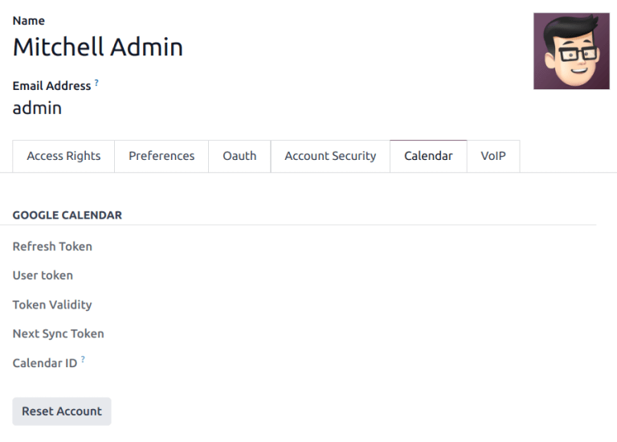
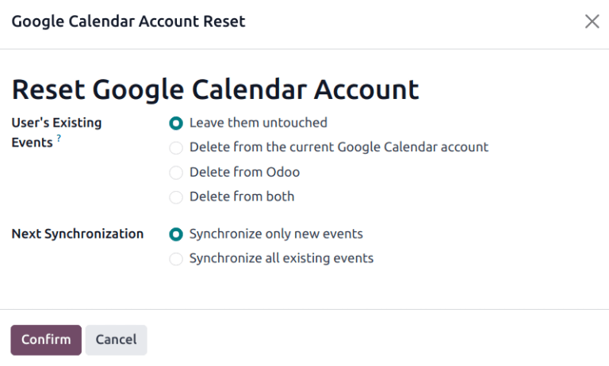
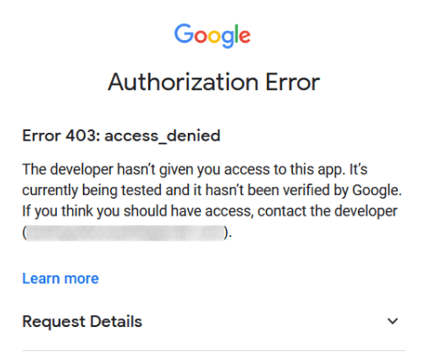
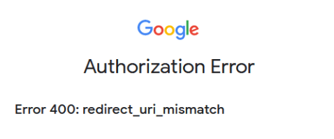

=====================================
Synchronize Google calendar with Odoo
=====================================

Synchronize Google Calendar with Odoo to see and manage meetings from both platforms (updates go in
both directions). This integration helps organize schedules, so a meeting is never missed.

.. seealso::
   - :doc:`/applications/general/users/google`
   - :doc:`/applications/general/email_communication/google_oauth`

Setup in Google
===============

Select (or create) a project
----------------------------

Create a new Google API project and enable the Google Calendar API. First, go to the `Google API
Console <https://console.developers.google.com>`_ and log into the Google account.

.. note::
   If this is the first time visiting this page, Google will prompt the user to enter a country and
   agree to the Terms of Service. Select a country from the drop-down list and agree to the
   :abbr:`ToS (Terms of Service)`.

Next, click :guilabel:`Select a project` and select (or create) an API project to configure OAuth
in, and store credentials. Click :guilabel:`New Project`.

.. image:: google/new-api-project.png
   :align: center
   :alt: Create a new API project to store credentials.

.. tip::
   Give the API Project a clear name, like "Odoo Sync", so it can be easily identified.

Enable Google calendar API
--------------------------

Now, click on :guilabel:`Enabled APIs and Services` in the left menu. Select :guilabel:`Enabled APIs
and Services` again if the :guilabel:`Search bar` doesn't appear.

.. image:: google/enable-apis-services.png
   :align: center
   :alt: Enable APIs and Services on the API Project.

After that, search for `Google Calendar API` using the search bar and select :guilabel:`Google
Calendar API` from the search results. Click :guilabel:`Enable`.

.. image:: google/enable-google-cal-api.png
   :align: center
   :alt: Enable the Google Calendar API.

OAuth consent screen
--------------------

Now that the API project has been created, OAuth should be configured. To do that, click on
:guilabel:`OAuth consent` in the left menu and then select the :guilabel:`User Type`.

.. warning::
   *Personal* Gmail Accounts are only allowed to be **External** User Type, which means Google may
   require an approval, or for *Scopes* to be added on. However, using a *Google WorkSpace* account
   allows for **Internal** User Type to be used.

   Note, as well, that while the API connection is in the *External* testing mode, then no approval
   is necessary from Google. User limits in this testing mode is set to 100 users.

In the second step, :guilabel:`OAuth Consent Screen`, type `Odoo` in the :guilabel:`App name` field,
select the email address for the :guilabel:`User support email` field, and type the email address
for the :guilabel:`Developer contact information` section. Then, click :guilabel:`Save and
Continue`.

Skip the third step, :menuselection:`Scopes`, by clicking :guilabel:`Save and Continue`.

Next, if continuing in testing mode (External), add the email addresses being configured under the
:guilabel:`Test users` step, by clicking on :guilabel:`Add Users`, and then the :guilabel:`Save and
Continue` button. A summary of the app registration appears.

Finally, scroll to the bottom, and click on :guilabel:`Back to Dashboard`.

Now, the OAuth consent has been configured, and it's time to create credentials.

Create credentials
------------------

The *Client ID* and the *Client Secret* are both needed to connect Google Calendar to Odoo. This is
the last step in the Google console. Begin by clicking :guilabel:`Credentials` in the left menu.
Then, click :guilabel:`Create Credentials`, and select :guilabel:`OAuth client ID`, Google will open
a guide to create credentials.

Under :menuselection:`Create OAuth Client ID`, select :guilabel:`Website application` for the
:guilabel:`Application Type` field, and type `My Odoo Database` for the :guilabel:`Name`.

- Under the :guilabel:`Authorized JavaScript Origins` section, click :guilabel:`+ Add URI` and type
  the company's Odoo full :abbr:`URL (Uniform Resource Locator)` address.
- Under the :guilabel:`Authorized redirect URIs` section, click :guilabel:`+ Add URI` and type the
  company's Odoo :abbr:`URL (Uniform Resource Locator)` address followed by
  `/google_account/authentication`. Finally, click :guilabel:`Create`.

.. image:: google/uri.png
   :align: center
   :alt: Add the authorized JavaScript origins and the authorized redirect URIs.

A :guilabel:`Client ID` and :guilabel:`Client Secret` will appear, copy these to a notepad.

Setup in Odoo
=============

Once the *Client ID* and the *Client Secret* are located, open the Odoo database and go to
:menuselection:`Settings --> General Settings --> Integrations --> Google Calendar`. Check the box
next to :guilabel:`Google Calendar`.

.. image:: google/settings-google-cal.png
   :align: center
   :alt: The Google Calendar checkbox in General Settings.

Next, copy and paste the *Client ID* and the *Client Secret* from the Google Calendar API
credentials page into their respective fields below the :guilabel:`Google Calendar` checkbox. Then,
click :guilabel:`Save`.

Sync calendar in Odoo
=====================

Finally, open the :menuselection:`Calendar` app in Odoo and click on the :guilabel:`Google` sync
button to sync Google Calendar with Odoo.

.. image:: google/sync-google.png
   :align: center
   :alt: Click the Google sync button in Odoo Calendar to sync Google Calendar with Odoo.

.. note::
   When syncing Google Calendar with Odoo for the first time, the page will redirect to the Google
   Account. From there, select the :guilabel:`Email Account` that should have access, then select
   :guilabel:`Continue` (should the app be unverifed), and finally select :guilabel:`Continue` (to
   give permission for the transfer of data)`.

.. image:: google/trust-odoo.png
   :align: center
   :alt: Give Odoo permission to access Google Calendar.

Now, Odoo Calendar is successfully synced with Google Calendar!

.. warning::
   Odoo highly recommends testing the Google calendar synchronization on a test database and a test
   email address (that is not used for any other purpose) before attempting to sync the desired
   Google Calendar with the user's production database.

   Once a user synchronizes their Google calendar with the Odoo calendar:

   - Creating an event in Odoo causes Google to send an invitation to all event attendees.
   - Deleting an event in Odoo causes Google to send a cancellation to all event attendees.
   - Adding a contact to an event causes Google to send an invitation to all event attendees.
   - Removing a contact from an event causes Google to send a cancellation to all event attendees.

   Events can be created in *Google Calendar* without sending a notification by selecting
   :guilabel:`Don't Send` when prompted to send invitation emails.

Troubleshoot sync
=================

There may be times when the *Google Calendar* account does not sync correctly with Odoo. Sync issues
can be seen in the database logs.

In these cases, the account needs troubleshooting. A reset can be performed using the
:guilabel:`Reset Account` button, which can be accessed by navigating to :menuselection:`Settings
app --> Manage Users`. Then, select the user to modify the calendar, and click the
:guilabel:`Calendar` tab.

Next, click :guilabel:`Reset Account` under the correct calendar.

Reset options
-------------

The following reset options are available for troubleshooting Google calendar sync with Odoo:

:guilabel:`User's Existing Events`:

 - :guilabel:`Leave them untouched`: no changes to the events.
 - :guilabel:`Delete from the current Google Calendar account`: delete the events from *Google
   Calendar*.
 - :guilabel:`Delete from Odoo`: delete the events from the Odoo calendar.
 - :guilabel:`Delete from both`: delete the events from both *Google Calendar* and Odoo calendar.

:guilabel:`Next Synchronization`:

 - :guilabel:`Synchronize only new events`: sync new events on *Google Calendar* and/or Odoo
   calendar.
 - :guilabel:`Synchronize all existing events`: sync all events on *Google Calendar* and/or Odoo
   calendar.

Click :guilabel:`Confirm` after making the selection to modify the user's events and the calendar
synchronization.

Google OAuth FAQ
================

At times there can be misconfigurations that take place, and troubleshooting is needed to resolve
the issue. Below are the most common errors that may occur when configuring the *Google Calendar*
for use with Odoo.

Production vs. testing publishing status
----------------------------------------

Choosing :guilabel:`Production` as the :guilabel:`Publishing Status` (instead of
:guilabel:`Testing`) displays the following warning message:

`OAuth is limited to 100 sensitive scope logins until the OAuth consent screen is verified. This may
require a verification process that can take several days.`

To correct this warning, navigate to the `Google API Platform
<https://console.cloud.google.com/apis/credentials/consent>`_. If the :guilabel:`Publishing Status`
is :guilabel:`In Production`, click :guilabel:`Back to Testing` to correct the issue.

No test users added
-------------------

If no test users are added to the :guilabel:`OAuth consent screen`, then an :guilabel:`Error 403:
access_denied` populates.

To correct this error, return to the :guilabel:`OAuth consent screen`, under :guilabel:`APIs &
Services`, and add test users to the app. Add the email to be configured in Odoo.

Application Type
----------------

When creating the credentials (OAuth *Client ID* and *Client Secret*), if :guilabel:`Desktop App` is
selected for the :guilabel:`Application Type`, an :guilabel:`Authorization Error` appears
(:guilabel:`Error 400:redirect_uri_mismatch`).

To correct this error, delete the existing credentials, and create new credentials, by selecting
:guilabel:`Web Application` for the :guilabel:`Application Type`.

Then, under :guilabel:`Authorized redirect URIs`, click :guilabel:`ADD URI`, and type:
`https://yourdbname.odoo.com/google_account/authentication` in the field, being sure to replace
*yourdbname* in the URL with the **real** Odoo database name.

.. tip::
   Ensure that the domain (used in the URI:
   `https://yourdbname.odoo.com/google_account/authentication`) is the exact same domain as
   configured in the `web.base.url` system parameter.

   Access the `web.base.url` by activating :ref:`developer mode <developer-mode>`, and navigating to
   :menuselection:`Settings app --> Technical header menu --> Parameters section --> System
   Parameters`.
