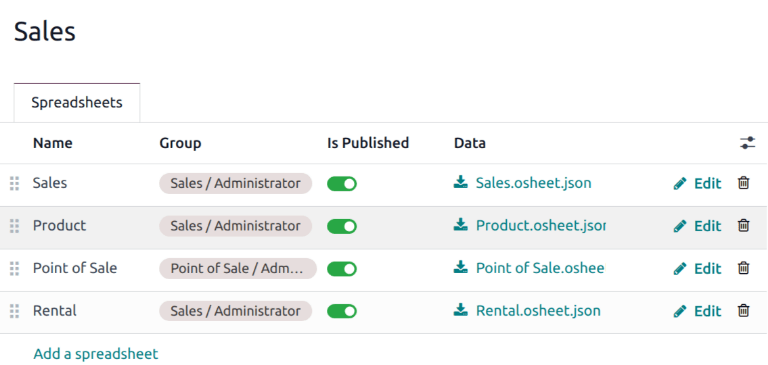
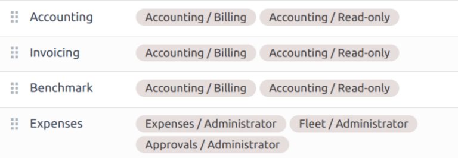

==========
Dashboards
==========

The **Dashboards** application displays data collated from spreadsheets in a read-only format. It
also allows users to create a custom dashboard that displays data from various applications. These
dashboards can be customized for individual users based on visibility settings, and the apps that
are installed.

.. note::
   The main **Spreadsheet dashboard** app, is automatically installed with most databases. To allow
   users to customize their own dashboards, the **Dashboards** app must be :ref:`installed
   <general/install>`.

   .. figure:: dashboards/dashboards-module.png
      :align: center
      :alt: The Dashboards module in the Apps menu.

      The **Dashboards** application, which allows for individuals to add their own customized
      dashboards.

Structure
=========

On the main dashboards page, the

Configuration
=============

Navigate to :menuselection:`Dashboards --> Configuration --> Dashboards`. This opens a list of
preconfigured dashboards. Click a dashboard from the list to open its details form. The details form
includes a list of spreadsheets with data from specific applications.

.. note::
   The dashboards listed on this page, and the default spreadsheets included on each dashboard may
   vary, depending on the applications that are installed on the database, and the features that are
   enabled.

   - :guilabel:`Sales`: data from the **Sale**, **Rental**, and **Point of Sale** apps.
   - :guilabel:`Subscriptions`: data from the **Subscriptions** app.
   - :guilabel:`CRM`: data from the **CRM** app.
   - :guilabel:`Finance`: data from the **Accounting**, **Invoicing**, and **Expenses** apps.
   - :guilabel:`Logistics`: data from the **Purchase**, **Inventory**, and **MRP** apps.
   - :guilabel:`Services`: data from the **Project**, **Timesheets**, and **Helpdesk** apps.
   - :guilabel:`Marketing`: data from the **Events** apps.
   - :guilabel:`Website`: data from the **Live Chat**, **eCommerce**, and **eLearning** apps.
   - :guilabel:`Human Resources`: data from the **Employees**, **Payroll**, and **Recruitment**
     apps.

To add a new spreadsheet to a dashboard, or to create a new :doc:`spreadsheet <spreadsheet/insert>`,
click :guilabel:`Add a spreadsheet`.

.. warning::
   After a spreadsheet is added to a dashboard, it is no longer accessible through the **Documents**
   app. The spreadsheet can still be edited by clicking the :icon:`fa-pencil` :guilabel:`Edit` icon.

Assign permissions
------------------

Access to individual spreadsheets is controlled on a :ref:`groups <access-rights/groups>` level. To
provide access to a spreadsheet, click the :guilabel:`Group` field for a spreadsheet, and select a
group from the drop-down list. Multiple groups can be selected in the :guilabel:`Group` field.

.. seealso::
   - :doc:`Spreadsheets <spreadsheet>`
   - :doc:`Documents <documents>`

