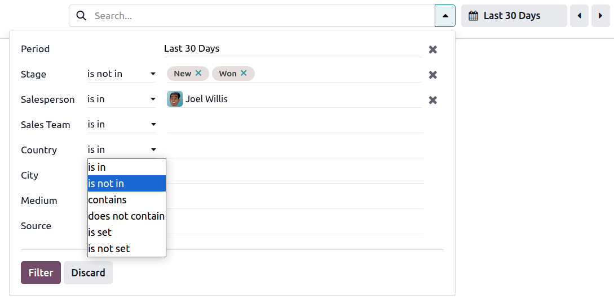

:show-content:

==========
Dashboards
==========

.. toctree::
   :titlesonly:

   dashboards/build_and_customize_dashboards
   dashboards/my_dashboard

**Odoo Dashboards** allows you to consult, interact with, customize, and build interactive
dashboards that display real-time data from your Odoo database in an easy-to-understand way. By
centralizing data from various Odoo sources in a single location, dashboards provide an overview of
key business metrics that can help you monitor business performance and make informed decisions.

:doc:`Odoo spreadsheets <../../applications/productivity/spreadsheet>` serve as the foundation for
dashboards, with tables and charts used to structure and visualize dynamic Odoo data. :ref:`Data
sources <spreadsheet/insert/data-sources>` connect a dashboard's underlying spreadsheet to your
database, ensuring the most recent data is retrieved every time the dashboard is opened or
refreshed.

With Odoo Dashboards, users can, depending on their :ref:`access rights
<dashboards/access-and-sharing>`:

- :ref:`consult and interact with dashboards <dashboards/use-dashboards>`, including
  :ref:`standard, pre-configured dashboards <dashboards/standard>`
- use :ref:`global filters <dashboards/use-dashboards/global-filters>` to filter all the data shown
  on a dashboard
- :ref:`share a snapshot of a dashboard <dashboards/access-and-sharing>` with internal users who do
  not have the appropriate access rights or with external users
- :doc:`build custom dashboards
  <../../applications/productivity/dashboards/build_and_customize_dashboards>` using Odoo
  Spreadsheet
- :ref:`customize dashboards <build_and_customize_dashboards/customize>` to modify what data is
  shown, the layout, or the filters available
- :ref:`manage access rights <dashboards/access-and-sharing>` to dashboards
- centralize frequently consulted Odoo views in a personal
  :doc:`../../applications/productivity/dashboards/my_dashboard`

.. tip::
   - Once a spreadsheet has been converted into a dashboard, it can only be accessed via the
     Dashboards app.
   - Unlike other Odoo dashboards, :guilabel:`My Dashboard` is not based on Odoo Spreadsheet, but
     rather on :doc:`Odoo views <../studio/views>`.

.. _dashboards/use-dashboards:

Use dashboards
==============

When the Dashboards app is opened, the left panel lists all :ref:`standard, pre-configured
dashboards <dashboards/standard>` and :doc:`custom-built dashboards
<dashboards/build_and_customize_dashboards>` to which a user has been :ref:`granted access
<dashboards/access-and-sharing>`, grouped by section.

Clicking on a dashboard name opens that dashboard in the main view.

.. tip::
   - Click the :icon:`fa-angle-double-left` :guilabel:`(double chevron)` icon at the top of the
     left panel to collapse the left panel, maximizing the space available for dashboards.
   - Mark a dashboard as a favorite by clicking the :icon:`fa-star` :guilabel:`(Toggle favorite)`
     icon in the upper-right corner. Favorited dashboards are grouped in a :guilabel:`Favorites`
     section at the top of the left panel for easy access.

.. _dashboards/use-dashboards/filter-sort:

Filter and sort data
--------------------

Filtering and sorting allow you to manage what data is displayed and how it is displayed. This can
help tailor the view to answer specific business questions.

- :ref:`Filtering <dashboards/use-dashboards/global-filters>` limits the data presented in charts and
  tables, allowing you to focus only on records that meet specific criteria,  e.g., viewing sales
  data only for a specific sales team.
- :ref:`Sorting <dashboards/use-dashboards/sort>` reorders the data presented in table columns,
  allowing you to see the data from different perspectives, e.g., viewing products by sales revenue
  from highest to lowest.

.. _dashboards/use-dashboards/global-filters:

Apply filters
~~~~~~~~~~~~~

If :doc:`global filters <spreadsheet/global_filters>` are available for a dashboard, a search bar
above the dashboard allows you to filter the entire dashboard for the selected values.

.. tip::
   - Global filters are available for all :ref:`standard dashboards <dashboards/standard>`.
     Additional :doc:`global filters can be added <spreadsheet/global_filters>` by a user with the
     appropriate :ref:`access rights <dashboards/access-and-sharing/customize-configure-build>`.
   - It is also possible to :ref:`search for values <search/values>` by typing directly in the
     search bar; the search categories shown reflect the available global filters.

To apply global filters:

#. Click within the search bar or click on the :icon:`fa-caret-down` :guilabel:`(dropdown)` icon to
   access all filters available for that dashboard.
#. For the relevant filter, select a conditional operator from the first dropdown, e.g.,
   :guilabel:`is in`, then select the desired value from the second dropdown.
#. Click :guilabel:`Filter`.

For dashboards with a date filter, this filter can be set via the search bar or via the button
with the :icon:`fa-calendar` :guilabel:`(calendar)` icon.

.. tip:: The :guilabel:`Custom Range` at the bottom of the period selector shows either a manually
   entered custom range, if relevant, or the start and end date of the selected period.

To remove a value from a filter, click the :icon:`fa-times` :guilabel:`(remove)` icon beside the
name of the value; to empty a filter, click the :icon:`fa-times` :guilabel:`(remove)` icon at the
far right of the filter.

.. _dashboards/use-dashboards/sort:

Sort data
~~~~~~~~~

Depending on the dashboard and the table in question, it may be possible to sort the data by column,
by clicking the column heading. A :icon:`fa-caret-down` :guilabel:`(caret down)` or
:icon:`fa-caret-up` :guilabel:`(caret up)` icon beside a column heading indicates that the column
has been sorted in descending or ascending order, respectively. If, when hovering over other column
headings, a :icon:`fa-sort` :guilabel:`(sort)` icon appears, the column can be sorted.

.. tip::
   If conditional formatting has been applied to a table, the original formatting is maintained when
   the table is resorted by a different column.

   .. example::
      In this example, the table was originally sorted by revenue per CRM tag, in decreasing
      order. Conditional formatting was defined to visualize the proportional revenue using data
      bars. When the table is resorted by number of leads in descending order, the data bars still
      reflect the revenue per tag in decreasing order.

      .. image:: dashboards/sorting-data-bars.png
         :alt: Sorting a table with conditional formatting using data bars
         :scale: 80%

.. _dashboards/use-dashboards/underlying-data:

Access underlying records
-------------------------

While dashboards provide a user-friendly summary of key data, drilling down to the underlying data
allows a more detailed analysis. This can be useful for investigating anomalies or providing the
full context needed for decision-making.

- **Open underlying database records**: To access database records referenced by a dashboard, click
  on the relevant value in a table or on a data point on a chart. Doing so opens either the
  individual record, or, in the case of charts or tables displaying consolidated data, a list of the
  referenced records.

- **Open underlying database views**: To access the view from which the data for a specific chart
  or table is retrieved, click on the title of the chart or table. Doing so opens the corresponding
  list view, pivot view or graph view.

.. tip::
   To return to a dashboard after drilling down to underlying records or views, click the
   :guilabel:`Dashboards` breadcrumb in the upper-left corner.

.. _dashboards/use-dashboards/charts:

Expand, copy or download charts
-------------------------------

To see charts in full screen, hover over a chart and click the :icon:`fa-expand` icon.

It is also possible to copy or download a chart by hovering over the chart and clicking the
:icon:`fa-ellipsis-v` (vertical ellipsis) icon, then clicking :icon:`os-copy-as-image`
:guilabel:`Copy as image` or :icon:`fa-download` :guilabel:`Download` as relevant.

.. tip::
   :ref:`Expanding a time-series chart to full screen
   <dashboards/use-dashboards/time-series-charts-zoom-scroll>` allows a more detailed analysis.

.. _dashboards/use-dashboards/time-series-charts:

Analyze time-series charts
--------------------------

Time-series charts, i.e., charts showing data over time, can be analyzed more closely by:

- :ref:`adjusting the granularity <dashboards/use-dashboards/time-series-charts-granularity>`;
- :ref:`zooming in <dashboards/use-dashboards/time-series-charts-zoom-scroll>` on a chosen time
  span.

.. _dashboards/use-dashboards/time-series-charts-granularity:

Adjust granularity
~~~~~~~~~~~~~~~~~~

For many time-series charts it is possible to adjust the granularity of the unit of time on the
x-axis.

To do so, hover over the chart, click the :icon:`fa-caret-down` :guilabel:`(dropdown)` icon, then
select the desired granularity.

.. _dashboards/use-dashboards/time-series-charts-zoom-scroll:

Zoom in on a time span and scroll
~~~~~~~~~~~~~~~~~~~~~~~~~~~~~~~~~

When a time-series chart is :ref:`expanded to full screen <dashboards/use-dashboards/charts>`, a
slider below the chart allows you to:

- zoom in on a specific time span by dragging the ends of the slider to select the desired time
  span;
- when you have zoomed in, to scroll through the chart while maintaining the level of zoom by
  dragging the slider to the left or right.

Resize the slider to return to the initial view.

.. example::
   In this example from the :guilabel:`Warehouse Daily Operations` dashboard, the chart shows
   transfers yet to be assigned to a responsible user, by day. The zoom of the chart has been
   adjusted to show data for five days, and the current position of the slider allows data from the
   last five days to be shown.

   .. image:: dashboards/navigate-charts.png
      :alt: Zoomed-in chart with slider

.. _dashboards/standard:

Standard dashboards
===================

Depending on which apps are installed, a series of standard dashboards is available by default.

These pre-configured dashboards have been designed to provide the most relevant insights
for the topic in question, and users with the appropriate :ref:`access rights
<dashboards/access-and-sharing>` can :ref:`consult and interact <dashboards/use-dashboards>` with
them. Dashboard-specific :ref:`filters <dashboards/use-dashboards/global-filters>`, available via
the search bar, allow the entire dashboard to be filtered for selected values.

Standard dashboards can be :ref:`customized <build_and_customize_dashboards/customize>` by a user
with the appropriate :ref:`access rights <dashboards/access-and-sharing/customize-configure-build>`.
For example, dashboard elements like tables and charts, or global filters can be added, edited, or
removed.

.. important::
   When customizing a standard dashboard, it is highly recommended to :ref:`duplicate the dashboard
   <build_and_customize_dashboards/customize/duplicate-dashboard>` and make any changes on the
   duplicated version. Standard dashboards are reinstalled at each Odoo version upgrade, meaning any
   customizations on the original version are lost.

.. _dashboards/configuration:

Configuration settings
======================

.. note::
   Only a user with the appropriate :ref:`access rights <access-rights/groups>` can configure or
   modify settings for dashboards and dashboard sections.

To manage dashboards and dashboard sections, go to :menuselection:`Configuration --> Dashboards`.
The following actions are possible at the level of dashboard sections:

- **Change the order of dashboard sections** by using the :icon:`oi-draggable` :guilabel:`(drag
  handle)` icon to move a section to a new position.

- **Duplicate a dashboard section** by selecting the relevant section name, clicking the
  :icon:`fa-cog` :guilabel:`Actions` button, and then :icon:`fa-clone` :guilabel:`Duplicate`. The
  dashboards within the section are not duplicated.

- **Delete a dashboard section** by selecting the relevant section name, clicking the :icon:`fa-cog`
  :guilabel:`Actions` button then :icon:`fa-trash-o` :guilabel:`Delete`.

   .. tip::
      Standard, pre-installed dashboard sections cannot be deleted; custom dashboard sections, on
      the other hand, can be deleted.

- **Create a new dashboard section** by clicking :guilabel:`New`, then entering the section name.
  When creating a new section, it is possible to add a dashboard to the new section
  directly by clicking :guilabel:`Add a spreadsheet`.

Clicking on an individual dashboard section lists all dashboards within that section. The following
actions are possible:

- **Change the order of a dashboard within its section** by using the :icon:`oi-draggable`
  :guilabel:`(drag handle)` icon to move the dashboard to a new position.

- **Edit the name of a dashboard section or dashboard** by clicking the name and modifying it.

- **Add or remove user groups** to :ref:`control access to the dashboard
  <dashboards/access-and-sharing>`.

- **Select one or more companies** if, in a :doc:`multi-company
  <../../applications/general/companies/multi_company>` database, the dashboard should only be
  visible to users of a specific company or companies. If this field is left blank, the dashboard is
  visible to all users with the appropriate access rights, regardless of which company is currently
  selected in the database.

- **Unpublish a dashboard** by disabling the :guilabel:`Is Published` toggle.

- **Edit the underlying spreadsheet** of a dashboard by clicking :icon:`fa-pencil` :guilabel:`Edit`
  on the line of the relevant dashboard.

  .. important::
     When customizing a standard dashboard, it is highly recommended to :ref:`duplicate the
     dashboard <build_and_customize_dashboards/customize/duplicate-dashboard>` and make any changes
     on the underlying spreadsheet of the duplicated version. Standard dashboards are reinstalled at
     each Odoo version upgrade, meaning any customizations on the original version are lost.

- **Delete a dashboard** by clicking the :icon:`fa-trash` :guilabel:`(trash)` icon.

  .. tip::
     A standard dashboard that is deleted is reinstalled at the next Odoo version upgrade.

- **Add a new dashboard to the section** by clicking :guilabel:`Add a spreadsheet`. Two options
  exist:

  - To convert an existing spreadsheet into a dashboard and add it to the new section, select the
    relevant spreadsheet, then click :guilabel:`Confirm`. Back in the section overview, update the
    :guilabel:`Group` and :guilabel:`Company` fields if needed.

  - To start creating a dashboard from scratch, select :guilabel:`Blank spreadsheet`. To return to
    the section overview, click the name of the section in the top-left corner, above the menu
    bar. Update the :guilabel:`Group` and :guilabel:`Company` fields if needed.

  .. note::
     After a spreadsheet has been converted into a dashboard, it can only be :ref:`accessed and
     edited via the Dashboards app <build_and_customize_dashboards/customize>`.

  .. tip::
     - A newly created dashboard is by default accessible to users belonging to the default internal
       :ref:`user group <access-rights/groups>`. Edit this if needed via the
       :guilabel:`Configuration` settings of the relevant dashboard section.
     - It is also possible to :ref:`convert a spreadsheet into a dashboard
       <spreadsheet/manage-spreadsheets/convert-to-dashboard>` and add it to a dashboard section
       starting from the spreadsheet in the Documents app.

.. _dashboards/access-and-sharing:

Access rights and sharing
=========================

.. _dashboards/access-and-sharing/viewing:

Using dashboards
----------------

The *right to view and interact with a dashboard* is based on :ref:`user groups
<access-rights/groups>`, and is managed in the :ref:`Configuration settings
<dashboards/access-and-sharing/manage-view-access>` of the Dashboards app. Only users who are part
of a group that has been granted access to a specific dashboard see that dashboard in the left-hand
panel when the Dashboards app is opened. Users with `Dashboard / Admin` access rights can view all
dashboards.

However, the *visibility of dynamic Odoo data within a dashboard* is handled separately. This is
based on a user's :ref:`access rights <access-rights/user-permissions>` to the model from which the
data has been retrieved, and takes into account any record rules that may restrict access.

.. important::
   User permissions are taken into account when a user opens a dashboard, with the dashboard only
   being populated with data the user is authorized to see. This means that a user could in theory
   be able to view a dashboard but, due to a lack of appropriate permissions, not be able to see the
   Odoo data the dashboard's creator intended to be displayed.

   Therefore, it is crucial to take user permissions into consideration when granting dashboard
   access to groups.

.. example::
   Granting the user group `Sales / User: Own Documents Only` access to the :guilabel:`Sales`
   dashboard would serve little purpose. While users belonging to that group would be able to view
   and interact with the dashboard, they would only see data related to their own sales, rendering
   the overall dashboard misleading.

.. _dashboards/access-and-sharing/manage-view-access:

Manage access rights to view dashboards
~~~~~~~~~~~~~~~~~~~~~~~~~~~~~~~~~~~~~~~

To manage users' rights to view and interact with a dashboard:

#. In the Dashboards app, go to :menuselection:`Configuration --> Dashboards`.
#. From the list of dashboard sections, open the relevant section.
#. On the line of the relevant dashboard, in the :guilabel:`Group` column:

   - add a user group by clicking the field until a dropdown with user groups appears, then
     selecting the appropriate user group. In the dropdown, click :guilabel:`Search More` to access
     the full list of user groups;
   - remove a user group by clicking the relevant group name, then clicking :icon:`fa-times`
     :guilabel:`(Delete)`.

.. _dashboards/access-and-sharing/customize-configure-build:

Building, customizing and configuring dashboards
------------------------------------------------

Only users with `Dashboards / Admin` access rights can :ref:`customize dashboards
<build_and_customize_dashboards/customize>` or :ref:`configure dashboard settings
<dashboards/configuration>`. To :ref:`build a dashboard from scratch
<build_and_customize_dashboards/build>`, a user must have both `Dashboards / Admin` and, at minimum
for the Documents app, `Documents / User` access rights.

.. _dashboards/access-and-sharing/sharing:

Sharing a dashboard snapshot
----------------------------

To share a frozen version of a dashboard with an internal user who does not have the appropriate
access or with an external party, click :icon:`fa-share-alt` :guilabel:`Share` at the top-right of
the page then click the :icon:`fa-clone` :guilabel:`(copy)` icon to copy a shareable link to your
clipboard.
