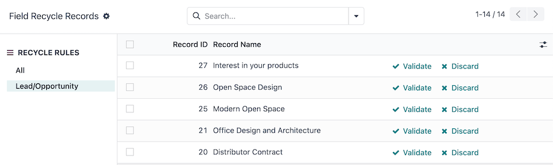

=============
Data Cleaning
=============

The Odoo *Data Cleaning* app keeps the database neat and organized throughout the use of its
provided features:

- :ref:`Deduplicates <data_cleaning/deduplication>`: merges or removes duplicate entries to ensure
  data is unique.
- :ref:`Recycles <data_cleaning/recycle>`: identifies outdated records to either archive or delete
  them.
- :ref:`Merges <data_cleaning/merge-action-manager>`: combines multiple similar entries into one
  streamlined record.
- :ref:`Formats <data_cleaning/field-cleaning>`: standardizes text data by finding and replacing it
  according to specified needs.

Through customizable automated rules (or manual praxis), individual records and accompanying text
data in the database will remain up-to-date and consistently formatted, tailored to company
specifications.

.. _data_cleaning/install-modules:

Install modules
===============

The *Data Cleaning* application consists of several modules. :ref:`Install <general/install>` the
following to access all available features:

.. list-table::
   :header-rows: 1
   :widths: 25 25 50

   * - Name
     - Technical name
     - Description
   * - :guilabel:`Data Recycle`
     - `data_recycle`
     - Base module to enable the recycle feature, available on Odoo Community edition.
   * - :guilabel:`Data Cleaning`
     - `data_cleaning`
     - Enables field cleaning feature to format text data across multiple records, available
       **only** on Odoo Enterprise edition.
   * - :guilabel:`Data Cleaning (merge)`
     - `data_merge`
     - Enables the deduplication feature to find similar (or duplicate) records, and merge them,
       available **only** on Odoo Enterprise edition.

.. spoiler:: Additionally, several app-specific modules are available

   .. list-table::
      :widths: 25 25 50

      * - :guilabel:`CRM Deduplication`
        - `data_merge_crm`
        - Enables the deduplication feature on the *CRM* app, and uses the :doc:`CRM default merging
          feature <../sales/crm/pipeline/merge_similar>`.
      * - :guilabel:`Helpdesk Merge action`
        - `data_merge_helpdesk`
        - Enables the merge feature for the *Helpdesk* app.
      * - :guilabel:`Project Merge action`
        - `data_merge_project`
        - Enables the merge feature for the *Projects* app.
      * - :guilabel:`UTM Deduplication`
        - `data_merge_utm`
        - Enables the merge feature for the *UTM Tracker* app.
      * - :guilabel:`WMS Accounting Merge`
        - `data_merge_stock_account`
        - Creates a warning in cases of products merging that may affect inventory valuation, if the
          *Inventory* app is installed.

.. _data_cleaning/deduplication:

Deduplication
=============

On the :guilabel:`Duplicates` dashboard (:menuselection:`Data Cleaning app --> Deduplication`), Odoo
suggests groups of similar records to be :ref:`merged <data_cleaning/merge-records>` by matching
conditions within the records set by the :ref:`deduplication rules
<data_cleaning/deduplication-rules>`.

.. image:: data_cleaning/data-cleaning-duplicates.png
   :align: center
   :alt: Deduplication dashboard in the Data Cleaning application.

The :guilabel:`RULE` sidebar lists each of the active deduplication rules, and displays the total
number of duplicates detected beside each rule.

By default, the :guilabel:`All` rule is selected. Displayed records are grouped by their rule, with
a :guilabel:`Similarity` rating (out of 100%) in the list view, with the following columns:

- :guilabel:`Created On`: the date and time the original record was created.
- :guilabel:`Name`: the name or title of the original record.
- :guilabel:`Field Values`: the original record's values for the fields used to detect duplicates.
- :guilabel:`Used In`: lists other models referencing the original record.
- :guilabel:`ID`: the original record's unique ID.
- :guilabel:`Is Master`: the duplicates are merged into the *master* record. There can be **one**
  master record in a grouping of similar records.

Select a specific rule in the :guilabel:`RULE` sidebar to filter the duplicate records.

.. _data_cleaning/merge-records:

Merge duplicate records
-----------------------

To merge records, first choose a *master* record within the grouping of similar records. The master
record acts as the base, at which any additional information from similar records are merged into.

Optionally, no master record can be set, leaving Odoo to choose a record at random to merge into.

Next, click the :guilabel:`Merge` button at the top of the similar records grouping. Then, click
:guilabel:`Ok` to confirm the merge.

Once a record is merged, a message is logged in the chatter of the master record, describing the
merge. Certain records, like *Project* tasks, are logged in the chatter with a link to the old
record for a convenient reference.

.. tip::
   Discard groupings by clicking the :guilabel:`DISCARD` button. Upon doing so, the grouping is
   hidden from the list and archived.

   View discarded groupings by selecting the :guilabel:`Discarded` filter from the :ref:`Search...
   <search/filters>` bar.

.. _data_cleaning/deduplication-rules:

Deduplication rules
-------------------

The :guilabel:`Deduplication Rules` page (:menuselection:`Data Cleaning app --> Configuration -->
Rules: Deduplication`) is where the conditions for records to be detected as duplicates can be set.

These rules can be configured for each model in the database, and with varying levels of
specificity.

.. tip::
   The deduplication rules run once every day, by default, as part of a scheduled action chron
   (*Data Merge: Find Duplicate Records*). However, each rule can be :ref:`ran manually
   <data_cleaning/run-deduplication-rule>` anytime.

Modify a deduplication rule
~~~~~~~~~~~~~~~~~~~~~~~~~~~

Select a default rule to edit, or create a new rule by clicking on the :guilabel:`New` button, on
the :guilabel:`Deduplication Rules` page (:menuselection:`Data Cleaning app --> Configuration -->
Rules: Deduplication`).

First, choose a :guilabel:`Model` for this rule to target. Selecting a model updates the rule title
to the chosen model.

Optionally, configure a :guilabel:`Domain` to specify the records eligible for this rule. The number
of eligible records is shown in the :icon:`oi-arrow-right` :guilabel:`# record(s)` link.

Depending on the selected :guilabel:`Model`, the :guilabel:`Duplicate Removal` field appears.
Choose whether to :guilabel:`Archive` or :guilabel:`Delete` merged records.

Next, select a :guilabel:`Merge Mode`:

- :guilabel:`Manual`: requires each duplicate grouping to be manually merged, also enables the
  :guilabel:`Notify Users` field.
- :guilabel:`Automatic`: automatically merges duplicate groupings, without notifying users, based on
  the records with a similarity percentage above the threshold set in the :guilabel:`Similarity
  Threshold` field.

Enable the :guilabel:`Active` toggle to start capturing duplicates with this rule as soon as it is
saved.

Lastly, create at least one deduplication rule in the :guilabel:`Deduplication Rules` field, by
clicking :guilabel:`Add a line`, under the :guilabel:`Unique ID Field` column.

- Select a field in the model from the :guilabel:`Unique ID Field` drop-down menu. This field is
  referenced for similar records.
- Select a matching condition in the :guilabel:`Match If` field to apply the deduplication rule,
  depending on the text in the :guilabel:`Unique ID Field`:

  - :guilabel:`Exact Match`: the characters in the text match exactly.
  - :guilabel:`Case/Accent Insensitive Match`: the characters in the text match, regardless of
    casing and language-specific accent differences.

.. important::
   The rule does **not** capture duplicates without at least one deduplication rule set in the
   :guilabel:`Deduplication Rules` field.

.. tip::
   A few more fields are available for an advanced configuration.

   If on a multi-company database, the :guilabel:`Cross-Company` field is available. When enabled,
   duplicates across different companies are suggested.

   Activate :ref:`developer-mode` to display the :guilabel:`Suggestion Threshold` field. Duplicates
   with a similarity below the threshold set in this field are **not** suggested.

With the rule's configuration complete, either close the rule form, or :ref:`run the rule manually
<data_cleaning/run-deduplication-rule>` to instantly capture duplicate records.

.. _data_cleaning/run-deduplication-rule:

Manually run a deduplication rule
~~~~~~~~~~~~~~~~~~~~~~~~~~~~~~~~~

To manually run a specific deduplication rule at any time, navigate to :menuselection:`Data Cleaning
app --> Configuration --> Rules: Deduplication`, and select the rule to run.

Then, on the rule form, select the :guilabel:`Deduplicate` button on the top-left. Upon doing so,
the :icon:`fa-clone` :guilabel:`Duplicates` smart button displays the number of duplicates captured.

Click on the :icon:`fa-clone` :guilabel:`Duplicates` smart button to manage these records.

.. _data_cleaning/recycle:

Recycle records
===============

Use the *Recycle Records* feature to rid the database of old and outdated records.

On the :guilabel:`Field Recycle Records` dashboard (:menuselection:`Data Cleaning app --> Recycle
Records`), Odoo detects records that can be archived or deleted, by matching conditions within the
records set by the :ref:`recycle record's rules <data_cleaning/recylce-rule>`.

The :guilabel:`RECYCLE RULES` sidebar lists each of the active recycle record rules, and displays
the total number of records detected beside each rule.

By default, the :guilabel:`All` option is selected. Records are displayed in the list view, with the
following columns:

- :guilabel:`Record ID`: the ID of the original record.
- :guilabel:`Record Name`: the name or title of the original record.

Select a specific rule in the :guilabel:`RECYCLE RULES` sidebar to filter the duplicate records.

To recycle records, click the :icon:`fa-check` :guilabel:`Validate` button on the row of the record.

Upon doing so, the record is recycled, depending on how the rule is configured, to be either
archived or deleted from the database.

.. tip::
   Discard groupings by clicking the :icon:`fa-times` :guilabel:`Discard` button. Upon doing so, the
   record is hidden from the list, and is not detected by the recycle rule again in the future.

   View discarded records by selecting the :guilabel:`Discarded` filter from the :ref:`search bar
   <search/filters>` drop-down menu.

.. _data_cleaning/recylce-rule:

Recycle record rules
--------------------

The :guilabel:`Recycle Records Rules` page (:menuselection:`Data Cleaning app --> Configuration -->
Rules: Recycle Records`) is where the conditions for records to be recycled can be set.

These rules can be configured for each model in the database, and with varying levels of
specificity.

.. tip::
   The recycle rules run once a day, by default, as part of a scheduled action chron (*Data
   Recycle: Clean Records*). However, each rule can be :ref:`run manually
   <data-cleaning/run-recycle-rule>` anytime.

By default, no recycle record rules exist. Click the :guilabel:`New` button to create a new rule.

On the recycle record rule form, first choose a :guilabel:`Model` for this rule to target. Selecting
a model updates the rule title to the chosen model.

Optionally, configure a :guilabel:`Filter` to specify the records eligible for this rule. The number
of eligible records is shown in the :icon:`oi-arrow-right` :guilabel:`# record(s)` link.

Next, configure the field and time range for how the rule detects the records to recycle:

- :guilabel:`Time Field`: select a field from the model to base the time (:dfn:`Delta`).
- :guilabel:`Delta`: type the length of time, which must be a whole number (e.g. `7`).
- :guilabel:`Delta Unit`: select the unit of time (:guilabel:`Days`, :guilabel:`Weeks`,
  :guilabel:`Months`, or :guilabel:`Years`).

Then, select a :guilabel:`Recycle Mode`:

- :guilabel:`Manual`: requires each detected record to be manually recycled, and enables the
  :guilabel:`Notify Users` field.
- :guilabel:`Automatic`: automatically merges recycled groupings, without notifying users.

Lastly, select a :guilabel:`Recycle Action` to either :guilabel:`Archive` or :guilabel:`Delete`
records. If :guilabel:`Delete` is selected, choose whether or not to :guilabel:`Include Archived`
records in the rule.

With the rule's configuration complete, either close the rule form, or :ref:`run the rule manually
<data-cleaning/run-recycle-rule>` to instantly capture records to recycle.

.. example::
   A recycle rule can be configured to delete archived leads and opportunities that were last
   updated a year ago, and with a specific lost reason, by using the following configuration:

   - :guilabel:`Model`: :guilabel:`Lead/Opportunity`
   - :guilabel:`Filter`:

     - `Active` `is` `not set`
     - `Lost Reason` `is in` `Too expensive`

   - :guilabel:`Time Field`: :guilabel:`Last Updated on (Lead/Opportunity)`
   - :guilabel:`Delta`: `1`
   - :guilabel:`Delta Unit`: :guilabel:`Years`
   - :guilabel:`Recycle Mode`: :guilabel:`Automatic`
   - :guilabel:`Recycle Action`: :guilabel:`Delete`
   - :guilabel:`Include Archived`: :icon:`fa-check-square`

   .. image:: data_cleaning/data-cleaning-recycle-rule.png
      :align: center
      :alt: Recycle records rule form for a lead/opportunity.

.. _data-cleaning/run-recycle-rule:

Manually run a recycle rule
~~~~~~~~~~~~~~~~~~~~~~~~~~~

To manually run a specific recycle rule at any time, navigate to :menuselection:`Data Cleaning app
--> Configuration --> Rules: Recycle Records`, and select the rule to run.

Then, on the rule form, click the :guilabel:`Run Now` button on the top-left. Upon doing so, the
:icon:`fa-bars` :guilabel:`Records` smart button displays the number of records captured.

Click the :icon:`fa-bars` :guilabel:`Records` smart button to manage these records.

.. _data_cleaning/field-cleaning:

Field cleaning
==============

On the :guilabel:`Field Cleaning Records` dashboard (:menuselection:`Data Cleaning app --> Field
Cleaning`), Odoo suggests formatting changes to data in fields of a record, to follow a convention
set by the field cleaning rules.

.. _data_cleaning/merge-action-manager:

Merge action manager
====================

The :guilabel:`Merge Action Manager` (:menuselection:`Data Cleaning app --> Configuration --> Merge
Action Manager`) enables or disables the *Merge* action available in the *Actions* menu for models
in the database.
