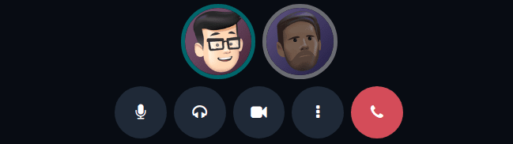
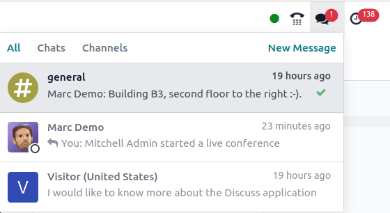

:show-content:
:hide-page-toc:

=======
Discuss
=======

Odoo **Discuss** is an internal communication app that allows users to connect through messages,
notes, file sharing, and video calls. **Discuss** enables communication through a persistent chat
window that works across applications, or through the dedicated *Discuss* dashboard.

Upon opening the :menuselection:`Discuss app`, the :guilabel:`Discuss` dashboard appears.

Inbox, starred, and history
===========================

Upon opening the :menuselection:`Discuss app`, the *Discuss* dashboard appears.

On the :guilabel:`Discuss` dashboard, unread messages are visible in the :icon:`fa-inbox`
:guilabel:`Inbox`. :icon:`fa-star-o` :guilabel:`Starred` is where starred messages are stored.
:icon:`fa-history` :guilabel:`History` shows chatter updates for records in the Odoo database the
user has been assigned to, or tagged on.

Direct messages
===============

*Direct messages* allow the user to communicate privately with one or multiple team members. To
start a new direct message, click the :icon:`fa-plus` icon, next to :guilabel:`Direct Messages` on
the :guilabel:`Discuss` dashboard, and enter the name of the desired person in the :guilabel:`Start
a conversation` search bar that appears.

.. tip::
   Multiple names can be selected in the :guilabel:`Start a conversation` search bar. Once all of
   the names have been entered, press :kbd:`Enter`.

Direct message actions
----------------------

Hover over a direct message in the chat window to see a menu of actions to take on the message.

- :icon:`oi-smile-add` :guilabel:`(Add a Reaction)`: open a drop-down menu of emojis that can be
  used to react to the direct message.
- :icon:`fa-reply` :guilabel:`(Reply)`: reply to the direct message in a thread.
- :icon:`fa-star-o` :guilabel:`(Mark as Todo)`: add the message to the :guilabel:`Starred` tab.
- :icon:`fa-ellipsis-h` :guilabel:`(Expand)`: reveals more message actions, including:

  - :icon:`fa-thumb-tack` :guilabel:`Pin`
  - :icon:`fa-eye-slash` :guilabel:`Mark as Unread`
  - :icon:`fa-pencil` :guilabel:`Edit`
  - :icon:`fa-trash` :guilabel:`Delete`

Conversation actions
--------------------

The icons in the top-right corner of a direct message conversation represent different actions the
user can take on that conversation.

Click :icon:`fa-bell` :guilabel:`Notification Settings` to set up notification preferences for the
conversation, or click :icon:`fa-phone` :guilabel:`Start a Call` to begin a meeting. See the
:ref:`Meetings <discuss/meetings>` section for more information about meetings.

At the top of the direct message window, click the name of the direct message to change the group
name, and choose to add a description in the adjacent :guilabel:`Add a description` field.

.. note::
   The :guilabel:`Add a description` field is **only** available for group messages with more than
   two participants.

User status
-----------

It is helpful to see what colleagues are up to, and how quickly they can respond to messages, by
checking their status. The status is displayed as a circle in the bottom-right corner of a contact's
photo in the :icon:`fa-users` :guilabel:`(Members List)`.

The color of the circle represents the user's status:

- Green = online
- Orange = away
- White = offline
- Airplane = out of the office

Leave a direct message conversation
-----------------------------------

To leave a direct message conversations, click the :icon:`fa-times` :guilabel:`(Leave this channel)`
icon next to the conversation name in the :guilabel:`Direct Messages` section of the sidebar.

.. note::
   Leaving a conversation does **not** delete the direct messages in the conversation. The direct
   message conversation's history is visible when another direct message with the same person, or
   group, is created.

.. _discuss/meetings:

Meetings
========

In **Discuss**, *Meetings* are video calls. To start a meeting from the :guilabel:`Discuss`
dashboard, click :guilabel:`Start a meeting` in the top-left corner, and select who to invite to the
meeting, via the :guilabel:`Invite People` drop-down window that appears. To start a meeting from a
direct message, click the :icon:`fa-phone` :guilabel:`Start a Call` icon in the top-right corner.

Once a meeting has been started, the following buttons can be used:

+-----------------------------+--------------------------------+
| Icon                        | Use                            |
+=============================+================================+
| :icon:`fa-microphone`       | :guilabel:`Mute`               |
+-----------------------------+--------------------------------+
| :icon:`fa-microphone-slash` | :guilabel:`Unmute`             |
+-----------------------------+--------------------------------+
| :icon:`fa-headphones`       | :guilabel:`Deafen`             |
+-----------------------------+--------------------------------+
| :icon:`fa-deaf`             | :guilabel:`Undeafen`           |
+-----------------------------+--------------------------------+
| :icon:`fa-video-camera`     | :guilabel:`Turn camera on/off` |
+-----------------------------+--------------------------------+
| :icon:`fa-hand-paper-o`     | :guilabel:`Raise Hand`         |
+-----------------------------+--------------------------------+
| :icon:`fa-desktop`          | :guilabel:`Share Screen`       |
+-----------------------------+--------------------------------+
| :icon:`fa-arrows-alt`       | :guilabel:`Enter Full Screen`  |
+-----------------------------+--------------------------------+

.. _discuss_app/notification_preferences:

User-specific notification preferences
======================================

Access user-specific preferences for the **Discuss** app by navigating to :menuselection:`Settings
app --> Manage Users`, select a user, then click the :guilabel:`Preferences` tab.

.. image:: discuss/preferences-user.png
   :alt: View of the Preferences tab for Odoo Discuss.

By default, the :guilabel:`Notification` field is set as :guilabel:`Handle by Emails`. With this
setting enabled, a notification email is sent by Odoo every time a message is sent from the chatter
of a record, a note is sent with an `@` mention (from the chatter of a record), or a notification is
sent for a record the user follows.

By choosing :guilabel:`Handle in Odoo`, the above notifications are shown in the **Discuss** app's
*Inbox*.

Chat from different applications
================================

The **Discuss** application enables communication across all of Odoo's applications. To view chats
and channels, or start a new message, select the speech bubbles that are consistently present in the
upper-right corner of the database header.

.. seealso::
   - :doc:`discuss/team_communication`
   - :doc:`/applications/essentials/activities`
   - :doc:`discuss/ice_servers`
   - :doc:`discuss/chatter`

.. toctree::
   :titlesonly:

   discuss/team_communication
   discuss/ice_servers
   discuss/chatter
