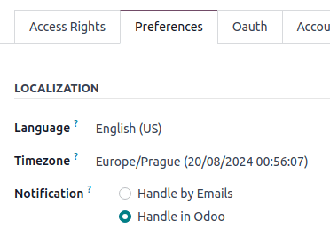
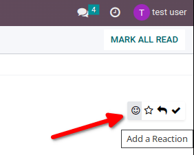
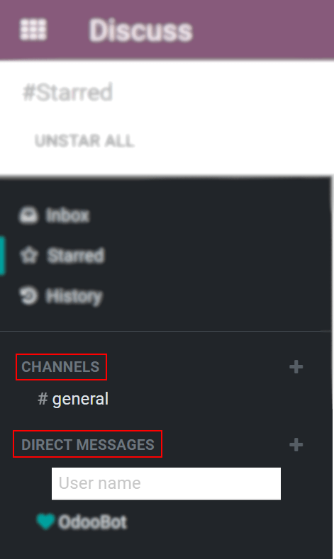
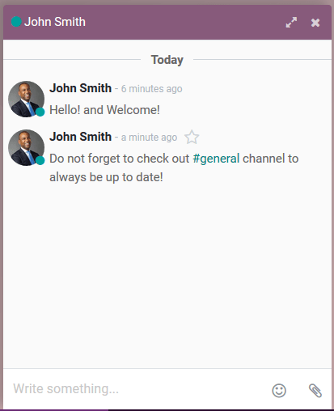

:show-content:
:show-toc:

.. _discuss_app:

=======
Discuss
=======

Odoo *Discuss* is an internal communication app that allows users to connect through messages,
notes, and file sharing, either through a persistent chat window that works across applications, or
through the dedicated *Discuss* dashboard.

.. _discuss_app/notification_preferences:

Choose notifications preference
===============================

Access user-specific preferences for the *Discuss* app by navigating to :menuselection:`Settings app
--> Users --> User --> Preferences tab`.

By default, the :guilabel:`Notification` field is set as :guilabel:`Handle by Emails`. With this
setting enabled, a notification email will be sent by Odoo every time a message is sent from the
chatter, a note is sent with an `@` mention (from chatter), or a notification is sent for a record
that the user follows. Something that triggers a notification is changing of the stage (if an email\
is configured to be sent, for example if the task is set to :guilabel:`Done`).

By choosing :guilabel:`Handle in Odoo`, the above notifications are shown in the *Discuss* app's
*inbox*. Messages can have the following actions taken on them: respond with an emoji by clicking
:guilabel:`Add a Reaction`, or reply to the message by clicking on :guilabel:`Reply`. Additional
actions may include starring the message by clicking :guilabel:`Marked as Todo`, or pinning the
message by selecting :guilabel:`Pin` or even mark the message as unread by selecting
:guilabel:`Marked as unread`.

Clicking :guilabel:`Mark as Todo` on a message causes it to appear on the :guilabel:`Starred` page,
while clicking :guilabel:`Mark as Read` moves the message to :guilabel:`History`.

.. image:: discuss/starred-messages.png
   :alt: View of messages marked as todo in Odoo Discuss.

Start chatting
==============

The first time a user logs in to their account, OdooBot sends a message asking for permission to
send desktop notifications for chats. If accepted, the user will receive push notifications on their
desktop for the messages they receive, regardless of where the user is in Odoo.

.. image:: discuss/odoobot-push.png
   :alt: View of the messages under the messaging menu emphasizing the request for push
         notifications for Odoo Discuss.

.. tip::
   To stop receiving desktop notifications, reset the notifications settings of the browser.

To start a chat, go to the :menuselection:`Discuss` app and click on the :guilabel:`+ (plus)` icon
next to :guilabel:`Direct Messages` or :guilabel:`Channels` in the left menu of the dashboard.

         Discuss.

A company can also easily create :doc:`public and private channels <discuss/team_communication>`.

Mentions in the chat and on the chatter
---------------------------------------

To mention a user within a chat or the chatter, type `@user-name`; to refer to a channel, type
`#channel-name`. The user mentioned will be notified in their *inbox* or through an email, depending
on their communication settings.

.. tip::
   When a user is mentioned, the search list (list of names) suggests values first based on the
   task's followers, and secondly on employees. If the record being searched does not match with
   either a follower or employee, the scope of the search becomes all partners.

User status
-----------

It is helpful to see what colleagues are up to and how quickly they can respond to messages by
checking their *status*. The status is shown on the left side of a contact's name on the
:guilabel:`Discuss` sidebar, on the *messaging menu* and when listed in the *chatter*.

- Green = online
- Orange = away
- White = offline
- Airplane = out of the office

.. image:: discuss/status.png
   :height: 300
   :alt: View of the contacts' status for Odoo Discuss.

.. seealso::
   - :doc:`discuss/team_communication`
   - :doc:`/applications/essentials/activities`

.. toctree::
   :titlesonly:

   discuss/team_communication
   discuss/ice_servers
   discuss/chatter
