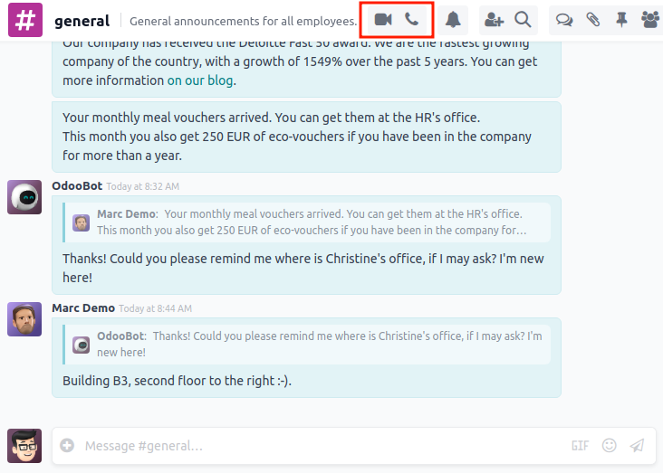
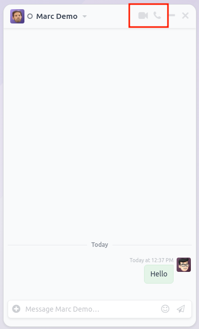
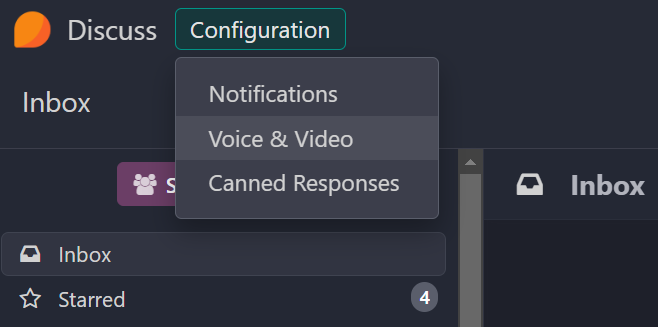

=====
Calls
=====

The Discuss calls feature enables real-time voice and video communication within Odoo. This
functionality allows team members to collaborate in real time, share screens, and conduct meetings
directly from the Odoo interface.

Starting a call
===============

You can initiate a call from different places in Odoo:

From a Discuss channel
----------------------

1. Open the **Discuss** app.
2. Select a channel from the sidebar.
3. Click the :icon:`fa-phone` :guilabel:`(phone)` icon in the top-right corner to start a call
   or the :icon:`fa-video-camera` :guilabel:`(video camera)` icon to start directly with the camera.

From a chat window
------------------

(this includes livechat)

1. Click on a chat window.
2. Click the :icon:`fa-phone` :guilabel:`(phone)` icon or the :icon:`fa-video-camera`
   :guilabel:`(video camera)` icon in the top-right corner of the chat window.

Receiving a call
================

When someone starts a call in a direct message or group chat:

1. An invitation notification appears in the upper-right corner of your screen.
2. You can:

   - Click :guilabel:`Accept` to join with audio only
   - Click :guilabel:`Accept with camera` to join with video
   - Click :guilabel:`Preview my camera` to check your video before accepting
   - Click :guilabel:`Refuse` to decline the call

Call settings
=============

.. image:: calls/call-settings_menu.png
   :align: center
   :alt: Settings menu

.. note::
   `The Push-to-Talk extension <https://chromewebstore.google.com/detail/discuss-push-to-talk/mdiacebcbkmjjlpclnbcgiepgifcnpmg>`_
   is available in Chrome to enable this functionality when not focused on the Odoo tab.

Advanced features
=================

For larger organizations or environments with specific network requirements:

- **SFU server**: For improved performance in calls with many participants.
  See :doc:`calls/sfu_server` for configuration details.
- **ICE servers**: For calls between networks with restrictive firewalls.
  See :doc:`calls/ice_servers` for configuration details.

Troubleshooting
===============

If you experience issues with calls, refer to the :doc:`calls/troubleshooting` guide for
diagnostic steps and solutions.

.. seealso::
   - :doc:`calls/sfu_server`
   - :doc:`calls/ice_servers`
   - :doc:`calls/troubleshooting`

.. toctree::
   :titlesonly:

   calls/sfu_server
   calls/ice_servers
   calls/troubleshooting
