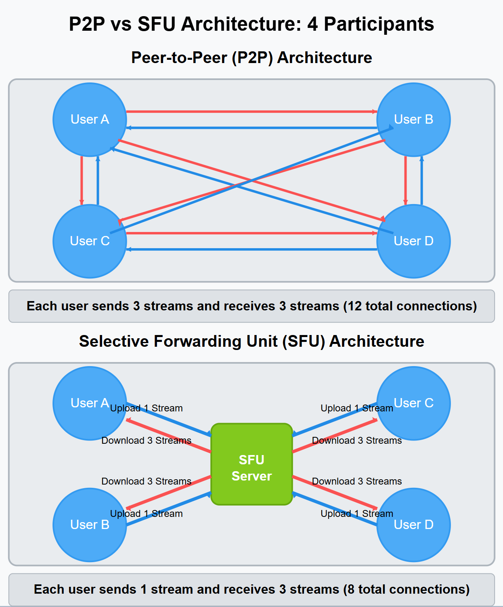
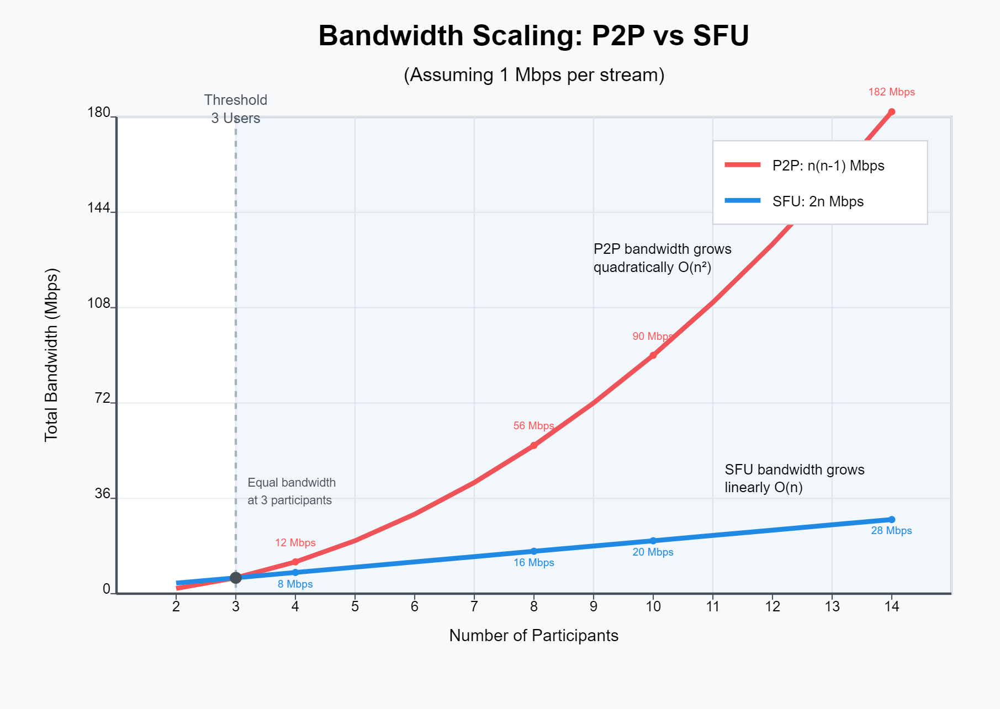

==========
SFU server
==========

In Odoo Discuss, the Selective Forwarding Unit (SFU) server enables efficient handling of calls with
many participants. Unlike peer-to-peer connections which can become resource-intensive with multiple
users, the SFU server receives media streams from each participant and selectively forwards them to
others, significantly improving call quality and scalability. Its sources can be found in the
`odoo/sfu repository <https://github.com/odoo/sfu>`_.

.. note::
   In Odoo.sh and Odoo SaaS, the SFU servers are already provided. Adding your own in the
   settings will override the default one.

What is a Selective Forwarding Unit (SFU)?
------------------------------------------

An SFU server is a type of media server that receives audio and video streams from each participant
in a call and selectively forwards them to other participants. This approach is more efficient than
peer-to-peer connections, especially in calls with many participants.

When to use an SFU server
-------------------------

Consider deploying an SFU server when:

- Your organization conducts calls with more than 5-10 participants
- You frequently use video in calls with multiple participants
- Your users are distributed across different networks or locations
- You need to support users behind restrictive firewalls or complex NAT configurations

Without an SFU server, Odoo will fall back to peer-to-peer connections, which work well for smaller
calls but may lead to performance issues with larger groups.

Deployment
----------

Follow the instructions in the `odoo-SFU README
<https://github.com/odoo/sfu/blob/master/README.md>`_.

Connecting to Odoo
------------------

Once your SFU server is running, you need to configure your Odoo server to use it:

1. Go to :menuselection:`Settings --> General Settings --> Discuss`
2. Enter the URL of your SFU server in the :guilabel:`SFU Server URL` field
3. Enter the same AUTH_KEY value in the :guilabel:`SFU Server Key` field
4. Click :guilabel:`Save`

