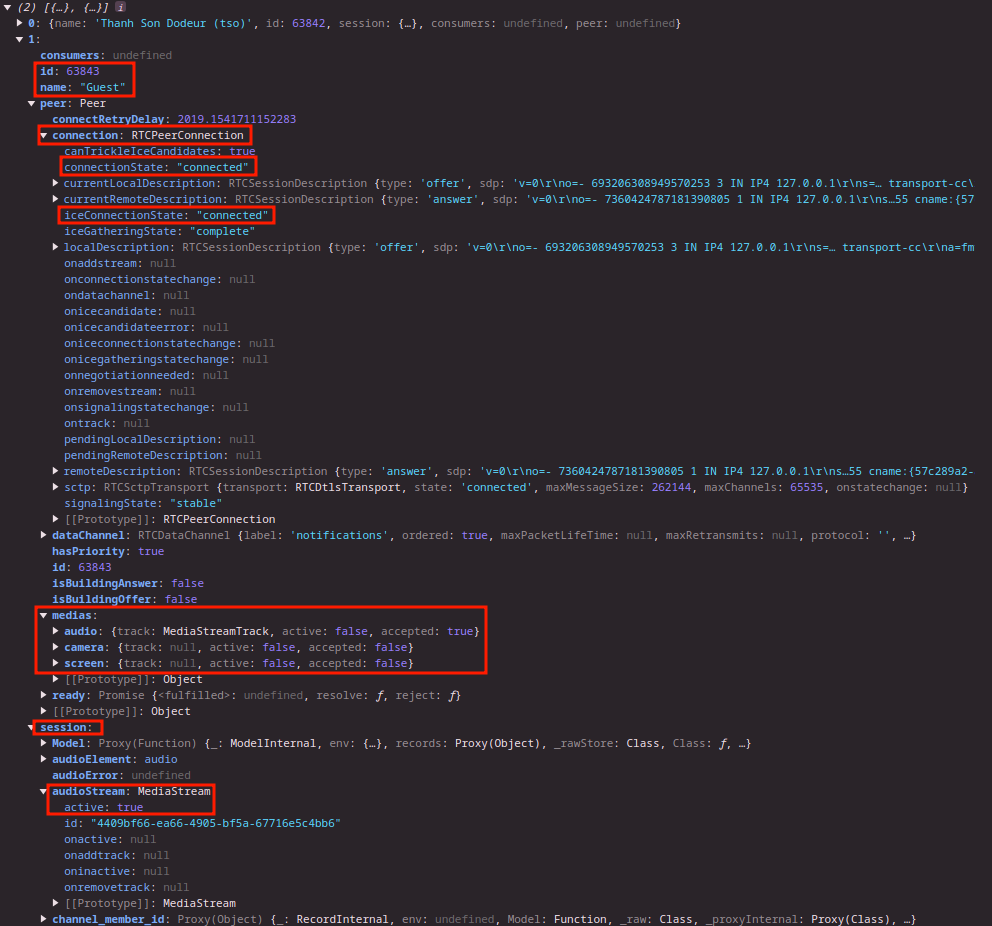
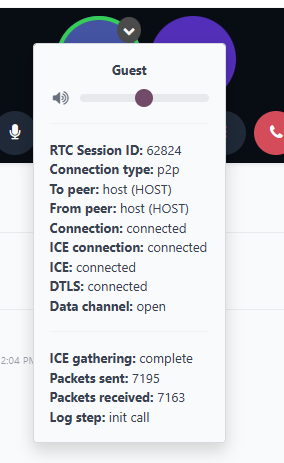
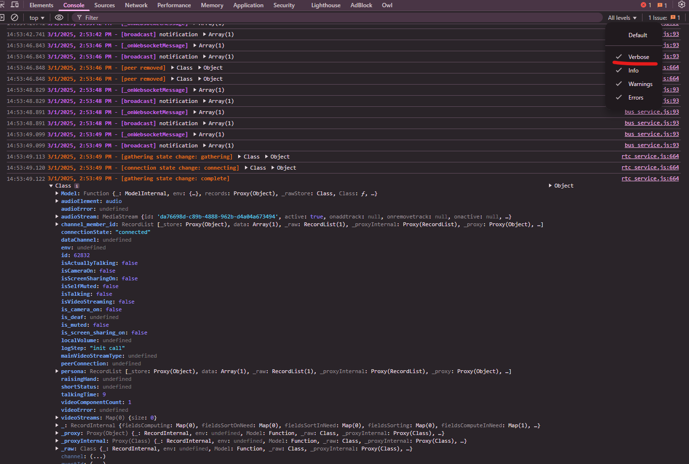
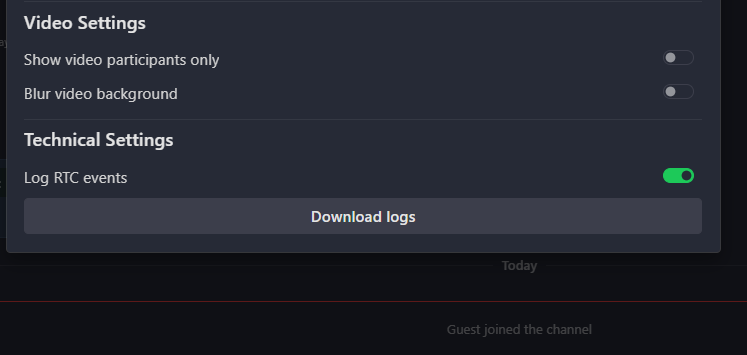

===============
Troubleshooting
===============

This guide will help you diagnose and resolve issues with Odoo Discuss calls. Follow the checklist
first, then use the diagnostic tools if needed.

Checklist
=========

Before exploring advanced troubleshooting options, verify these common issues:

- Is the issue related to a **user setting**?
   - Has microphone and camera **access** been granted in the browser permissions?
   - Are call participants missing from the view? Check if "Show video participants only" is enabled
     in the call settings.
- Is the **browser up to date**?
   - Check your browser's settings --> "about Chrome" or "about Firefox".
- Are there any network-limiting **browser extensions** installed?
- Is the **Odoo bus** operational?
   - There should be a "connection lost" warning in the UI.
- Are you behind a strong **firewall, VPN, or asymmetric NAT**?
   - If so, is a **TURN** or **SFU server** available to handle this network situation?
     (on the SaaS and odoo.sh, TURN/SFU servers should already be provided).

Gathering diagnostic information
================================

When you encounter problems with Discuss calls, follow these steps to collect important
diagnostic data:

1. Enable **debug mode**
2. Activate RTC logging in the call settings

.. note::
   Critical errors are always logged, even without RTC logging enabled. Note that the logging option
   is not saved and must be activated after each page reload (to avoid forgetting it and using
   memory and resources when not necessary).

Diagnostic information sources
==============================

Source 1: Console command
-------------------------

Enter this code in your browser's console (CTRL+Shift+I):

.. code-block:: javascript

    const rtc = odoo.__WOWL_DEBUG__.root.env.services["mail.store"].rtc;
    rtc.state.channel?.rtcSessions.map((session) => ({
        name: session.name,
        id: session.id,
        session: { ...session },
        consumers: rtc.sfuClient?._consumers.get(session.id),
        peer: rtc.p2pService?.peers.get(session.id),
    }));

This command provides a list of all sessions in your current call, showing important information for
each participant, such as the state of the Media elements, of the streams, of the connection to each
peer, of the connection to the sfu,...

This is particularly useful for examining participants with connection issues.

Source 2: Context menu
----------------------

Check connection status through the participant options menu:

1. While in a call, hover over a participant's video
2. Click the **context menu** button that appears in the top-right corner

The menu shows connection details for:
- Yourself when connected to the SFU
- Other participants when you have a peer-to-peer connection with them

.. warning::
   In a peer-to-peer connection, if the ICE connection is stuck at "new", it typically indicates the
   absence of TURN servers, which are needed to traverse certain types of NATs and firewalls.

Source 3: Logs
--------------

Detailed logs that contain information on the state of calls and the technical events/errors.

Browser console
~~~~~~~~~~~~~~~

Access through your browser's developer tools:

Downloaded logs
~~~~~~~~~~~~~~~

Obtain logs for the calls that were recorded during the **last 24 hours**.
User information in the logs are **anonymized**.

The amount of information contained in the logs depends on the "log RTC events" settings mentioned
above. If the setting is not activated, the logs will only contain errors.

1. Go to Discuss settings
2. Click the "Download logs" button

.. note::
   All tabs log to the same file (which can be downloaded from any other tab)
   and are stored for 24h.

You can send these logs in a support ticket or analyze them with the
`RTC Log Viewer <https://thanhdodeurodoo.github.io/rtc-log-viewer/>`_.
