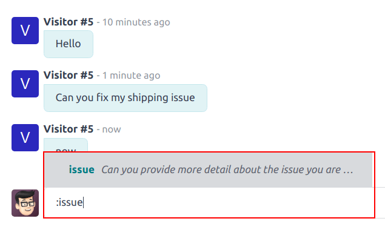
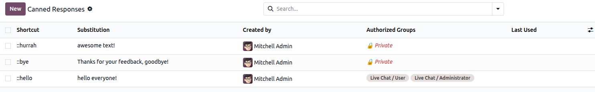

================
Canned responses
================

*Canned responses* are customizable inputs where a typed shortcut populates a longer response. A
user enters a keyword shortcut, which is then automatically replaced by the expanded substitution
response. Canned responses save time by allowing users to use shorthand phrases to populate longer
messages. This also limits the possibility of errors when typing out longer messages because these
are pre-set messages. This maintains consistency throughout customer interactions.

Canned responses consist of two main components: the *shortcut* and the *substitution*. The shortcut
is the keyword or key phrase that is to be replaced. The substitution is the longer message that
replaces the shortcut.

Canned responses are available :ref:`to use <discuss/use-cases>` in **Live Chat** conversations, the
**Discuss** app, and the *Chatter*. Canned responses are also available in direct message
conversations, channel conversations, and *WhatsApp* messages.

.. _discuss/created-canned-response:

Creating canned responses
=========================

Canned responses are managed through the **Discuss** application. To create a new canned response,
or manage the list of existing responses, navigate to :menuselection:`Discuss app --> Configuration
--> Canned Responses`.

Then, to create a new canned response, click :guilabel:`New` at the top-left of the list. Doing so
reveals a new blank line in the list.

Canned responses consist of two main components, a *shortcut* the user enters, and the
*substitution* that replaces the shortcut.

Type a shortcut command in the :guilabel:`Shortcut` field. Next, click on the
:guilabel:`Substitution` field, and type the message that will replace the shortcut.

.. tip::
   Try to connect the shortcut to the topic of the substitution. Not only does this make it easier
   to use the responses, it prevents the list of responses from becoming disorganized and
   overwhelming.

In the :guilabel:`Description` field, add any information that provides context for this response,
such as guidelines for when it should or should not be used.

The :guilabel:`Created by` field automatically populates with the name of the user that creates a
new response. This field cannot be edited.

To :ref:`share <discuss/sharing-responses>` this response with other users, select one or more
groups in the :guilabel:`Authorized Group` field that should have access.

.. warning::
   If the :guilabel:`Authorized Group` field is left blank, the response can **only** be used by the
   user that created it.

   Canned responses created by the database are automatically credited as created by *OdooBot*. They
   must be assigned to an *authorized group* before they can be used by **any** users. To view the
   responses created by *OdooBot*, navigate to :menuselection:`Discuss app --> Configuration -->
   Canned Responses`. Click into the :guilabel:`Search..` bar, and remove any filters.

Lastly, the :guilabel:`Last Used` field keeps track of the date and time each response was most
recently used. This field cannot be edited.

.. _discuss/sharing-responses:

Share responses
===============

Canned responses, by default, are made available **only** to the user who creates them. To make a
canned response available for others to use, they need to be shared.

.. note::
   Users with *Administrator* access rights can view and edit canned responses created by other
   users through the **Discuss** app. However, they are **only** able to use them if they are
   included in an authorized group that has been designated on that canned responses item line,
   located on the :guilabel:`Canned Responses` page.

Access to shared responses is granted on the :ref:`groups <access-rights/groups>` level.

To view the *Groups* a user is a member of, first enable :ref:`Developer mode <developer-mode>`,
then navigate to :menuselection:`Settings app --> Users & Companies --> Users`. Select a user from
the list, and click to open their :guilabel:`User Record`. Then, click the :guilabel:`Groups` smart
button at the top of the page.

.. tip::
   To view a list of users in a specific group, first enable :doc:`Developer mode
   <../../general/developer_mode/>`. Next, navigate to :menuselection:`Settings app --> Users &
   Companies --> Groups`. Select a group from the list, then click to open the :guilabel:`Group
   Record`. A list of users is included on the :guilabel:`Users` tab.

After determining what groups should have access to a response, they **must** :ref:`be added
<discuss/created-canned-response>` to the :guilabel:`Authorized Groups` field for each canned
response.

.. note::
   The user who created the response can use it, even if they are not a member of one of the
   *Authorized Groups*.

.. _discuss/use-cases:

Use a canned response
=====================

To use a canned response in a conversation, click the :icon:`fa-plus-circle` :guilabel:`(plus)` icon
in the message window. Then, click :guilabel:`Insert a Canned Response`. This opens a list of
available canned responses. Either select a response from the list, or type the appropriate
shortcut, then click the :icon:`fa-paper-plane` :guilabel:`(send)` icon or hit :kbd:`Enter`.

.. tip::
   Typing `::` in the *Chatter* composer, or chat window, on its own generates a drop-down list of
   available canned responses. A response can be selected from the list, in addition to the use of
   shortcuts.

   To search through the list of available responses, type `::`, followed by the first few letters
   of the shortcut.

   .. image:: canned_responses/canned-responses-using.png
      :alt: A live chat window with a list of all available canned responses.

.. seealso::
   - :doc:`Chatter <chatter>`
   - :doc:`Discuss <../discuss>`
   - :ref:`Commands and Canned Responses <live-chat/canned-responses>`
