=======
Chatter
=======

.. |user| replace:: :icon:`fa-user-o` :guilabel:`(user)` icon
.. |paperclip| replace:: :icon:`fa-paperclip` :guilabel:`(paperclip)` icon

The *Chatter* feature is integrated throughout Odoo to streamline communication, maintain
traceability, and provide accountability among team members. Chatter windows, known as *composers*,
are located on almost every record within the database, and allow users to communicate with both
internal users and external contacts.

Chatter composers also enable users to log notes, upload files, and schedule activities.

Chatter thread
==============

A *chatter thread* can be found on most pages in the database, and serves as a record of the updates
and edits made to a record. A note is logged in the chatter thread when a change is made. The note
includes details of the change, and a time stamp.

.. example::
   A user, Mitchell Admin, needs to update the email address of a contact. After they save the
   changes to the contact record, a note is logged in the chatter of the contact record with the
   following information:

   - The date when the change occurred.
   - The email address as it was previously listed.
   - The updated email address.

   .. image:: chatter/chatter-thread-email-update.png
      :align: center
      :alt: A close up of a chatter thread with an update to a contact record.

If a record was created, or edited, via an imported file, or was otherwise updated through an
intervention by the system, the chatter thread creates a log note, and credits the change to
OdooBot.

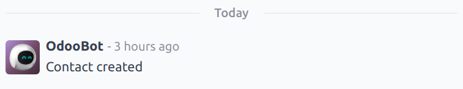

.. _discuss/add-followers:

Add followers
=============

A *follower* is a user or contact that is added to a record and is notified when the record is
updated, based on specific :ref:`follower subscription settings <discuss/edit-subscription>`.
Followers can add themselves, or can be added by another user.

.. note::
   If a user creates, or is assigned to a record, they are automatically added as a follower.

To follow a record, navigate to any record with a chatter thread. For example, to open a *Helpdesk*
ticket, navigate to :menuselection:`Helpdesk app --> Tickets --> All Tickets`, and select a ticket
from the list to open it.

At the top-right, above the chatter composer, click :guilabel:`Follow`. Doing this changes the
button to read :guilabel:`Following`. Click it again to :guilabel:`Unfollow`.

Manage followers
----------------

To add another user, or contact, as a follower, click the |user|. This opens a drop-down list of the
current followers. Click :guilabel:`Add Followers` to open an :guilabel:`Invite Follower` pop-up
window.

Select one or more contacts from the :guilabel:`Recipients` drop-down list. To notify the contacts,
tick the :guilabel:`Send Notification` checkbox. Edit the message template as desired, then click
:guilabel:`Add Followers`.

To remove followers, click the |user| to open the current followers list. Find the name of the
follower to be removed, and click the :icon:`fa-remove` :guilabel:`(remove)` icon.

.. _discuss/edit-subscription:

Edit follower subscription
--------------------------

The updates a follower receives can vary based on their subscription settings. To see the type of
updates a follower is subscribed to, and to edit the list, click the |user|. Find the appropriate
follower in the list, then click the :icon:`fa-pencil` :guilabel:`(pencil)` icon. This opens the
:guilabel:`Edit Subscription` pop-up window for the follower.

The list of available subscription settings varies depending on the record type. For example, a
follower of a *Helpdesk* ticket may be informed when the ticket is rated. This option would not be
available for the followers of a *CRM* opportunity.

Tick the checkbox for any updates the follower should receive, and clear the checkbox for any
updates they should **not** receive. Click :guilabel:`Apply` when finished.

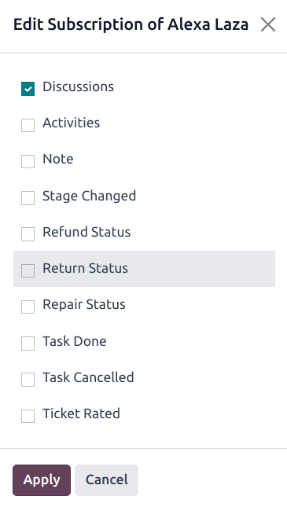

   The Edit Subscription options vary depending on the record type. These are the options for a
   Helpdesk ticket.

.. _discuss/log-notes:

Log notes
=========

The chatter function includes the ability to log internal notes on individual records. These notes
are only accessible to internal users, and are available on any records that feature a chatter
thread.

To log an internal note, first navigate to a record. For example, to open a *CRM* opportunity,
navigate to :menuselection:`CRM app --> Sales --> My Pipeline`, and click on the Kanban card of an
opportunity to open it. Then, at the top-right, above the chatter composer, click :guilabel:`Log
note`.

Enter the note in the chatter composer. To tag an internal user, type `@`, and begin typing the name
of the person to tag. Then, select a name from the drop-down menu. Depending on their notification
settings, the user is notified by email, or through Odoo.

.. important::
   Outside contacts can also be tagged in an internal log note. The contact then receives an email
   with the contents of the note they were tagged in, including any attachments added directly to
   the note. If they respond to the email, their response is logged in the chatter, and they are
   added to the record as a follower.

   Outside contacts are **not** able to log in to view the entire chatter thread, and are only
   notified of specific updates, based on their :ref:`follower subscription settings
   <discuss/edit-subscription>`, or when they are tagged directly.

.. _discuss/send-messages:

Send messages
=============

Chatter composers can send messages to outside contacts, without having to leave the database, or
open a different application. This makes it easy to communicate with potential customers in the
*Sales* and *CRM* applications, or vendors in the *Purchase* app.

To send a message, first navigate to a record. For example, to send a message from a *CRM*
opportunity, navigate to :menuselection:`CRM app --> Sales --> My Pipeline`, and click on the Kanban
card of an opportunity to open it. Then, at the top-right, above the chatter composer, click
:guilabel:`Send message`.

.. tip::
   Press :command:`Ctrl + Enter` to send a message, instead of using the :guilabel:`Send` button.

If any :ref:`followers <discuss/add-followers>` have been added to the record, they are added as
recipients of the message.

.. warning::
   :ref:`Followers <discuss/add-followers>` of a record are added as recipients of a message
   automatically. If a follower should **not** receive a message, they must be removed as a follower
   before the message is sent, or a note is logged.

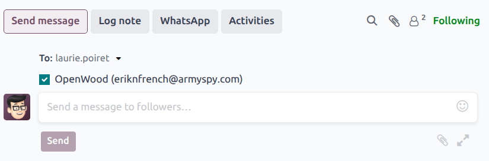
         the customer listed on the opportunity record.

Expand full composer
--------------------

The chatter composer can be expanded to a larger pop-up window, allowing for additional
customizations.

To open the full composer, click the :icon:`fa-expand` :guilabel:`(expand)` icon in the bottom-right
corner of the composer window.

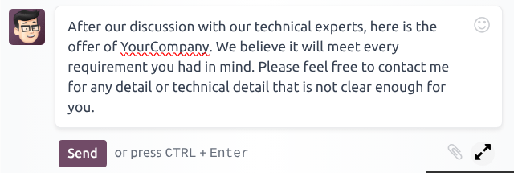

   The expand icon in a chatter composer.

Doing this opens a :guilabel:`Compose Email` pop-up window. Confirm or edit the intended
:guilabel:`Recipients` of the message, or add additional recipients. The :guilabel:`Subject` field
auto-populates based on the title of the record, though it can be edited, if desired.

To use an :doc:`email template <../../general/companies/email_template/>` for the message, select it
from the drop-down menu in the :guilabel:`Load template` field.

.. note::
   The number and type of templates available vary, based on the record the message is created from.

Click :icon:`fa-paperclip` :guilabel:`(paperclip)` icon to add any files to the message, then click
:guilabel:`Send`.

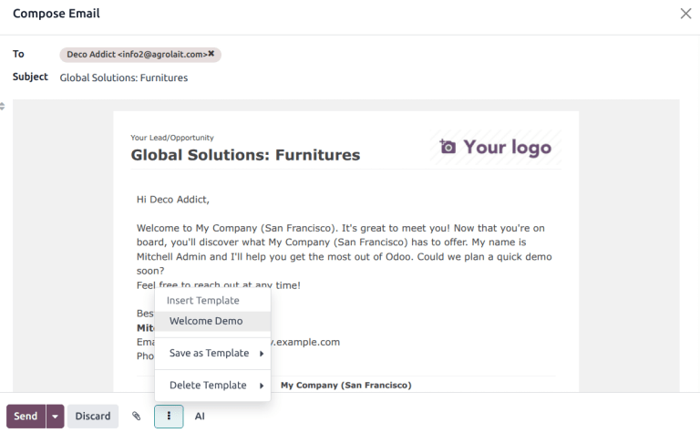

Edit sent messages
------------------

Messages can be edited after they are sent, to fix typos, correct mistakes, or add missing
information.

.. note::
   When messages are edited after they have been sent, an updated message is **not** sent to the
   recipient.

To edit a sent message, click the :icon:`fa-ellipsis-h` :guilabel:`(ellipsis)` icon menu to the
right of the message. Then, select :guilabel:`Edit`. Make any necessary adjustments to the message.

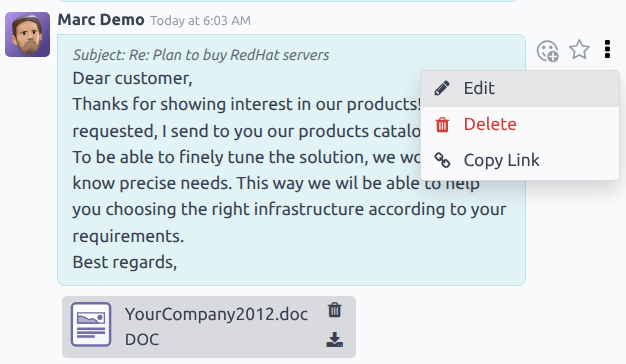

To save the changes, press :command:`Ctrl + Enter`. To discard the changes, press :command:`Escape`.

.. important::
   Users with Admin-level access rights can edit any sent messages. Users without Admin rights can
   **only** edit messages they created.

.. _discuss/search-messages:

Search messages
===============

Chatter threads can become long after a while, because of all the information they contain. To make
it easier to find a specific entry, users can search the text of messages and notes for specific
keywords.

First, select a record with a chatter thread. For example, to search a *CRM* opportunity, navigate
to :menuselection:`CRM app --> Sales --> My Pipeline`, and click on the Kanban card of an
opportunity to open it. Then, at the top-right, above the chatter composer, click the
:icon:`oi-search` :guilabel:`(search)` icon to open the search bar.

Enter a keyword or phrase into the search bar, then hit :command:`Enter`, or click the
:icon:`oi-search` :guilabel:`(search)` icon to the right of the search bar. Any messages or notes
containing the keyword or phrase entered are listed below the search bar, with the keyword
highlighted.

To be taken directly to a particular message in the chatter thread, hover over the upper-right
corner of the result to reveal a :guilabel:`Jump` button. Click this button to be directed to that
message's location in the thread.

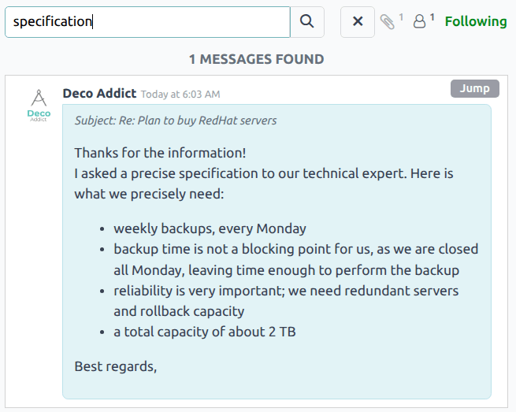

   Search results in a chatter thread. Hover over the upper-right corner of a result to see the
   **Jump** option. Click it to be taken directly to that message in the chatter thread.

.. _discuss/schedule-activities:

Schedule activities
===================

*Activities* are follow-up tasks tied to a record in an Odoo database. Activities can be scheduled
on any database page that contains a chatter thread, Kanban view, list view, or activities view of
an application.

To schedule an activity through a chatter thread, click the :guilabel:`Activities` button, located
at the top of the chatter on any record. On the :guilabel:`Schedule Activity` pop-up window that
appears, select an :guilabel:`Activity Type` from the drop-down menu.

.. tip::
   Individual applications have a list of *Activity Types* dedicated to that application. For
   example, to view and edit the activities available for the *CRM* application, go to
   :menuselection:`CRM app --> Configuration --> Activity Types`.

Enter a title for the activity in the :guilabel:`Summary` field, located in the :guilabel:`Schedule
Activity` pop-up window.

Select a name from the :guilabel:`Assigned to` drop-down menu to assign the activity to a different
user. Otherwise, the user creating the activity is automatically assigned.

Add any additional information in the optional :guilabel:`Log a note...` field.

.. note::
   The :guilabel:`Due Date` field on the :guilabel:`Schedule Activity` pop-up window auto-populates
   based on the configuration settings for the selected :guilabel:`Activity Type`. However, this
   date can be changed by selecting a day on the calendar in the :guilabel:`Due Date` field.

Lastly, click one of the following buttons:

- :guilabel:`Schedule`: adds the activity to the chatter under :guilabel:`Planned activities`.
- :guilabel:`Mark as Done`: adds the details of the activity to the chatter under :guilabel:`Today`.
  The activity is not scheduled, it is automatically marked as completed.
- :guilabel:`Done \& Schedule Next`: adds the task under :guilabel:`Today` marked as done, and
  opens a new activity window.
- :guilabel:`Discard`: discards any changes made on the pop-up window.

Scheduled activities are added to the chatter for the record under :guilabel:`Planned activities`,
and are color-coded based on their due date.

- **Red** icons indicate an overdue activity.
- **Yellow** icons indicate an activity with a due date scheduled for the current date.
- **Green** icons indicate an activity with a due date scheduled in the future.

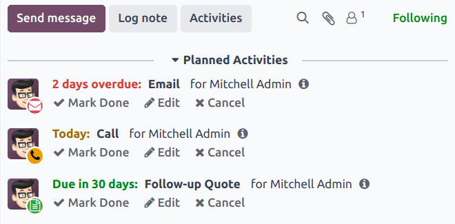

.. tip::
   Click the :icon:`fa-info-circle` :guilabel:`(info)` icon next to a planned activity to see
   additional details.

   .. image:: chatter/planned-activity-details.png
      :align: center
      :alt: A detailed view of a planned activity.

After completing an activity, click :guilabel:`Mark Done` under the activity entry in the chatter.
This opens a :guilabel:`Mark Done` pop-up window, where additional notes about the activity can be
entered. After adding any comments to the pop-up window, click: :guilabel:`Done \& Schedule Next`,
:guilabel:`Done`, or :guilabel:`Discard`.

After the activity is marked complete, an entry with the activity type, title, and any other details
that were included in the pop-up window are listed in the chatter.

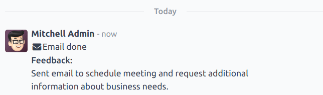

.. _discuss/attach-files:

Attach files
============

Files can be added as attachments in the chatter, either to send with messages, or to include with a
record.

.. note::
   After a file has been added to a chatter thread, it can be downloaded by any user with access to
   the thread. Click the |paperclip| to make the files header visible, if necessary. Then, click the
   :icon:`fa-download` :guilabel:`(download)` icon the file to download it.

To attach a file, click the |paperclip| located at the top of the chatter composer of any record
that contains a chatter thread.

This opens a file explorer pop-up window. Navigate to the desired file, select it, then click
:guilabel:`Open` to add it to the record. Alternatively, files can be dragged and dropped directly
onto a chatter thread.

After files have been added, they are listed in the chatter thread, under a :guilabel:`Files`
heading.

.. note::
   After at least one file has been added to a chatter record, a new button labeled
   :guilabel:`Attach files` appears below the :guilabel:`Files` heading. To attach any additional
   files, this is the button that **must** be used, instead of the |paperclip| at the top of the
   chatter thread.

   After the :guilabel:`Files` section heading appears in the thread, clicking the |paperclip| no
   longer opens a file explorer pop-up window. Instead, clicking the |paperclip| toggles the
   :guilabel:`Files` section from visible to invisible in the chatter thread.

   .. image:: chatter/chatter-attach-files.png
      :align: center
      :alt: A chatter thread with a file attached and the Attach files button added.

.. _discuss/integrations:

Integrations
============

Beyond the standard features, additional integrations can be enabled to work with the chatter
feature, specifically *WhatsApp* and *Google Translate*.

.. important::
   Before the *WhatsApp* and *Google Translate* integrations can be used with the chatter, they
   **must** be configured. Step-by-step instructions on how to set-up each of these features can be
   found in the documentation below:

   - :doc:`WhatsApp <../whatsapp>`
   - :doc:`Google Translate <../../general/integrations/google_translate>`

WhatsApp
--------

*WhatsApp* is an instant messaging and voice-over-IP app that allows users to send and receive
messages, as well as share content.

.. warning::
   *WhatsApp* is an Odoo Enterprise-only application that does **not** work in the Odoo Community
   edition. To sign up for an Odoo Enterprise edition, click here: `Odoo Free Trial
   <https://www.odoo.com/trial>`_.

After *WhatsApp* has been configured and enabled within a database, a :guilabel:`WhatsApp` button is
added above the chatter composer on any applicable record. If one or more approved *WhatsApp*
templates are found for that model, clicking this button opens a :guilabel:`Send WhatsApp Message`
pop-up window.

.. important::
   *WhatsApp* templates **must** be approved before they can be used. See :ref:`WhatsApp templates
   <productivity/whatsapp/templates>` for more information.

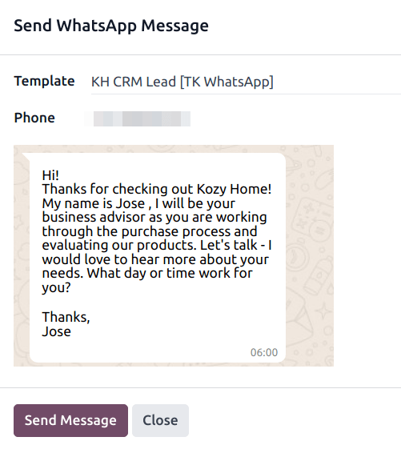

Google Translate
----------------

*Google Translate* can be used to translate user-generated text in the Odoo chatter.

To enable *Google Translate* on a database, an *API key* must first :doc:`be created
<../../general/integrations/google_translate>` through the `Google API Console
<https://console.developers.google.com/>`_.

After creating the API key, navigate to the :menuselection:`Settings app --> Discuss section` and
paste the key in the :guilabel:`Message Translation` field. Click :guilabel:`Save` to save the
changes.

Translate a chatter message
~~~~~~~~~~~~~~~~~~~~~~~~~~~

To translate a user's text from another language, click the :icon:`fa-ellipsis-h`
:guilabel:`(ellipsis)` menu to the right of the chatter. Then, select :guilabel:`Translate`. The
content translates to the language set in the :doc:`user's preferences
<../../general/users/language/>`.

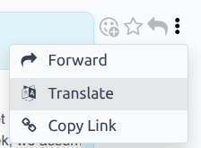

.. important::
   Using the *Google Translate* API **requires** a current billing account with `Google
   <https://myaccount.google.com/>`_.

.. seealso::
   - :doc:`Discuss <../discuss>`
   - :doc:`Discuss Channels <../discuss/team_communication/>`
   - :doc:`Activities <../../essentials/activities>`
   - :doc:`WhatsApp <../whatsapp>`
