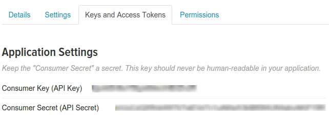

====================================
How to follow Twitter feed from Odoo
====================================

You can follow specific hashtags on Twitter and see the tweets within the 
Odoo Discuss channels of your choice. The tweets are retrieved periodically from Twitter.
An authenticated user can retweet the messages.

Setting up the App on Twitter's side
====================================

Twitter uses an "App" on its side which is opens a gate to which Odoo asks for
tweets, and through which a user can retweet.
To set up this app, go to http://apps.twitter.com/app/new and put in the values:

- Name: this is the name of the application on Twitter

- Website: this is the external url of your Odoo database, with "/web" added.
  For example, if your Odoo instance is hosted at "http://www.example.com", you
  should put "http://www.example.com/web" in this field.

- Callback URL: this is the address on which Twitter will respond. Following the
  previous example you should write "http://www.example.com/web/twitter/callback".

Do not forget to accept the terms **Developer agreement** of use and click on
**Create your Twitter application** at the bottom of the page.

Getting the API key and secret
==============================

When on the App dashboard, switch to the **Keys and Access Tokens** tab.

And copy those values in Odoo in :menuselection:`Settings--> General Settings--> Twitter discuss integration`
and click on **Save** to save the settings.