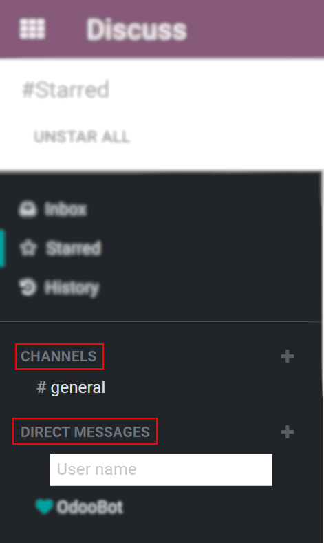

========================
Get Started with Discuss
========================

Discuss allows you to bring all of your company’s communication together through messages, notes,
and chat. Share information, projects, files, prioritize tasks, and stay connected with colleagues
and partners throughout applications. Forge better relationships, increase productivity and
transparency by promoting a convenient way of communicating.

.. _discuss_app/notification_preferences:

Choose your notifications preference
====================================

Access your *Preferences* and choose how you would like your notifications to be handled.

.. image:: get_started/change_preferences.png
   :align: center
   :alt: View of the preferences page for Odoo Discuss

| By default, the field is set as *Handle by Emails* making messages, notes, and notifications where
  you were mentioned or that you follow, to be sent through email. By choosing *Handle in Odoo*,
  they are shown in the *Inbox*.
| Messages can then be *Marked as Todo*, *Replied*, or *Marked as Read*.

.. image:: get_started/inbox_actions.png
   :align: center
   :alt: View of an inbox message and its action options in Odoo Discuss

The messages tagged as *Mark as Todo* are also shown in *Starred*, while the ones *Marked as Read*
are moved to *History*.

.. image:: get_started/starred_messages.png
   :align: center
   :alt: View of messages marked as todo in Odoo Discuss

Start Chatting
==============

The first time you log in to your account, OdooBot sends you a message asking for permission to
receive desktop notifications to chats. If accepted, you receive push notifications to the messages
sent to you despite of where you are in Odoo.

.. image:: get_started/odoobot_push.png
   :align: center
   :alt: View of the messages under the messaging menu emphasizing the request for push
         notifications for Odoo Discuss

.. tip::
   To stop receiving desktop notifications, reset the notifications settings of your browser.

To start a chat, click on *New Message* on the *Messaging Menu*, or go to *Discuss* and send a
*Direct Message*.

You can also create :doc:`public and private channels <team_communication>`.

Mentions in the chat and on the Chatter
---------------------------------------

| To mention a user within a chat or the chatter type *@user-name*; to refer to a channel, type
  *#channel-name*.
| A notification is sent to the user mentioned either to his *Inbox* or through email, depending
  on his settings.

.. image:: get_started/chat_windows.png
   :align: center
   :alt: View of a couple of chat window messages for Odoo Discuss

.. tip::
   When a user is mentioned, the search list (list of names) suggests values first based on the
   task’s followers, and secondly on *Employees*. If the record being searched does not match with
   either a follower or employee, the scope of the search becomes all partners.

Chat status
-----------

It is helpful to see what colleagues are up to and how quickly they can respond to messages by
checking their *Status*. The status is shown on the left side of a contact’s names on Discuss’
sidebar and on the *Messaging menu*.

- Green = online
- Orange = away
- White = offline
- Airplane = out of the office

.. image:: get_started/status.png
   :align: center
   :height: 300
   :alt: View of the contacts’ status for Odoo Discuss

.. seealso::
   - :doc:`team_communication`
   - :doc:`/applications/general/email_communication/email_servers`
