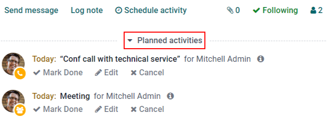
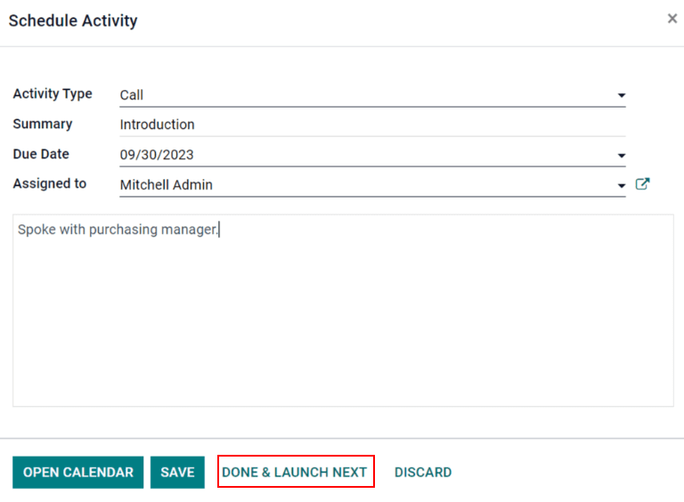

==========
Activities
==========

*Activities* are follow-up tasks tied to a record in an Odoo database. Activities can be scheduled
on any page of the database that contains a chatter thread, kanban view, list view, or activities
view of an application.

Schedule activities
===================

One way that activities are created is by clicking the :guilabel:`Schedule Activity` button, located
at the top of the *chatter* on any record. On the pop-up window that appears, select an
:guilabel:`Activity Type` from the drop-down menu.

.. tip::
   Individual applications have a list of *Activity Types* dedicated to that application. For
   example, to view and edit the activities available for the *CRM* application, go to
   :menuselection:`CRM app --> Configuration --> Activity Types`.

Enter a title for the activity in the :guilabel:`Summary` field, located in the :guilabel:`Schedule
Activity` pop-up window.

To assign the activity to a different user, select a name from the :guilabel:`Assigned to` drop-down
menu. Otherwise, the user creating the activity is automatically assigned.

Lastly, feel free to add any additional information in the optional :guilabel:`Log a note...` field.

.. note::
   The :guilabel:`Due Date` field on the :guilabel:`Schedule Activity` pop-up window auto-populates
   based on the configuration settings for the selected :guilabel:`Activity Type`. However, this
   date can be changed by selecting a day on the calendar in the :guilabel:`Due Date` field.

Lastly, click one of the following buttons:

- :guilabel:`Schedule`: adds the activity to the chatter under :guilabel:`Planned activities`.
- :guilabel:`Mark as Done`: adds the details of the activity to the chatter under :guilabel:`Today`.
  The activity is not scheduled, it is automatically marked as completed.
- :guilabel:`Done \& Schedule Next`: adds the task under :guilabel:`Today` marked as done, and
  opens a new activity window.
- :guilabel:`Discard`: discards any changes made on the pop-up window.

.. image:: plan_activities/schedule-pop-up.png
   :align: center
   :alt: View of CRM leads and the option to schedule an activity.

.. note::
   Depending on the activity type, the :guilabel:`Schedule` button may be replaced by a
   :guilabel:`Save` button, or an :guilabel:`Open Calendar` button.

Scheduled activities are added to the chatter for the record under :guilabel:`Planned activities`.

Activities can also be scheduled from the kanban, list, or activities view of an application.

.. tabs::

   .. tab:: Kanban view

      Select a record on which to schedule an activity. Click on the :guilabel:`🕘 (clock)` icon,
      then :guilabel:`Schedule An Activity`, and proceed to fill out the pop-up form.

      .. image:: plan_activities/schedule-kanban-activity.png
         :align: center
         :alt: Kanban view of the CRM pipeline and the option to schedule an activity.

   .. tab:: List view

      Select a record on which to schedule an activity. Click on the :guilabel:`🕘 (clock)` icon,
      then :guilabel:`Schedule An Activity`. If the record already has an activity scheduled, the
      clock icon may be replaced by a :guilabel:`📞 (phone)` or an :guilabel:`✉️ (envelope)` icon.

      .. image:: plan_activities/schedule-list-activity.png
         :align: center
         :alt: List view of the CRM pipeline and the option to schedule an activity.

   .. tab:: Activity view

      To open the activity view for an application, select the :guilabel:`🕘 (clock)` icon from the
      menu bar anywhere in the database. Select any application from the drop-down menu, and click
      the :guilabel:`🕘 (clock)` icon for the desired app.

      .. image:: plan_activities/schedule-activity-view-menu.png
         :align: center
         :alt: Activity menu drop down with focus on where to open activity view for CRM.

      Select a record on which to schedule an activity. Move across the row to find the desired
      activity type, then click the :guilabel:`＋ (plus sign)`.

      .. image:: plan_activities/schedule-activity-view.png
         :align: center
         :alt: Activity view of the CRM pipeline and the option to schedule an activity.

.. note::
   Activity colors, and their relation to an activity's due date, is consistent throughout Odoo,
   regardless of the activity type, or the view.

   - Activities that appear in **green** indicate a due date sometime in the future.
   - **Yellow** indicates that the activity's due date is today.
   - **Red** indicates that the activity is overdue and the due date has passed.

   For example, if an activity is created for a phone call, and the due date passes, the activity
   appears with a red phone in list view, and a red clock on the kanban view.

View scheduled activities
=========================

To view scheduled activities, open either the :menuselection:`Sales app` or :menuselection:`CRM app`
and click the :guilabel:`🕘 (clock)` icon, located to the far-right side of the other view options.

Doing so opens the activities menu, showcasing all the scheduled activities for the user, by
default. To show all activities for every user, remove the :guilabel:`My Pipeline` filter from the
:guilabel:`Search...` bar.

To view a consolidated list of activities separated by the application where they were created, and
by deadline, click the :guilabel:`🕘 (clock)` icon on the header menu to see the activities for that
specific application in a drop-down menu.

The possibility to :guilabel:`Add new note` and :guilabel:`Request a Document` appear at the bottom
of this drop-down menu, when the :guilabel:`🕘 (clock)` icon on the header menu is clicked.

.. image:: plan_activities/activities-menu.png
   :align: center
   :alt: View of CRM leads page emphasizing the activities menu.

Configure activity types
========================

To configure the types of activities in the database, go to :menuselection:`Settings app --> Discuss
--> Activities --> Activity Types`.

.. image:: plan_activities/settings-activities-types.png
   :align: center
   :alt: View of the settings page emphasizing the menu activity types.

Doing so reveals the :guilabel:`Activity Types` page, where the existing activity types are found.

To edit an existing activity type, select it from the list, then click :guilabel:`Edit`. To create a
new activity type, click :guilabel:`Create`.

At the top of a blank activity type form, start by choosing a :guilabel:`Name` for the new activity
type.

.. image:: plan_activities/new-activity-type.png
   :align: center
   :alt: New activity type form.

Activity settings
-----------------

Action
~~~~~~

The *Action* field specifies the intent of the activity. Some actions trigger specific behaviors
after an activity is scheduled.

- If :guilabel:`Upload Document` is selected, a link to upload a document is added directly to the
  planned activity in the chatter.
- If either :guilabel:`Phonecall` or :guilabel:`Meeting` are selected, users have the option to open
  their calendar to schedule a time for this activity.
- If :guilabel:`Request Signature` is selected, a link is added to the planned activity in the
  chatter that opens a signature request pop-up window.

.. note::
   The actions available to select on an activity type vary, depending on the applications currently
   installed in the database.

Default user
~~~~~~~~~~~~

To automatically assign this activity to a specific user when this activity type is scheduled,
choose a name from the :guilabel:`Default User` drop-down menu. If this field is left blank, the
activity is assigned to the user who creates the activity.

Default summary
~~~~~~~~~~~~~~~

To include notes whenever this activity type is created, enter them into the :guilabel:`Default
Summary` field.

.. note::
   The information in the :guilabel:`Default User` and :guilabel:`Default Summary` fields are
   included when an activity is created. However, they can be altered before the activity is
   scheduled or saved.

Next activity
-------------

To automatically suggest, or trigger, a new activity after an activity has been marked complete, the
:guilabel:`Chaining Type` must be set.

Suggest next activity
~~~~~~~~~~~~~~~~~~~~~

In the :guilabel:`Chaining Type` field, select :guilabel:`Suggest Next Activity`. Upon doing so, the
field underneath changes to: :guilabel:`Suggest`. Click the :guilabel:`Suggest` field drop-down menu
to select any activities to recommend as follow-up tasks to this activity type.

In the :guilabel:`Schedule` field, choose a default deadline for these activities. To do so,
configure a desired number of :guilabel:`Days`, :guilabel:`Weeks`, or :guilabel:`Months`. Then,
decide if it should occur :guilabel:`after completion date` or :guilabel:`after previous activity
deadline`.

This :guilabel:`Schedule` field information can be altered before the activity is scheduled.

When all configurations are complete, click :guilabel:`Save`.

.. image:: plan_activities/schedule-recommended-activity.png
   :align: center
   :alt: Schedule activity popup with emphasis on recommended activities.

.. note::
   If an activity has the :guilabel:`Chaining Type` set to :guilabel:`Suggest Next Activity`, and
   has activities listed in the :guilabel:`Suggest` field, users are presented with recommendations
   for activities as next steps.

Trigger next activity
~~~~~~~~~~~~~~~~~~~~~

Setting the :guilabel:`Chaining Type` to :guilabel:`Trigger Next Activity` immediately launches the
next activity once the previous one is completed.

If :guilabel:`Trigger Next Activity` is selected in the :guilabel:`Chaining Type` field, the field
beneath changes to: :guilabel:`Trigger`. From the :guilabel:`Trigger` field drop-down menu, select
the activity that should be launched once this activity is completed.

In the :guilabel:`Schedule` field, choose a default deadline for these activities. To do so,
configure a desired number of :guilabel:`Days`, :guilabel:`Weeks`, or :guilabel:`Months`. Then,
decide if it should occur :guilabel:`after completion date` or :guilabel:`after previous activity
deadline`.

This :guilabel:`Schedule` field information can be altered before the activity is scheduled.

When all configurations are complete, click :guilabel:`Save`.

.. note::
   When an activity has the :guilabel:`Chaining Type` set to :guilabel:`Trigger Next Activity`,
   marking the activity as `Done` immediately launches the next activity listed in the
   :guilabel:`Trigger` field.

.. seealso::
   - :doc:`get_started`
   - :doc:`team_communication`
