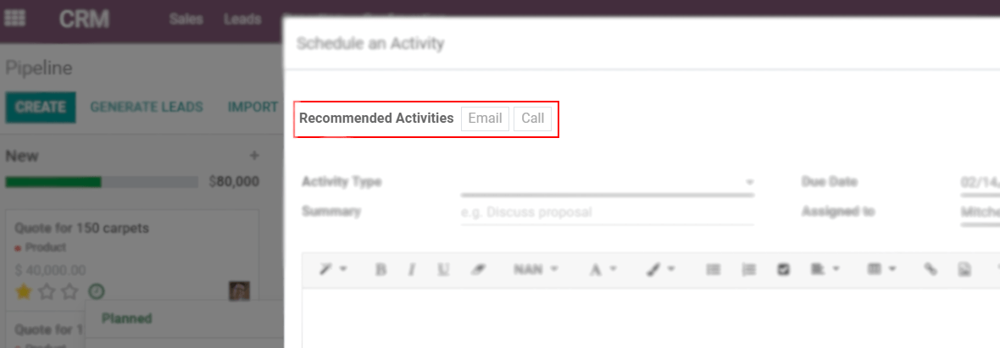

====================================
Get Organized by Planning Activities
====================================

When you plan activities you minimize the risk of uncertainties, as you provide clear directions
for the course of your next action. In addition to that, you do not leave space for wasteful
activities and reduce the chance of having overlapping actions between team members.

Where do I see my schedule activities?
======================================

Access and manage your activities wherever you are in Odoo by the *Activities* menu.

.. image:: plan_activities/activities_menu.png
   :align: center
   :height: 300
   :alt: View of crm leads page emphasizing the activities menu for Odoo Discuss

Plan activities
===============

Activities can be planned and managed from the chatter by clicking on *Schedule activity*,
or through Kanban views.

.. image:: plan_activities/schedule_activity.png
   :align: center
   :height: 300
   :alt: View of crm leads and the option to schedule an activity for Odoo Discuss

Set your activity types
-----------------------

A number of activities types are available by default in Odoo (call, email, meeting, etc.). However,
you can set new ones going to :menuselection:`Settings --> Activity types`.

.. image:: plan_activities/settings_activities_types.png
   :align: center
   :height: 300
   :alt: View of the settings page emphasizing the menu activity types for Odoo Discuss

.. tip::
   If you need to create an activity type with an available calendar, make sure to create
   it with an *Action to Perform* set as *Meeting*.

Recommend next activities
-------------------------

Odoo helps you to plan a flow of activities by allowing you to set *Recommended Next Activities*.

.. image:: plan_activities/recommended_activities.png
   :align: center
   :alt: View of an activity type form emphasizing the field recommended next activities for Odoo
         Discuss

Once the respective activity is completed, select *Done & Schedule Next* and next steps are
suggested to you.

         shown for Odoo Discuss

.. seealso::
   - :doc:`get_started`
   - :doc:`team_communication`
