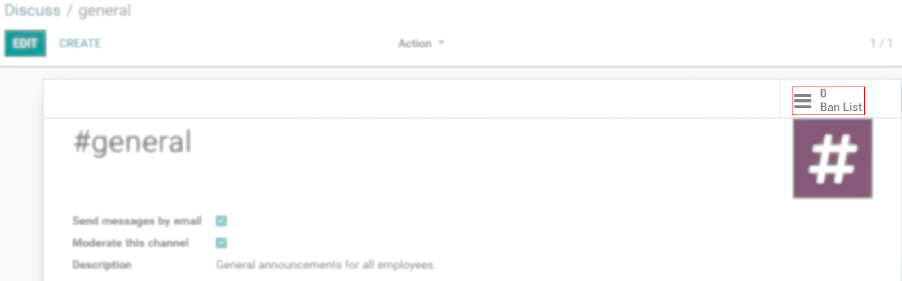
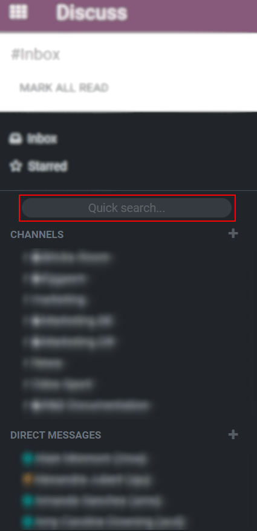

======================================
Efficiently Communicate Using Channels
======================================

You can use channels to organize discussions between individual teams, departments, projects, or any
other group that requires regular communication. This way, you keep everyone in the loop updated
with the latest developments.

Public and Private channels
===========================

A *Public* channel can be seen by everyone, while a *Private* one is only visible to users invited
to it.

.. image:: team_communication/create_channel.png
   :align: center
   :height: 370
   :alt: View of discuss’s sidebar and a channel being created in Odo Discuss

.. tip::
   A public channel is best used when many employees need to access information (such as company
   announcements), whereas a private channel could be used whenever information should be limited
   to specific groups (such as a specific department).

Configuration options
---------------------

You can configure a channel’s name, description, email alias, and privacy by clicking on the
*Channel Settings* icon on the sidebar.

.. image:: team_communication/channel_settings.png
   :align: center
   :alt: View of a channel’s settings form in Odoo Discuss

Privacy and Members
~~~~~~~~~~~~~~~~~~~

| Changing *Who can follow the group’s activities?* allows you to control which groups can have
  access to the channel. Note that allowing *Everyone* to follow a private channel lets other users
  view and join it, as they would a public one.
| If you choose *Invited people only*, go to the *Members* tab to add your members, or, go to
  Discuss’ main page, select the channel and click on *Invite*.

.. image:: team_communication/invite_channel.png
   :align: center
   :height: 380
   :alt: View of Discuss’ sidebar emphasizing the option to invite members in Odoo Discuss

For *Selected group of users*, the option *Auto Subscribe Groups* automatically add its members
as followers. In other words, while *Authorized Groups* limits which users can access the channel,
*Auto Subscribe Groups* automatically adds the user as a member as long as they are part of the
group.

Use a channel as a mailing list
-------------------------------

| Choosing to *Send messages by email* configures the channel to behave as a mailing list.
| Enabling this option allows you to *Moderate this channel*, meaning that messages will need to be
  approved before being sent.

.. image:: team_communication/pending_moderation.png
   :align: center
   :alt: View of a message with a pending moderation status in Odoo Discuss

| Under the *Moderation* tab choose as many moderators as you need, and if you would like them to
  receive an *Automatic notification*.
| Mark *Send guidelines to new subscribers* to automatically send instructions to newcomers.

.. image:: team_communication/moderation_settings.png
   :align: center
   :alt: View of a channel’s settings form emphasizing the tab moderation in Odoo Discuss

Moderators can: *Accept*, *Reject*, *Discard*, *Always Allow* or *Ban* messages.

.. image:: team_communication/moderate_messages.png
   :align: center
   :alt: View of a message to be moderated in Odoo Discuss

.. note::
   Members of a mailing channel receive messages through email regardless of their
   :doc:`notification preference <get_started>`.

Once a channel is moderated, the menu *Ban List* allows you to add email addresses per moderated
channel to auto-ban them from sending messages.

Quick search bar
================

Once at least 20 channels, direct message and live chat conversations (if the module is installed
on your database) are pinned in the sidebar, a *Quick search…* bar is displayed. It is a clever
way to filter conversations and quickly find the one you need.

Finding channels
----------------

| Click on *Channels* (on the sidebar), browse through the list of public channels, and join or
  leave them from a single screen.
| Apply filters criteria and save it for later use. The search function accepts wildcards by using
  the underscore character *(_)* to represent a single character.

.. image:: team_communication/filter.png
   :align: center
   :alt: View of a channel being searched through filters in Odoo Discuss

.. seealso::
   - :doc:`get_started`
   - :doc:`plan_activities`
