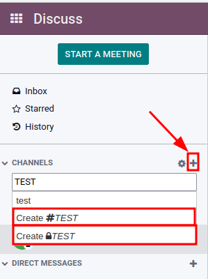
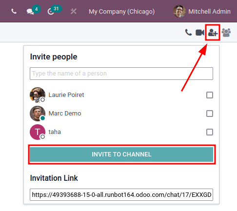
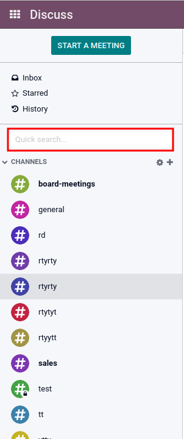
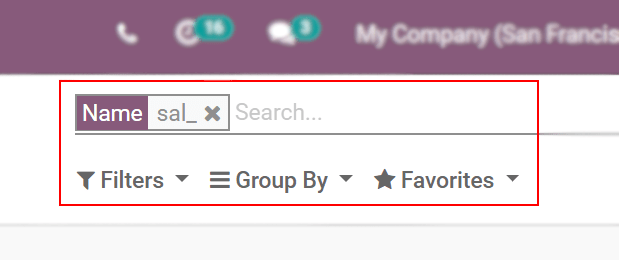
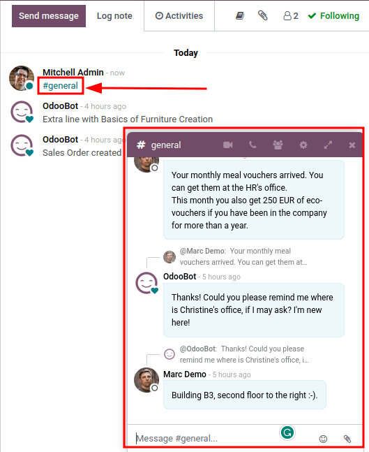

===================================
Use channels for team communication
===================================

Use channels in the Odoo *Discuss* app to organize discussions between individual teams,
departments, projects, or any other group that requires regular communication. With channels,
employees can communicate inside dedicated spaces within the Odoo database around specific topics,
updates, and latest developments having to do with the organization.

Public and private channels
===========================

A *Public* channel can be seen by everyone, while a *Private* one is only visible to users invited
to it. To create a new channel, navigate to the :menuselection:`Discuss` app, and then click on the
:guilabel:`➕ (plus)` icon next to the :guilabel:`Channels` heading in the left-side menu. After
typing the name of the channel, two selectable options will appear: The first is a channel with a
hashtag (`#`) to indicate that it is a public channel; the second option is a channel with a lock
icon (`🔒`) next to it, to indicate that it is a private channel. Select the channel type that best
fits the communication needs.

.. tip::
   A public channel is best used when many employees need to access information (such as company
   announcements), whereas a private channel could be used whenever information should be limited
   to specific groups (such as a specific department).

Configuration options
---------------------

The channel's :guilabel:`Group Name`, :guilabel:`Description`, and :guilabel:`Privacy` settings can
be modified by clicking on the channel's settings, represented by a :guilabel:`⚙️ (gear)` icon in
the left sidebar menu, next to the channel's name.

.. image:: team_communication/channel-settings.png
   :align: center
   :alt: View of a channel's settings form in Odoo Discuss.

Privacy and Members tabs
~~~~~~~~~~~~~~~~~~~~~~~~

Changing :guilabel:`Who can follow the group's activities?` controls which groups can have access to
the channel.

.. note::
   Allowing :guilabel:`Everyone` to follow a private channel lets other users view and join it, as
   they would a public one.

When choosing :guilabel:`Invited people only`, specify in the :guilabel:`Members` tab which members
should be invited. Inviting members can also be done from the *Discuss* app's main dashboard, by
selecting the channel, clicking the *add user* icon in the top-right corner of the dashboard, and
finally clicking :guilabel:`Invite to Channel` once all the users have been added.

When the :guilabel:`Selected group of users` option is selected, it reveals the ability to add an
:guilabel:`Authorized Group`, along with the options to :guilabel:`Auto Subscribe Groups` and
:guilabel:`Auto Subscribe Departments`.

The option to :guilabel:`Auto Subscribe Groups` automatically adds users of that particular user
group as followers. In other words, while :guilabel:`Authorized Groups` limits which users can
access the channel, :guilabel:`Auto Subscribe Groups` automatically adds users as members as long as
they are part of a specific user group. The same is true for :guilabel:`Auto Subscribe Departments`.

Quick search bar
================

Once at least 20 channels, direct messages, or live chat conversations (if *Live Chat* module is
installed on the database) are pinned in the sidebar, a :guilabel:`Quick search…` bar is displayed.
This feature is a convenient way to filter conversations and quickly find relevant communications.

Finding channels
----------------

Click on the settings :guilabel:`⚙️ (gear)` icon, located in the left sidebar, to the right of the
:guilabel:`CHANNELS` collapsible menu item. Doing so will lead to a mosaic view containing all the
public channels available. Users can join or leave channels on this screen by clicking the
:guilabel:`JOIN` or :guilabel:`LEAVE` buttons that appear in the channel boxes.

There is also the ability to apply filtering criteria and save them for later use. The
:guilabel:`Search...` function accepts wildcards by using the underscore character [ `_` ], and
specific searches can be saved by using the :menuselection:`Favorites --> Save Current Search`
drop-down menu.

Linking channel in chatter
==========================

Channels can be linked in the chatter (log note) of a record in Odoo. To do so, simply type: `#` and
the channel name. Click or press enter on the *channel* name. Upon logging the note a link to the
channel will appear. After clicking on the link a chat window with the channel conversation will
pop up in the lower right corner of the screen.

Users are able to contribute to this group channel (either public or member based) by typing
messages in window and pressing *enter*.

.. seealso::
   - :doc:`get_started`
   - :doc:`plan_activities`
