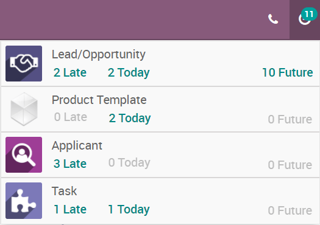
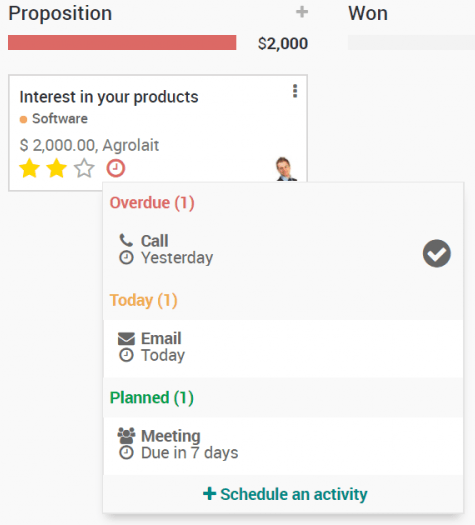
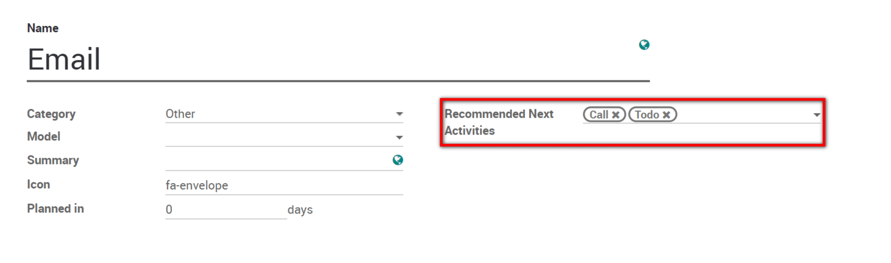
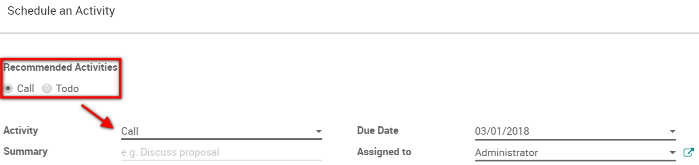

====================================
Get organized by planning activities
====================================

Planning activities is the perfect way to keep on track with your work.
Get reminded of what needs to be done and schedule the next activities
to undertake.

Your activities are available wherever you are in Odoo. It is easy to
manage your priorities.

Activities can be planned and managed from the chatters or in the kanban
views. Here is an example for opportunities :

Set your activity types
=======================

A number of generic activities types are available by default in Odoo
(e.g. call, email, meeting, etc.). If you would like to set new ones, go
to :menuselection:`Settings --> General settings --> Activity types`.

Schedule meetings
=================

Activities are planned for specific days. If you need to set hours, go
with the *Meeting* activity type. When scheduling one, the calendar
will simply open to let you select a time slot.

.. tip::
    If you need to use other activity types with a calendar
    planning, make sure their *Category* is set as *Meeting*.

Schedule a chain of activities to follow
========================================

Odoo helps you easily plan your usual flow of activities. Go to
:menuselection:`Configuration --> Activity Types` and set the common
following steps as *Recommended next activities*.

Now, when an activity is completed, you can select *Done & schedule
next*. The next steps will automatically be suggested to you.

Have fun getting better organized by planning activities !
