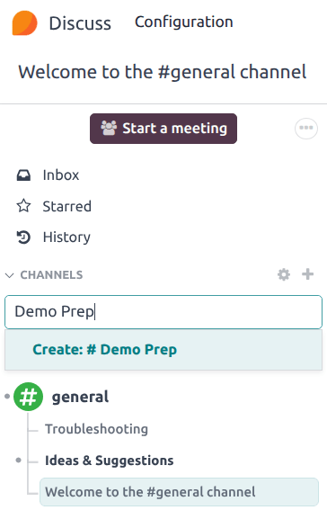
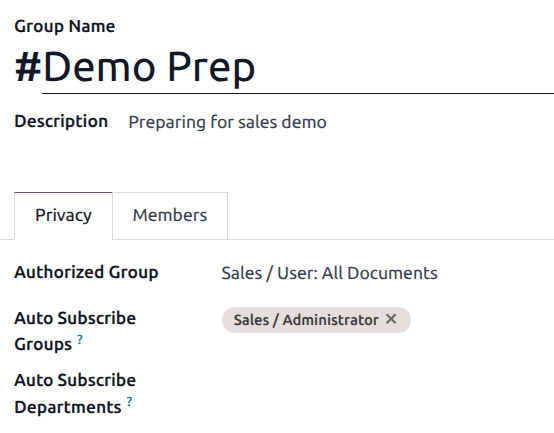
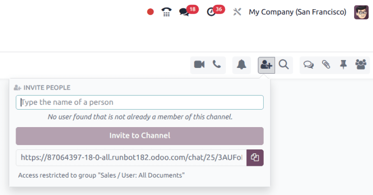
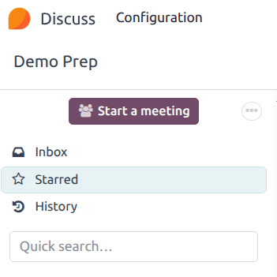
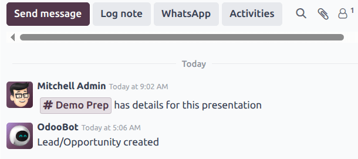

===================================
Use channels for team communication
===================================

Use channels in the Odoo **Discuss** app to organize discussions between individual teams,
departments, projects, or any other group that requires regular communication. With channels,
employees can communicate inside dedicated spaces within the Odoo database around specific topics,
updates, and latest developments having to do with the organization.

Create a new channel
====================

To create a new channel, navigate to the :menuselection:`Discuss` app, and then click on the
:icon:`fa-plus` :guilabel:`(plus)` icon next to the :guilabel:`Channels` heading in the left-side
menu.

The channel's :guilabel:`Group Name`, :guilabel:`Description`, and :guilabel:`Privacy` settings can
be modified by clicking on the channel's settings, represented by a :icon:`fa-cog`
:guilabel:`(gear)` icon in the left sidebar menu, next to the channel's name.

Privacy tab
-----------

To control which users can join a channel, open the channel's setting page and navigate to the
:guilabel:`Privacy` tab.

To limit access of the channel to a specific group, select an option from the :guilabel:`Authorized
Group` drop-down menu.

To automatically add members of a group as followers of the channel, click the :guilabel:`Auto
Subscribe Groups` field, and select one or more groups from the list.

.. note::
   Users who are automatically added as followers can manually edit their subscription to the
   channel, if necessary.

The option to :guilabel:`Auto Subscribe Groups` automatically adds users of that particular user
group as followers. In other words, while :guilabel:`Authorized Groups` limits which users can
access the channel, :guilabel:`Auto Subscribe Groups` automatically adds users as members as long as
they are part of a specific user group. The same is true for :guilabel:`Auto Subscribe Departments`.

Invite members to a channel
---------------------------

To invite members to a channel, click on the :guilabel:`Members` tab. Click :guilabel:`Add a line`,
then select either a :guilabel:`Partner` or :guilabel:`Guest` from the drop-down menu.

Inviting members can also be done from the **Discuss** app's main dashboard, by selecting the
channel, clicking the :icon:`fa-user-plus` :guilabel:`(add user)` icon in the top-right corner of
the dashboard, and finally clicking :guilabel:`Invite to Channel` once all the users have been
added.

Quick search bar
================

Once at least 20 channels, direct messages, or live chat conversations are pinned in the sidebar, a
:guilabel:`Quick search…` bar is displayed. This feature is a convenient way to filter conversations
and find relevant communications.

Finding channels
----------------

To view all available channels, click on the :icon:`fa-cog` :guilabel:`(gear)` icon to the right of
the :guilabel:`CHANNELS` menu. Users can join or leave channels on this screen by clicking the
:guilabel:`Join` or :guilabel:`Leave` buttons that appear in the channel boxes.

There is also the ability to apply filtering criteria and save them for later use. The
:guilabel:`Search...` function accepts wildcards by using the underscore character [ `_` ], and
specific searches can be saved by using the :menuselection:`Favorites --> Save Current Search`
drop-down menu.

Linking channel in chatter
==========================

Channels can be linked in the *chatter* of a record to share relvant discussions. To do so, type:
`#` and the channel name. Click or press enter on the *Channel* name. Upon logging the note a link
to the channel appears. After clicking on the link a chat window with the channel conversation pops
up in the lower right corner of the screen.

Users are able to contribute to this group channel by typing messages in window and pressing
*enter*.

.. seealso::
   - :doc:`../discuss`
   - :doc:`/applications/essentials/activities`
