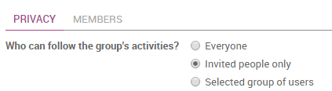

=====================================================
How to efficiently communicate in team using channels
=====================================================

You can use **channels** to organize discussions between individual
teams, departments, projects, or any other group that requires regular
communication. By having conversations that everyone in the channel can
see, it's easy to keep the whole team in the loop with the latest
developments.

Creating a channel
==================

In Discuss there are two types of channels - **public** and
**private**.

A **public channel** can only be created by an administrator with
write privileges and can be seen by everyone in the organization. By
contrast, a **private channel** can be created by any user and by
default is only visible to users who have been invited to this
channel.

.. note::
    A public channel is best used when many employees need to
    access information (such as interdepartmental communication or
    company announcements), whereas a private channel should be used
    whenever information should be limited to specific users/employees
    (such as department specific or sensitive information).

Configuring a channel
=====================

You can configure a channel's name, description, access rights,
automatic subscription, and emailing from
:menuselection:`#channel-name --> Settings`. 
Changing channel access rights allows
you to control which groups can view each channel. You can make a
channel visible by all users, invited users, or users within a
selected user group. Note that allowing "Everyone" to follow a
private channel will let other users view and join it as they would
a public channel.

How to set up a mailing list
============================

A channel can be configured to behave as a mailing list. From within
:menuselection:`#channel-name --> Settings`, define the email you would like to use.
Users can then post to the channel and choose to receive
notifications using the defined email address. An envelope icon will
appear next to the channel name in the list to indicate that a
channel will send messages by email.

Locating a channel
==================

If you do not see a channel on your dashboard, you can search the
list of **public channels** to locate the correct channel or create
a new channel by clicking the plus icon.

.. image:: media/discuss03.png
    :align: center

You can also click the **CHANNELS** heading to browse a list of all
public channels. This allows the user to manually **join** and
**leave** public channels from a single screen.

.. note::
    It is always wise to search for a channel before creating a new
    one to ensure that duplicate entries are not created for the same topic.

Using filters to navigate within Discuss
========================================

The topbar search provides access to the same comprehensive search
function present in the rest of Odoo. You can apply multiple **filter
criteria** and **save filters** for later use. The search function
accepts wildcards by using the underscore character "\ **\_**\ " to
represent a **single character wildcard.**