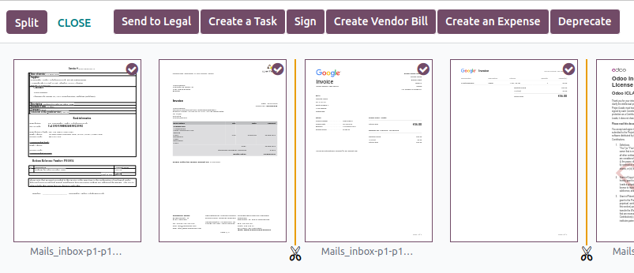
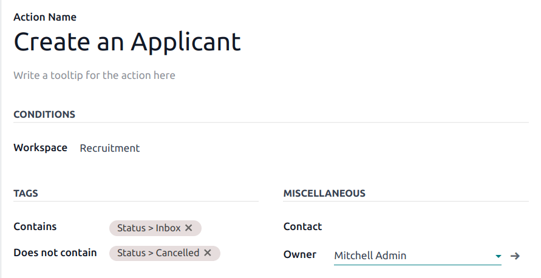
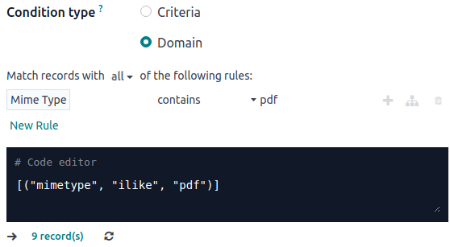
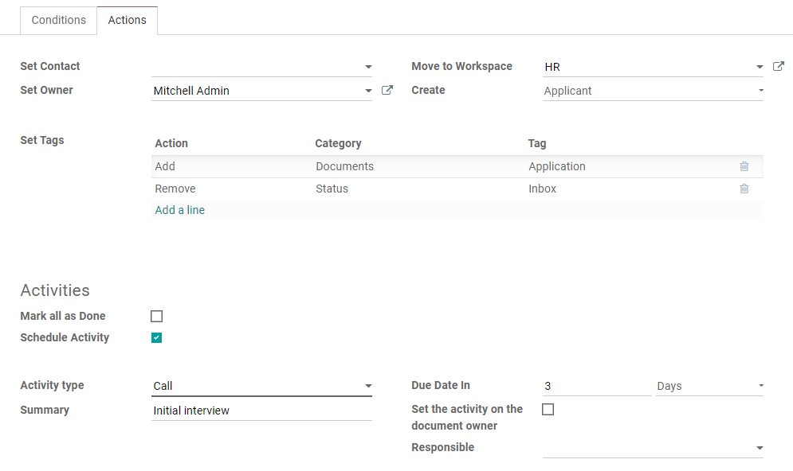

=========
Documents
=========

**Odoo Documents** allows you to store, view, and manage files within Odoo.

You can upload any file (max 64MB per file on Odoo Online) and organize them in various workspaces.

.. seealso::
   - `Odoo Documents: product page <https://www.odoo.com/app/documents>`_
   - `Odoo Tutorials: Documents basics [video] <https://www.odoo.com/slides/slide/documents-basics-6841?fullscreen=1>`_
   - `Odoo Tutorials: Using Documents with your Accounting App [video] <https://www.odoo.com/slides/slide/accounting-integration-and-workflow-actions-6853?fullscreen=1>`_

Configuration
=============

By going to :menuselection:`Documents --> Configuration --> Settings`, you can enable the
centralization of files attached to a specific area of your activity. For example, by ticking
:guilabel:`Human Resources`, your HR documents are automatically available in the HR workspace,
while documents related to Payroll are automatically available in the Payroll sub-workspace. You
can change the default workspace using the dropdown menu and edit its properties by clicking the
:icon:`fa-arrow-right` (:guilabel:`Internal link`) icon.

.. image:: documents/files-centralization.png
   :alt: Enable the centralization of files attached to a specific area of your activity.

.. note::
   - If you enable the centralization of your accounting files and documents, it is necessary to
     click on :guilabel:`Journals` and define each journal independently to allow automatic
     synchronization.

     .. image:: documents/accounting-files-centralization.png
        :alt: Enable the centralization of files attached to your accounting.

   - If you select a new workspace, existing documents are not moved. Only newly created documents
     will be found under the new workspace.

.. _documents/workspaces:

Workspaces
==========

Workspaces are hierarchical folders having their own set of :ref:`tags <documents/tags>`
and :ref:`actions <documents/workflow-actions>`. Default workspaces exist, but you can create your
own by going to :menuselection:`Documents --> Configuration --> Workspaces` and clicking
:guilabel:`New`. On the new page, fill in the following information:

- :guilabel:`Name`
- :guilabel:`Parent Workspace`: if you want to create a sub-workspace, select its :guilabel:`Parent
  Workspace`.

Three tabs are available: :ref:`Tags <documents/tags>`,
:ref:`Access Rights <documents/access-rights>`, and :ref:`Description <documents/description>`.

.. _documents/tags:

Tags
----

Tags are used within workspaces to add a level of differentiation between documents. They are
organized per category, and filters can be used to sort them.

From the :guilabel:`Tags` tab, click :guilabel:`Add a line`, create the :guilabel:`Tag Category`,
and :guilabel:`Name` your tags.

.. note::
   - The tags of a parent workspace apply to the child workspaces automatically;
   - Tags can be created and modified by going to :menuselection:`Documents --> Configuration -->
     Tags`;
   - Tags can also be created or edited by clicking the :icon:`fa-gear` (:guilabel:`gear`) icon on
     the left panel;
   - An :ref:`email alias <documents/upload>` can be used to automatically send received documents
     to a specific workspace based on the tag assigned.

.. _documents/access-rights:

Access rights
-------------

To manage your workspace access rights, go to the :guilabel:`Access Rights` tab. You can add
:guilabel:`Write Groups` that can view, create, and edit the workspace's documents. You can also add
:guilabel:`Read Groups` that only view the workspace's documents.

.. tip::
   Enable :guilabel:`Own Documents Only` to limit :guilabel:`Read Groups` and
   :guilabel:`Write Groups` to the documents of which they are owner.

.. _documents/description:

Description
-----------

You can add descriptive information to your workspace by going to the :guilabel:`Description` tab.

.. note::
   Workspaces can also be created and edited by clicking the :icon:`fa-gear` (:guilabel:`gear`) icon
   on the left panel.

.. _documents/management:

Documents management
====================

When selecting or opening a document, the right panel displays different options, including, for
example:

- :icon:`fa-download` (:guilabel:`Download`);
- :icon:`fa-share-alt` (:guilabel:`Share this selection`): a share URL is copied to your clipboard;
- :icon:`fa-retweet` (:guilabel:`Replace`): select a new file to replace the existing one. Scroll
  down to the bottom of the right panel to see the :guilabel:`History` and :guilabel:`restore`,
  :guilabel:`download`, or :guilabel:`delete` the document;
- :icon:`fa-unlock` (:guilabel:`Lock`);
- :icon:`fa-scissors` (:ref:`Split <documents/split>`).

You can also :icon:`fa-comments` :guilabel:`Open chatter` or delete the document by clicking the
:icon:`fa-trash` (:guilabel:`Move to trash`) icon.

.. note::
   Items moved to the trash are permanently deleted after 30 days.

To modify the name of your file, click on :guilabel:`Name`. A :guilabel:`Contact` or an
:guilabel:`Owner` can be assigned. The related :guilabel:`Workspace` can be modified and it is
possible to access the related :guilabel:`Journal Entry` or add :guilabel:`Tags`.

.. note::
   - The :guilabel:`Contact` is a person related to the document who only has read
     :ref:`access rights <documents/access-rights>` to the document, e.g., an existing supplier in
     your database;
   - The creator of a document is automatically assigned as its :guilabel:`Owner` and is granted
     full access rights to it. To replace the owner of a document, select the required user from the
     dropdown list in the :guilabel:`Owner` field.

.. tip::
   An employee must be a user and the owner of a document to view it in **My Profile**.

Different :ref:`Actions <documents/workflow-actions>` are available at the bottom of the right
panel, depending on the workspace where your document is stored.

.. _documents/split:

Split PDF documents
-------------------

Select the PDF you want to split, and click the :icon:`fa-scissors` (:guilabel:`scissors`) icon. A
new view displays all the pages of the document.

By default, all pages are split when you click :guilabel:`Split`. To remove a split between two
pages, click the :icon:`fa-scissors` (:guilabel:`scissors`) icon.

.. tip::
   To merge documents from your dashboard, select them and click the :icon:`fa-scissors`
   (:guilabel:`scissors`) icon. Click on the scissors between the two documents and click
   :guilabel:`Split` to merge the documents.

Additional features
-------------------

Select a workspace and click the :icon:`fa-caret-down` (:guilabel:`down arrow`) next to the
:guilabel:`Upload` button to access additional features:

Request
~~~~~~~

You can request files and organize them as documents to remind users to download them.

Select the workspace where the file should be stored, click the :icon:`fa-caret-down`
(:guilabel:`down arrow`) next to the :guilabel:`Upload` button, then :guilabel:`Request`. Add the
:guilabel:`Document Name` and select the person you need it from in the :guilabel:`Request To`
field. You can also fill in the :guilabel:`Due Date In`, confirm the :guilabel:`Workspace` the
document should belong to, and add :guilabel:`Tags` and a :guilabel:`Message`. Then, click
:guilabel:`Request`. A placeholder for the missing document is created in the workspace.

When your document is available, click the placeholder to upload it.

You can see all missing documents by going to the **Activity** view and the :guilabel:`Requested
Document` column.

.. tip::
   From the :guilabel:`Activity` view, you can send a **reminder email** to users from whom you are
   expecting a document. Go to the :guilabel:`Requested Document` column and click the
   :icon:`fa-ellipsis-v` (:guilabel:`ellipsis`) icon, and :guilabel:`Document Request: Reminder`.
   Click on a date to see the details of a specific request. You can update it by clicking on the
   :icon:`fa-pencil` (:guilabel:`pen`) icon, :guilabel:`Preview` the content of the reminder email,
   or :guilabel:`Send Now` to send a reminder email.

      .. image:: documents/reminder-email.png
         :alt: send a reminder email from the Activity view

.. _documents/add-a-link:

Add a link
~~~~~~~~~~

To add a link to your documents dashboard, click :guilabel:`Add a Link`, enter the :guilabel:`URL`,
and :guilabel:`Name` it.

Share
~~~~~

You can make a document or a workspace accessible to anyone by sharing a URL.

Share a document
****************

To generate a **share link** to a document, select the document, click the :icon:`fa-caret-down`
(:guilabel:`down arrow`) next to the :guilabel:`Upload` button, and click :guilabel:`Share`.

In the pop-up, you can :guilabel:`Name` the share link, set a validity date by filling in the
:guilabel:`Valid Until` field, and if you own more than one site, select the :guilabel:`Website` you
want so the right domain name is reflected in the URL.

Click :guilabel:`Copy` or :guilabel:`Share` to send the URL to whomever you want.

.. tip::
   You can also generate a share URL by selecting the document, going to the right panel, and
   clicking the :icon:`fa-share-alt` (:guilabel:`Share this selection`) icon.

Share a workspace
*****************

You can share a link to a workspace and allow users to :guilabel:`Download` its content or
:guilabel:`Download and Upload` files to it.

To do so, go to the left column of your dashboard. In the :guilabel:`Workspace` section, select the
workspace to share, and possibly one or several tags that will be automatically added to the
uploaded documents. Then, click the :icon:`fa-caret-down` (:guilabel:`down arrow`) next to the
:guilabel:`Upload` button and :guilabel:`Share`.

In the pop-up, a share :guilabel:`URL` you can :guilabel:`Copy` is displayed. You can
:guilabel:`Name` your share link, set a validity date by filling in the :guilabel:`Valid Until`
field, tick the :guilabel:`Include Sub Folders` box if you want to share the workspace's
sub-folders, and if you own more than one site, select the :guilabel:`Website` you
want so the share link reflects the right domain name.

Then, allow users to either :guilabel:`Download` files from your workspace, or to :ref:`Download and
Upload <documents/upload>` files to it.

.. Note::
   - The links added to your workspace using the :ref:`Add a Link <documents/add-a-link>` option
     cannot be shared and are, therefore, excluded;
   - When tags are applied to a shared workspace, users can exclusively access the documents
     associated with those tags.

.. _documents/upload:

Upload by email
^^^^^^^^^^^^^^^

Select the :guilabel:`Download and Upload` option to enable users to upload their files to your
workspace using an :guilabel:`Email Alias`. To create the email alias, enter its name in the
:guilabel:`Email Alias` field. The :doc:`domain name <../general/email_communication>` should be set
by default, but you can modify it by clicking it.

The documents sent to this email alias are uploaded to the workspace using the chosen
:ref:`tags <documents/tags>`.

.. note::
   - By default, the :guilabel:`Document Owner` is the person who uploads a file to a workspace, but
     you can select another user. You can also set a :guilabel:`Contact`, usually an external
     person, such as a partner.
   - Enable :guilabel:`Create a new activity` to automatically create an activity when a document is
     uploaded. Select the :guilabel:`Activity type` from the dropdown list and set the
     :guilabel:`Due Date In` field. You can also add a :guilabel:`Summary` and a
     :guilabel:`Responsible` person assigned to the activity.

.. tip::
   Go to :menuselection:`Configuration --> Share & Emails` to see and manage your share links.
   Select a line and click :guilabel:`Delete` to disable the URL. People who have received this
   link will no longer be able to access the document(s) or workspace.

New spreadsheet
~~~~~~~~~~~~~~~

To create a new :doc:`spreadsheet <spreadsheet>`, click :guilabel:`New Spreadsheet`. You can select
a :guilabel:`Blank spreadsheet` or an :doc:`existing template <spreadsheet/templates>`.

.. _documents/workflow-actions:

Workflow actions
================

Workflow actions help manage documents and overall business operations. These are automated actions
that can be created and customized for each workspace. With a single click you can, for example,
create, move, sign, add tags to a document, and process bills.

When a document meets the set criteria, these workflow actions appear on the right panel.

Create workflow actions
-----------------------

To update an existing workflow action or create a new one, go to :menuselection:`Documents -->
Configuration --> Actions` and click :guilabel:`New`.

.. note::
   An action applies to all **sub-workspaces** under the :guilabel:`Related Workspace` you selected.

Set the conditions
------------------

Define the :guilabel:`Action Name` and then set the conditions that trigger the appearance of the
:icon:`fa-play` (:guilabel:`play`) icon on the right-side panel when selecting a file.

There are three basic types of conditions you can set:

#. :guilabel:`Tags`: you can use the :guilabel:`Contains` and :guilabel:`Does not contain`
   conditions, meaning the files *must have* or *must not have* the tags set here;

#. :guilabel:`Contact`: the files must be associated with the contact set here;

#. :guilabel:`Owner`: the files must be associated with the owner set here.

.. tip::
   If you do not set any conditions, the action button appears for all files inside the selected
   workspace.

Advanced condition type: domain
~~~~~~~~~~~~~~~~~~~~~~~~~~~~~~~

.. important::
   It is recommended to have some knowledge of Odoo development to configure *Domain* filters
   properly.

The :ref:`developer mode <developer-mode>` needs to be activated to access the :guilabel:`Domain`
condition from the :guilabel:`Actions` tab. Once done, select the :guilabel:`Domain` condition type
and click :guilabel:`New Rule`.

To create a rule, you typically select a :guilabel:`field`, an :guilabel:`operator`, and a
:guilabel:`value`. For example, if you want to add a workflow action to all the PDF files inside a
workspace, set the :guilabel:`field` to *Mime Type*, the :guilabel:`operator` to *contains*, and the
pdf :guilabel:`value`.

Click the :icon:`fa-plus` (:guilabel:`Add New Rule`) icon and the :icon:`fa-sitemap`
(:guilabel:`Add branch`) icon to add conditions and sub-conditions. You can then specify if your
rule should match :guilabel:`all` or :guilabel:`any` conditions. You can also edit the rule directly
using the :guilabel:`Code editor`.

Configure the actions
---------------------

Select the :guilabel:`Actions` tab to set up your action. You can simultaneously:

- **Move to Workspace**: move the file to any workspace;
- **Create**: create one of the following items attached to the file in your database:

  - **Link to record**: create a link between a document and a record from a specific model;
  - **Product template**: create a product you can edit directly;
  - **Task**: create a Project task you can edit directly;
  - **Signature PDF template**: create a new Sign template to send out;
  - **PDF to sign**: create a Sign template to sign directly;
  - **Applicant**: create a new HR application you can edit directly;
  - **Vendor bill**: create a vendor bill using OCR and AI to scrape information from the file
    content;
  - **Customer invoice**: create an invoice using OCR and AI to scrape information from the file;
  - **Vendor credit note**: create a vendor credit note using OCR and AI to scrape information
    from the file;
  - **Credit note**: create a customer credit note using OCR and AI to scrape information from the
    file;
  - **Miscellaneous Operations**: create an entry in the Miscellaneous Operations journal;
  - **Bank Statement**: import a bank statement;
  - **Purchase Receipt**: create a vendor receipt;
  - **Expense**: create an HR expense.

- **Set Contact**: add a contact to the file, or replace an existing contact with a new one;
- **Set Owner**: add an owner to the file, or replace an existing owner with a new one;
- **Set Tags**: add, remove, and replace any number of tags;
- **Activities - Mark all as Done**: mark all activities linked to the file as done;
- **Activities - Schedule Activity**: create a new activity linked to the file as configured in
  the action. You can choose to set the activity on the document owner.

Digitize documents with AI and optical character recognition (OCR)
==================================================================

Documents available in the Finance workspace can be digitized. Select the document to digitize,
click :guilabel:`Create Bill`, :guilabel:`Create Customer Invoice`, or
:guilabel:`Create credit note`, and then click :guilabel:`Send for Digitization`.

.. seealso::
   :doc:`AI-powered document digitization <../finance/accounting/vendor_bills/invoice_digitization>`
