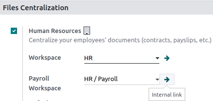
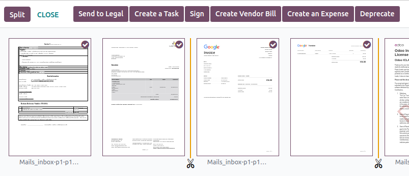

=========
Documents
=========

**Odoo Documents** allows you to store, view, and manage files within Odoo.

The interface is organized into key sections accessible from the left sidebar:

- :guilabel:`HOME`: Displays all folders and documents you have access to from :icon:`fa-building`
  :guilabel:`Company`, :icon:`fa-hdd-o` :guilabel:`My Drive`, and :icon:`fa-users`
  :guilabel:`Shared with me`.

- :icon:`fa-building` :guilabel:`Company`: Contains folders and documents shared across the company,
  accessible based on your :ref:`assigned rights <documents/access-rights>`.

- :icon:`fa-hdd-o` :guilabel:`My Drive`: Serves as your workspace to organize and access files and
  folders you own or have uploaded.

- :icon:`fa-users` :guilabel:`Shared with me`: Gather shared documents that are not part of a parent
  folder you can access.

- :icon:`fa-clock-o` :guilabel:`Recent`: Lists documents you can access that were recently modified.

- :icon:`fa-trash` :guilabel:`Trash`: Holds deleted documents and folders.

.. tip::
   - Use the search bar to quickly find specific items.
   - By default, items moved to the trash remain there for 30 days before being permanently deleted.
     To adjust the deletion delay for documents in the Trash, go to
     :menuselection:`Documents --> Configuration --> Settings`, and go to the
     :guilabel:`Trash Management` section.

.. seealso::
   - `Odoo Documents: product page <https://www.odoo.com/app/documents>`_

.. _documents/configuration:

Configuration
=============

By going to :menuselection:`Documents --> Configuration --> Settings`, you can enable the
centralization of files attached to a specific area of your activity. For example, by ticking
:guilabel:`Human Resources`, your HR documents are automatically available in the HR workspace,
while documents related to Payroll are automatically available in the Payroll sub-workspace. You
can change the default workspace using the dropdown menu and edit its properties by clicking the
:icon:`fa-arrow-right` (:guilabel:`Internal link`) icon.

.. note::
   - If you enable the centralization of your accounting files and documents, it is necessary to
     click on :guilabel:`Journals` and define each journal independently to allow automatic
     synchronization.

     .. image:: documents/accounting-files-centralization.png
        :alt: Enable the centralization of files attached to your accounting.

   - If you select a new workspace, existing documents are not moved. Only newly created documents
     will be found under the new workspace.

.. _documents/workspaces:

Folders
=======

You can organize your files in folders available in the :icon:`fa-building` :guilabel:`Company` or
:icon:`fa-hdd-o` :guilabel:`My Drive` sections.

To create a folder, select the desired section, click :guilabel:`New`, and choose
:guilabel:`Folder`. In the pop-up, enter the folder :guilabel:`Name` and click :guilabel:`Save`. To
create a sub-folder, select the parent folder first, then follow the same steps.

Configuration
-------------

To configure a folder or sub-folder, select it and click the :icon:`fa-cog` (:guilabel:`Actions`)
icon above the side panel. The following options are available:

:icon:`fa-download` :guilabel:`Download`: Download the folder, including its files and sub-folders,
as a .zip file.

:icon:`fa-pencil-square-o` :guilabel:`Rename`: Change the folder's name.

:icon:`fa-share-alt` :guilabel:`Share`: Share the folder or manage its access rights.

:icon:`fa-external-link-square` :guilabel:`Add shortcut`: This option is only available for
sub-folders. It lets you create a shortcut to a sub-folder, which is then added to your drive. You
can move the shortcut to any other folder as needed.

:icon:`fa-star-o` :guilabel:`Add star`: Mark a folder as a favorite for easier access. This setting
is user-specific and does not affect other users’ views. Once starred, you can use the
:guilabel:`Starred` filter to locate and navigate to your favorite folders quickly.

:icon:`fa-info-circle` :guilabel:`Info & Tags`: Open a panel above the chatter to add the folder's
:guilabel:`Owner` and :guilabel:`Contact` (usually an external person, such as a partner) and set an
:ref:`Email Alias <documents/email-aliases>`.

.. note::
   - The creator of a document is automatically assigned as its **owner** and is granted
     full access rights to it. To replace the owner of a document, select the required user from the
     dropdown list in the :guilabel:`Owner` field.
   - The **contact** is a person related to the document who only has read access rights to the
     document, e.g., an existing supplier in your database;
   - By default, the person who uploads a file to a workspace is set as its owner, but you can
     select another user and set a contact.

.. tip::
   To view a document in :guilabel:`My Profile`, an employee must be set as :guilabel:`Contact` and
   have at least :guilabel:`Viewer` access.

:icon:`fa-trash` :guilabel:`Move to trash`: Click to move the folder and its content to the trash.

:icon:`fa-cog` :guilabel:`Actions on Select`: Set server actions that are available for documents
from this folder. Scroll to :guilabel:`Add Custom Action` to create a new
:ref:`automated custom action <documents/custom-actions>`.

:icon:`fa-cog` :guilabel:`Automations`: Automate any workflow with
:ref:`automation rules <documents/automation-rules>`.

Additional features
-------------------

Select a folder or sub-folder and click the :guilabel:`New` button to access additional features:

Upload
~~~~~~

You can upload any file (max 64MB per file on Odoo Online) to your folder.

Request
~~~~~~~

You can request files and organize them as documents to remind users to download them. Add the
:guilabel:`Document Name` and select the person you need it from in the :guilabel:`Request To`
field. You can also fill in the :guilabel:`Due Date In`, confirm the :guilabel:`Folder` the document
should belong to, and add :guilabel:`Tags` and a :guilabel:`Message`. Then, click
:guilabel:`Request`. A placeholder for the missing document is created in the folder. When your
document is available, click the placeholder to upload it.

.. Tip::
   To see your missing documents, switch to the :guilabel:`Activity` view  and go to the
   :guilabel:`Requested Document` column. You can send a **reminder email** by clicking the
   :icon:`fa-ellipsis-v` (:guilabel:`ellipsis`) icon in the :guilabel:`Requested Document` column,
   then, clicking :guilabel:`Document Request: Reminder`. To see the activity details of a specific
   request, click on a date. You can update it by clicking on the (pen) icon, :guilabel:`Preview`
   the content of the reminder email, or :guilabel:`Send Now` to send a reminder email.

   .. image:: documents/reminder-email.png
      :alt: send a reminder email from the Activity view

Link
~~~~

To add a link to your documents dashboard, click :guilabel:`Link`, enter the :guilabel:`URL`,
:guilabel:`Name` it.

Spreadsheet
~~~~~~~~~~~

To create a new spreadsheet, click :guilabel:`Spreadsheet`. You can select a :guilabel:`Blank`
spreadsheet or an existing template.

.. _documents/email-aliases:

Email aliases
-------------

An email alias can be used to automatically send received documents to a specific folder. To create
an email alias, go to the folder where documents should be automatically sent, click the
:icon:`fa-cog` icon, :guilabel:`Info & Tags`, go to the right panel, and enter the
:guilabel:`Email Alias` name and :guilabel:`Domain`.

Then, you can select tag(s) in the :guilabel:`Alias Tag` field so all documents sent to your email
alias are uploaded to the folder using the chosen tags.

.. Note::
   You need to have an alias domain set to be able to upload documents by email. If it does not
   exist yet, click :guilabel:`Choose or Configure Email Servers` and create an alias domain.

Document management
===================

When selecting or opening a document, the :icon:`fa-cog` :guilabel:`Action` button available in the
top bar offers the following options:

Copy links
----------

Click :icon:`fa-link` :guilabel:`Copy Links` to copy the document's URL for sharing. The URL
respects the :ref:`access rights <documents/access-rights>` assigned to the document.

Lock
----

Click :icon:`fa-lock` :guilabel:`Lock` to protect your file from any modifications.

Create shortcut
---------------

A shortcut acts as a pointer to a file, allowing access to the document from multiple folders
without creating duplicates. If you have edit permissions for a folder, clicking
:icon:`fa-external-link-square` :guilabel:`Create shortcut` places the shortcut in that folder. If
not, the shortcut is added to :icon:`fa-hdd-o` :guilabel:`My Drive` where you can move it to another
folder of your choice.

Split PDF
---------

The :icon:`fa-scissors` :guilabel:`Split PDF` option allows you to divide a PDF into individual
pages. To do so, select the document, click the :icon:`fa-cog` :guilabel:`Action` button, then
:icon:`fa-scissors` :guilabel:`Split PDF`. A new view displays all the pages of the document. By
default, all pages are divided when you click :guilabel:`Split`. To remove a split between pages,
click the :icon:`fa-scissors` (:guilabel:`scissors`) icon.

.. tip::
   To merge documents, select them, click the :icon:`fa-cog` :guilabel:`Action` button, and choose
   :icon:`fa-scissors` :guilabel:`Merge PDFs`. Then, click the scissors icon between the documents
   and select :guilabel:`Split` to merge them.

Rename
------

The :icon:`fa-pencil-square-o` :guilabel:`Rename` option allows you to rename a document.

Duplicate
---------

Choose :icon:`fa-files-o` :guilabel:`Duplicate` to create a copy of your document.

Info and tags
-------------

Select :icon:`fa-info-circle` :guilabel:`Info & Tags` to show or hide a panel above the chatter,
where you can add the folder's :guilabel:`Owner` and :guilabel:`Contact`, set an
:ref:`Email Alias <documents/email-aliases>`, or add :ref:`tags <documents/tags>`.

Move to trash
-------------

To delete a document, select :icon:`fa-trash` :guilabel:`Trash`.

.. _documents/tags:

Tags
====

Tags are used to add extra information to your documents, e.g. to facilitate the search.

Go to :menuselection:`Documents --> Configuration --> Structure: Tags` to see your existing tags or
click :guilabel:`New` to create a new tag. Enter the :guilabel:`Tag Name`, select a
:guilabel:`Color` for your tag, and optionally add a :guilabel:`Tooltip` that appears when hovering
over the tag.

To add a tag to a document, select it, click the :icon:`fa-cog` :guilabel:`Action` button, then
:icon:`fa-info-circle` :guilabel:`Info & Tags`, and select your tag from the dropdown list.

.. note::
   An :ref:`alias tag <documents/email-aliases>` can also be used to automatically receive documents
   to a specific folder based on the tag assigned.

.. _documents/custom-actions:

Custom actions
==============

You can create and customize actions for each folder, such as creating, moving, signing, adding
tags, or processing bills. These actions appear on the top bar when a document meets the set
criteria.

To create a custom action, select a folder, click the :icon:`fa-cog`
(:guilabel:`Actions`) icon, choose :guilabel:`Actions on Select`, then scroll to
:guilabel:`Add Custom Action`. Click :guilabel:`New` to create a new custom action or select an
existing one to update it.

Enter an :guilabel:`Action Name`, select the :guilabel:`Type` of server
:ref:`action <studio/automated-actions/action>`, and fill in the related fields.

.. _documents/automation-rules:

Automation rules
================

Important note: studio nécessaire --> plan tarifaire change --> voir autre doc comment ça a été mis
dans la doc

:doc:`Automation rules <../studio/automated_actions>` are used to trigger automatic changes based on
user actions.

To create an automation rule from a folder, select the folder, click the :icon:`fa-cog`
(:guilabel:`Actions`) icon,
choose :icon:`fa-cog` :guilabel:`Automations`, then click the :guilabel:`New` button and
:doc:`set the rule <../studio/automated_actions>`.

.. _documents/access-rights:

Share and access rights
=======================

To share a folder or manage its access rights, select the folder, click the :icon:`fa-cog`
(:guilabel:`Actions`) icon, and choose :icon:`fa-share-alt` :guilabel:`Share`.

In the pop-up, grant access to specific individuals by selecting their name from the
dropdown menu or by adding their email address manually, then select :guilabel:`Viewer` or
:guilabel:`Editor`.

You can set :guilabel:`General access` for :guilabel:`Internal users` or
:guilabel:`Anyone with the link` by choosing :guilabel:`Viewer`, :guilabel:`Editor`, or
:guilabel:`None` to restrict access completely. For :guilabel:`Anyone with the link`, you can
further specify whether the folder should be :guilabel:`Discoverable` (accessible through browsing) or
require that users :guilabel:`Must have the link to access` it.

.. Note::
   - **Public users** :guilabel:`Must have the link to access` a folder or document on the portal on
     the first connection.
   - Each folder and document URL embarks the access rights set to them. When you share a folder,
     the person with whom you share it has access to a dedicated portal, where he can access the
     documents available in that folder, except those with restricted access.

.. Tip::
   You can set a **validity date to access a document or folder**. To do so, select the document or
   folder, and click :guilabel:`Share` to see the people you granted access to the folder. When
   hovering their name, a :icon:`fa-calendar` icon appears. Click on it, choose the expiry day and
   time and click :guilabel:`Apply`.

Digitize documents with AI and optical character recognition (OCR)
==================================================================

Documents available in the Finance workspace can be digitized. Select the document to digitize,
click :guilabel:`Create Vendor Bill`, :guilabel:`Create Customer Invoice`, or
:guilabel:`Create Customer Credit Note`, and then click :guilabel:`Send for Digitization`.

.. seealso::
   :doc:`AI-powered document digitization <../finance/accounting/vendor_bills/invoice_digitization>`
