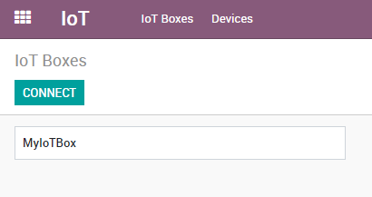

===================================
Connect an IoT Box to your database
===================================

Install the Internet of Things (IoT) App on your Odoo Database.

.. image:: connect/connect01.png
   :align: center

Go in the IoT App and click on Connect on the IoT Boxes page.

Follow the steps to connect your IoT Box.

.. image:: connect/connect03.png
   :align: center

Ethernet Connection
~~~~~~~~~~~~~~~~~~~

1. Connect to the IoT Box all the devices that have to be connected with
   cables (ethernet, usb devices, etc.).

2. Power on the IoT Box.

3. Read the Pairing Code from a screen or a receipt printer connected to the IoT Box.

   .. image:: connect/connect04.png

4. Input the Pairing Code and click on the Pair button.

.. note::
   Recent changes in modern web browsers forced us to modify the connection wizard.
   If your screen is different from the screenshots, make sure that the
   ``iot_pairing`` module is installed.

WiFi Connection
~~~~~~~~~~~~~~~

1. Power on the IoT Box

2. Copy the token

   .. image:: connect/connect05.png

3. Connect to the IoT Box WiFi Network (make sure there is no ethernet
   cable plugged in your computer).

   .. image:: connect/connect06.png

4. You will be redirected to the IoT Box Homepage (if it doesn't work,
   connect to the IP address of the box). Give a name to your IoT Box (not
   required) and paste the token, then click on next.

   .. image:: connect/connect07.png

   .. tip::
      If you are on Runbot, do not forget to add the -all or -base in the
      token (e.g. this token
      **http://375228-saas-11-5-iot-f3f920.runbot16.odoo.com\|4957098401**
      should become
      **http://375228-saas-11-5-iot-f3f920-all.runbot16.odoo.com\|4957098401**).

5. Choose the WiFi network you want to connect with (enter the password
   if there is one) and click on Submit. Wait a few seconds before being
   redirected to your database.

   .. image:: connect/connect08.png

You should now see the IoT Box.

.. image:: connect/connect09.png
   :align: center

IoT Box Schema
~~~~~~~~~~~~~~

.. image:: connect/connect10.png
   :align: center
