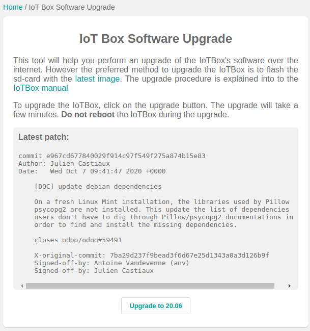

=====================
Flashing your SD Card
=====================

In some case, you may need to reflash your IoT Box’s SD Card to benefit
from our latest updates.

Upgrade from the IoT Box homepage
=================================

Go to the IoT Box homepage, click on *Update*, next to the version number.
If a new version of the IoT Box image is available, you will see a
*Upgrade to ___* button a the bottom of the page, the IoT Box will then
flash itself to the new version of the IoT Box. All of your configurations
will be saved.

.. note::
   This process can take more than 30 minutes. Do not turn off or unplug
   the IoT Box as it would leave it in an inconsistent state. 

Upgrade with Etcher
===================

Go to Balena’s website and download `Etcher <https://www.balena.io/>`__.
It’s a free and open-source utility used for burning image files.
Install and launch it. Download the latest image from `nightly
<http://nightly.odoo.com/master/iotbox/>`__.

Then, open *Etcher* and select *Flash from file*, find the image you just
downloaded. Insert the IoT Box SD card into your computer and select it.
Click on *Flash* and wait for the process to finish.

.. image:: flash_sdcard/flash_sdcard02.png
   :align: center
