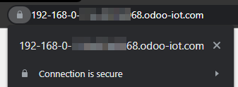

.. _iot/https_certificate_iot:

=======================
HTTPS certificate (IoT)
=======================

What is HTTPS?
==============

*Hypertext Transfer Protocol Secure* (HTTPS) is the secure version of *Hypertext Transfer Protocol*
(HTTP), which is the primary protocol used to send data back and forth between a web browser and a
website. :abbr:`HTTPS (Hypertext Transfer Protocol Secure)` is encrypted in order to increase the
security of data transfer.

:abbr:`HTTPS (Hypertext Transfer Protocol Secure)` uses an encryption protocol to encrypt
communications. The protocol is called *Transport Layer Security* (TLS), although formerly it was
known as *Secure Sockets Layer* (SSL).

:abbr:`HTTPS (Hypertext Transfer Protocol Secure)` occurs based upon the transmission of :abbr:`TLS
(Transport Layer Security)`/:abbr:`SSL (Secure Sockets Layer)` certificates, which verify that a
particular provider is who they say they are.

.. note::
   In this documentation and throughout Odoo the term "HTTPS certificate" will be used to define the
   fact that the :abbr:`SSL (Secure Sockets Layer)` certificate is valid and allows a :abbr:`HTTPS
   (Hypertext Transfer Protocol Secure)` connection.

Why is it needed?
-----------------

In order to communicate with certain network devices (in particular for payment terminals), the
usage of :abbr:`HTTPS (Hypertext Transfer Protocol Secure)` is mandatory. If the :abbr:`HTTPS
(Hypertext Transfer Protocol Secure)` certificate isn't valid, some devices won't be able to
interact with the :abbr:`IoT (Internet of Things)` Box.

How to obtain a Hypertext Transfer Protocol Secure (HTTPS) certificate
======================================================================

The generation of the :abbr:`HTTPS (Hypertext Transfer Protocol Secure)` certificate is automatic.

The :abbr:`IoT (Internet of Things)` Box will send a specific request to `<https://www.odoo.com>`_
which will send back the :abbr:`HTTPS (Hypertext Transfer Protocol Secure)` certificate if the
:abbr:`IoT (Internet of Things)` box and database are eligible.

.. _iot/iot-eligibility:

Internet of Things (IoT) eligibility
------------------------------------

 #. The database should be a **production** instance. The database instance should not be a copy, a
    duplicate, a staging, or a development environment.
 #. The Odoo subscription must:

     - Have an :guilabel:`IoT Box Subscription` line.
     - :guilabel:`Status` must be :guilabel:`In Progress`.

    If the subscription is linked to a `<https://www.odoo.com>`_ portal user check the information
    on the portal subscription page.

    .. figure:: https_certificate_iot/sub-example-in-progress.png
       :align: center
       :alt: Odoo.com portal subscriptions filtered by "in progress".

       In this case, both subscriptions are considered "in progress" as the :guilabel:`Filter By\:
       In Progress` was used.

    .. note::
       If the subscription is in question, contact the database's Account Manager or Partner
       regarding the matter.

Troubleshooting Hypertext Transfer Protocol Secure (HTTPS) certificate errors
=============================================================================

If anything goes wrong during the process of the "HTTPS certificate" generation or reception, a
specific error will code be given on the :abbr:`IoT (Internet of Things)` box home page.

.. tip::
   Accessing the :abbr:`IoT (Internet of Things)` box homepage will check for the presence of the
   "HTTPS certificate" and will attempt its generation if it is missing. As such, if there is an
   error on the :abbr:`IoT (Internet of Things)` box home page, refresh the :abbr:`IoT (Internet of
   Things)` home page to see if the error disappears.

`ERR_IOT_HTTPS_CHECK_NO_SERVER`
-------------------------------

Reason:
    The configuration regarding the server is missing. In other words, the Odoo instance is not
    connected with the IoT box.

Solution:
    Ensure that the server is configured.

.. seealso::
   :doc:`/applications/productivity/iot/config/connect`

`ERR_IOT_HTTPS_CHECK_CERT_READ_EXCEPTION`
-----------------------------------------

Reason:
    An unhandled error happened when trying to read the existing :abbr:`HTTPS (Hypertext Transfer
    Protocol Secure)` certificate.

Solution:
    Ensure that the :abbr:`HTTPS (Hypertext Transfer Protocol Secure)` certificate file is readable.

`ERR_IOT_HTTPS_LOAD_NO_CREDENTIAL`
----------------------------------

Reason:
    The contract and/or database :abbr:`UUID (Universal Unique Identifier)` is missing.

Solution:
    Ensure that both values are configured as intended. To modify them, go to the :abbr:`IoT
    (Internet of Things)` box home page, and navigate to :guilabel:`Credential`.

`ERR_IOT_HTTPS_LOAD_REQUEST_EXCEPTION`
--------------------------------------

Reason:
    An unexpected error happened when the :abbr:`IoT (Internet of Things)` box tried to reach
    `<https://www.odoo.com>`_. The causes are likely due to the network
    infrastructure/configuration:

     - The :abbr:`IoT (Internet of Things)` box does not have access to internet.
     - The network does not allow the :abbr:`IoT (Internet of Things)` box to communicate with
       `<https://www.odoo.com>`_. This may be due to network devices preventing the communication
       (firewalls, etc.) or the network configuration (:abbr:`VPN (Virtual Private Network)`,
       etc.).

    .. note::
       More information regarding the error that occurred can be found in the full request
       exception details, which are in the :abbr:`IoT (Internet of Things)` box logs.

Solution:
    .. warning::
       Consult with your system or network administrator should this issue arise. This error code
       depends on the network infrastructure and goes beyond Odoo support's service scope.

`ERR_IOT_HTTPS_LOAD_REQUEST_STATUS`
-----------------------------------

Reason:
    The IoT-box was able to reach `<https://www.odoo.com>`_ but received an unusual
    `HTTP response (status codes)
    <https://developer.mozilla.org/en-US/docs/Web/HTTP/Status>`_.

    This error code will also give the HTTP response status codes. For example, if the error reads
    `ERR_IOT_HTTPS_LOAD_REQUEST_STATUS 404` it means that the page returned a 404 error, which is
    the "Page Not Found" code.

Solution:
    Check if `<https://www.odoo.com>`_ is down using a web browser, as it's possible that it is down
    due to maintenance.

     - If `<https://www.odoo.com>`_ is down due to maintenance, unfortunately there is nothing that
       can be done but instead wait for it to recover.
     - If `<https://www.odoo.com>`_ is not down due to maintenance, open a `support ticket
       <https://www.odoo.com/help>`_ on the matter. Ensure that the 3 digits status code next to the
       code error is included in the support ticket.

`ERR_IOT_HTTPS_LOAD_REQUEST_NO_RESULT`
--------------------------------------

Reason:
    The :abbr:`IoT (Internet of Things)` box was able to reach `<https://www.odoo.com>`_ but it
    refused to deliver the :abbr:`HTTPS (Hypertext Transfer Protocol Secure)` certificate.

Solution:
    Ensure that the :abbr:`IoT (Internet of Things)` box and database are eligible for a
    certificate: :ref:`Internet of Things (IoT) eligibility <iot/iot-eligibility>`.

How to ensure that the HTTPS certificate is correct
===================================================

If the certificate has been applied successfully, a new :abbr:`HTTPS (Hypertext Transfer Protocol
Secure)` :abbr:`URL (Uniform Resource Locator)` for the :abbr:`IoT (Internet of Things)` box ending
with `.odoo-iot.com` will appear on the Odoo database, inside of the :menuselection:`IoT`
application on that specific device's form.

.. image:: https_certificate_iot/odoo-new-domain.png
   :align: center
   :alt: Odoo IoT app IoT box with .odoo-iot.com domain.

When navigating to the :abbr:`URL (Uniform Resource Locator)` in a browser a secured :abbr:`HTTPS
(Hypertext Transfer Protocol Secure)` connection will be established.

   Padlock in Chrome on Windows 10 attesting the fact that the connection is secured in :abbr:`HTTPS
   (Hypertext Transfer Protocol Secure)`.

The IoT-box homepage will now display an `OK` status next to `HTTPS certificate`. The
drop-down menu icon, when clicked, will reveal information regarding the certificate.

.. image:: https_certificate_iot/status-ok.png
   :align: center
   :alt: IoT box homepage with HTTPS certificate OK status.

Domain Name System (DNS) issue
==============================

If the :abbr:`IoT (Internet of Things)` box can be accessed from its :abbr:`IP (Intrernet Protocol)`
address but not the Odoo assigned domain: `.odoo-iot.com`; then the :abbr:`IoT (Internet of Things)`
box is likely running into a :abbr:`DNS (Domain Name System)` issue. On some browsers, it will give
an error code mentioning :abbr:`DNS (Domain Name System)` (like `DNS_PROBE_FINISHED_NXDOMAIN`).

These :abbr:`DNS (Domain Name System)` issues may appear as the following in different browsers:

.. tabs::

   .. tab:: Chrome

      .. figure:: https_certificate_iot/dns-chrome.png
         :align: center
         :alt: DNS issue on Chrome browser on Windows 10.

         DNS issue on Chrome browser on Windows 10.

   .. tab:: Firefox

      .. figure:: https_certificate_iot/dns-firefox.png
         :align: center
         :alt: DNS issue on Firefox browser on Windows 10.

         DNS issue on Firefox browser on Windows 10.

   .. tab:: Edge

      .. figure:: https_certificate_iot/dns-edge.png
         :align: center
         :alt: DNS issue on Edge browser on Windows 10.

         DNS issue on Edge browser on Windows 10.

Domain Name System (DNS) issue solution
---------------------------------------

#. Should the router allow the :abbr:`DNS (Domain Name System)` to be manually changed, change the
   DNS to use `Google DNS <https://developers.google.com/speed/public-dns>`_.
#. If your router doesn't allow for this, then a change will need to be made on the :abbr:`DNS
   (Domain Name System)` settings of each of the devices using `Google DNS
   <https://developers.google.com/speed/public-dns>`_. This will need to occur on **every** device
   that plans to interact with the :abbr:`IoT (Internet of Things)` box (e.g. computer, tablet or
   phone). The individual device configuration processes can be found on the website of the
   device's manufacturer.

   .. note::
      Other :abbr:`IoT (Internet of Things)` devices such as payment terminals likely won't need
      their :abbr:`DNS (Domain Name System)` settings changed as they are already configured with
      custom :abbr:`DNS (Domain Name System)`.

   .. warning::
      Consult with your system or network administrator should this issue arise. This error code
      depends on the network infrastructure, and it goes beyond Odoo support's service scope.
