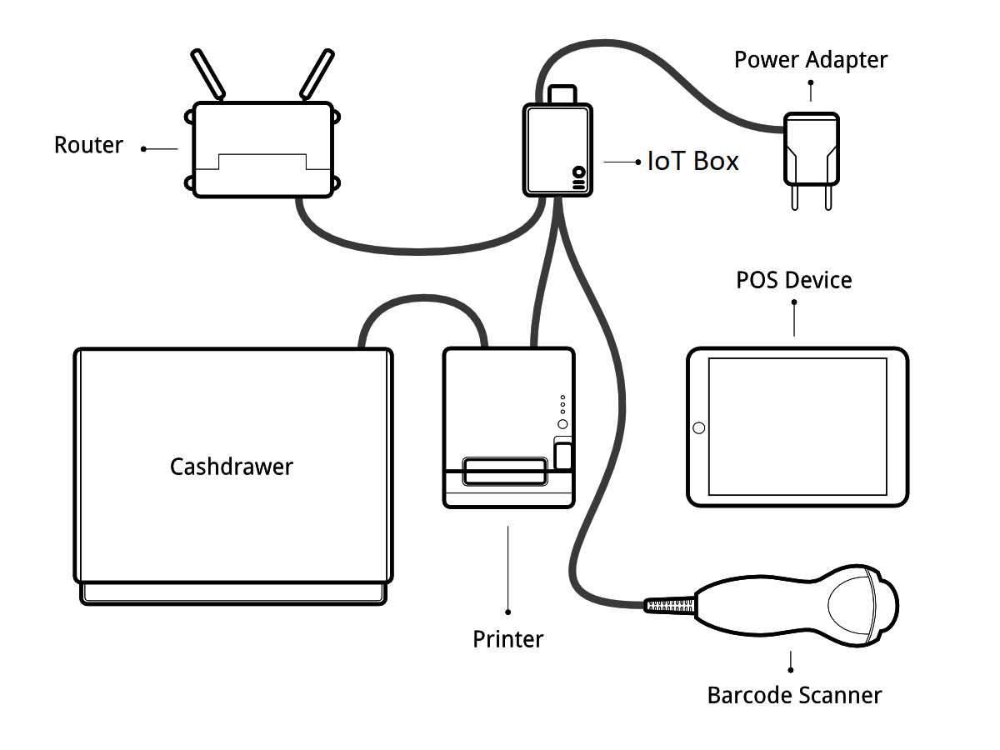
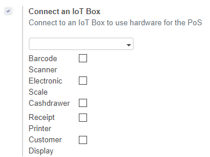

===========================
Use the IoT Box for the PoS
===========================

Prerequisites
~~~~~~~~~~~~~

Before starting, make sure you have the following:

-  An IoT Box

-  A 2A Power adapter with pi 3 b+ 2.5 A

-  A computer or tablet with an up-to-date web browser

-  A running SaaS or Odoo instance with the Point of Sale and IoT apps
   installed

-  A local network setup with DHCP (this is the default setting)

-  An Epson USB TM-T20 Printer or another ESC/POS compatible printer
   (officially supported printers are listed at the `POS Hardware
   page <https://www.odoo.com/page/pos-ipad-android-hardware>`__)

-  A Honeywell Eclipse USB Barcode Scanner or another compatible scanner

-  An Epson compatible cash drawer

-  An RJ45 Ethernet Cable (optional, WiFi is built in)

Set Up 
~~~~~~~

To connect hardware to the PoS, the first step is to connect an IoT Box
to your database. For this, follow this
`documentation <https://docs.google.com/document/d/1vhWrSSlSdJcRYe4tjPpXKYVMTD47lVK3ysyYc7tJDlA/edit#>`__.

Then, you have to connect the peripheral devices to your IoT Box.

Officially supported hardware is listed on `the POS Hardware
page <https://www.odoo.com/page/pos-ipad-android-hardware>`__, but
other hardware might work as well.

-  **Printer**: Connect an ESC/POS printer to a USB port and power it
   on.

-  **Cash drawer**: The cash drawer should be connected to the printer
   with an RJ25 cable.

-  **Barcode scanner**: Connect your barcode scanner. In order for your
   barcode scanner to be compatible it must behave as a keyboard and
   must be configured in **US QWERTY**. It also must end barcodes
   with an Enter character (keycode 28). This is most likely the
   default configuration of your barcode scanner.

-  **Scale**: Connect your scale and power it on.

-  **Ethernet**: If you do not wish to use Wi-Fi, plug in the Ethernet
   cable. Make sure this will connect the IoT Box to the same
   network as your POS device.

-  **Wi-Fi**: The current version of the IoT Box has Wi-Fi built in.
   Make sure not to plug in an Ethernet cable when booting, because
   all Wi-Fi functionality will be bypassed when a wired network
   connection is available on boot.

Once it's done, you can connect the IoT Box to your PoS. For this, go in
Point of Sale > Configuration > PoS, tick the box "IoT Box" and select
the IoT Box you want to connect with. Save the changes.

Set up is done, you can launch a new PoS Session.

Troubleshoot
~~~~~~~~~~~~

The PoS cannot connect to the IoT Box
^^^^^^^^^^^^^^^^^^^^^^^^^^^^^^^^^^^^^

-  The easiest way to make sure the IoT Box is properly set-up is to
   turn it on with the printer plugged in as it will print a receipt
   indicating any error if encountered or the IoT Box's IP address
   in case of success. If no receipt is printed, check the following
   steps:

-  Make sure the IoT Box is powered on, indicated by a brightly lit red
   status LED.

-  Make sure the IoT Box is ready, this is indicated by a brightly lit
   green status LED just next to the red power status LED. The IoT
   Box should be ready ~2 minutes after it is started.

-  Make sure the IoT Box is connected to the same network as your POS
   device. Both the device and the IoT Box should be visible in the
   list of connected devices on your network router.

-  If you specified the IoT Box's IP address in the configuration, make
   sure it corresponds to the ip address printed on the IoT Box's
   status receipt.

-  Make sure that the POS is not loaded over HTTPS.

-  A bug in Firefox's HTTP implementation might prevent the
   autodiscovery from working reliably. You could also manually set
   up the IoT Box's IP address in the POS configuration.

The Barcode Scanner is not working
^^^^^^^^^^^^^^^^^^^^^^^^^^^^^^^^^^

-  The barcode scanner must be configured in US QWERTY and emit an Enter
   after each barcode. This is the default configuration of most
   barcode readers. Refer to the barcode reader documentation for
   more information.

-  The IoT Box needs a 2A power supply to work with some barcode
   scanners. If you are not using the provided power supply, make
   sure the one you use has enough power.

-  Some barcode scanners will need more than 2A and will not work, or
   will work unreliably, even with the provided power supply. In
   those case you can plug the barcode scanner in a self-powered USB
   hub.

-  Some poorly built barcode scanners do not advertise themselves as
   barcode scanners but as a usb keyboard instead, and will not be
   recognized by the IoT Box.

The Barcode Scanner is not working reliably
^^^^^^^^^^^^^^^^^^^^^^^^^^^^^^^^^^^^^^^^^^^

-  Make sure that no more than one device with 'Scan via Proxy'/'Barcode
   Scanner' enabled are connected to the IoT Box at the same time.

Printing the receipt takes too much time
^^^^^^^^^^^^^^^^^^^^^^^^^^^^^^^^^^^^^^^^

-  A small delay before the first print is expected, as the IoT Box will
   do some preprocessing to speed up the next printings. If you
   suffer delays afterwards it is most likely due to poor network
   connection between the POS and the IoT Box.

Some characters are not correctly printed on the receipt
^^^^^^^^^^^^^^^^^^^^^^^^^^^^^^^^^^^^^^^^^^^^^^^^^^^^^^^^

-  The IoT Box does not support all languages and characters. It
   currently supports Latin and Cyrillic based scripts, with basic
   Japanese support.

The printer is offline
^^^^^^^^^^^^^^^^^^^^^^

-  Make sure the printer is connected, powered, has enough paper and has
   its lid closed, and is not reporting an error. If the error
   persists, please contact support.

The cashdrawer does not open
^^^^^^^^^^^^^^^^^^^^^^^^^^^^

-  The cashdrawer should be connected to the printer and should be
   activated in the POS configuration.
