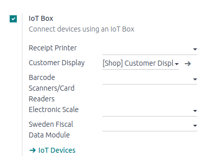

=========================
Use an IoT box with a PoS
=========================

Prerequisites
=============

Before starting, make sure the following equipment is available:

- An :abbr:`IoT (Internet of Things)` box, with its power adapter.
- A computer or tablet with an up-to-date web browser.
- Odoo Online or an Odoo instance with the *Point of Sale* and *IoT* applications installed.
- A local network set up with :abbr:`DHCP (Dynamic Host Configuration Protocol)` (this is the
  default setting).
- An RJ45 Ethernet Cable (optional, but preferred over WiFi, which is already built in).
- Any of the supported hardware (receipt printer, barcode scanner, cash drawer, payment terminal,
  scale, customer display, etc.). The list of supported hardware can be found on the `POS Hardware
  page <https://www.odoo.com/page/point-of-sale-hardware>`_.

Setup
=====

.. figure:: pos/pos-connections.png

  A suggested configuration for a point of sale system.

To connect hardware to the :abbr:`PoS (Point of Sale)`, the first step is to connect an :abbr:`IoT
(Internet of Things)` box to the database. To do this, follow these instructions: :doc:`Connect an
Internet of Things (IoT) box to the Odoo database <connect>`.

Then, connect the peripheral devices to the :abbr:`IoT (Internet of Things)` box.

.. list-table::
   :header-rows: 1
   :stub-columns: 1

   * - Device Name
     - Instructions
   * - Printer
     - Connect a supported receipt printer to a :abbr:`USB (Universal Serial Bus)` port or
       to the network, and power it on. Refer to
       :doc:`/applications/sales/point_of_sale/restaurant/kitchen_printing`.
   * - Cash drawer
     - The cash drawer should be connected to the printer with an RJ25 cable.
   * - Barcode scanner
     - In order for the barcode scanner to be compatible it must end barcodes with an `ENTER`
       character (keycode 28). This is most likely the default configuration of the barcode scanner.
   * - Scale
     - Connect the scale and power it on. Refer to
       :doc:`/applications/productivity/iot/devices/scale`.
   * - Customer display
     - Connect a screen to the :abbr:`IoT (Internet of Things)` box to display the :abbr:`PoS (Point
       of Sale)` order. Refer to :doc:`/applications/productivity/iot/devices/screen`.
   * - Payment terminal
     - The connection process depends on the terminal. Refer to the :doc:`payment terminals
       documentation </applications/sales/point_of_sale/payment_methods>`.

Once this is completed, connect the :abbr:`IoT (Internet of Things)` box to the :menuselection:`PoS`
application. To do this, go to :menuselection:`Point of Sale --> Configuration --> PoS`, tick the
:guilabel:`IoT Box` option, and select the devices to be used in this :abbr:`PoS (Point of Sale)`.
:guilabel:`Save` the the changes.

Once set up is done, a new :abbr:`PoS (Point of Sale)` session can be launched.
