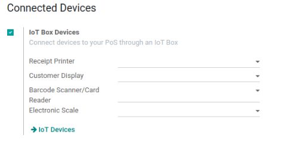

===========================
Use the IoT Box for the PoS
===========================

.. image:: pos/pos01.png
    :align: center

Prerequisites
~~~~~~~~~~~~~

Before starting, make sure you have the following:

-  An IoT Box, with its power adapter.

-  A computer or tablet with an up-to-date web browser

-  A running SaaS or Odoo instance with the Point of Sale and IoT apps
   installed

-  A local network setup with DHCP (this is the default setting)

-  An RJ45 Ethernet Cable (optional, WiFi is built in)

-  Any of the supported hardware (receipt printer, barcode scanner,
   cash drawer, payment terminal, scale, customer display, etc.).
   The list of supported hardware can be found on the `POS Hardware
   page <https://www.odoo.com/page/point-of-sale-hardware>`__

Set Up 
~~~~~~~

To connect hardware to the PoS, the first step is to connect an IoT Box
to your database. For this, follow this
:doc:`documentation <connect>`.

Then, you have to connect the peripheral devices to your IoT Box.

-  **Printer**: Connect a supported receipt printer to a USB port or to
   the network and power it on.

-  **Cash drawer**: The cash drawer should be connected to the printer
   with an RJ25 cable.

-  **Barcode scanner**: Connect your barcode scanner. In order for your
   barcode scanner to be compatible it must end barcodes with an Enter
   character (keycode 28). This is most likely the default configuration
   of your barcode scanner.

-  **Scale**: Connect your scale and power it on.

-  **Customer Display**: Connect a monitor to the IoT Box using an HDMI
   cable. You can also access the Customer Display from any other computer
   by accessing the IoT Box homepage and clicking on the *POS Display*
   button.

-  **Payment terminal**: The connection process depends on the terminal,
   please refer to the :doc:`payment terminals documentation
   </applications/sales/point_of_sale/payment>`.

Once it's done, you can connect the IoT Box to your PoS. For this, go in
:menuselection:`Point of Sale --> Configuration --> PoS`, tick *IoT Box*
and select the devices you want to use in this Point of Sale. Save the
changes.

Set up is done, you can launch a new PoS Session.
