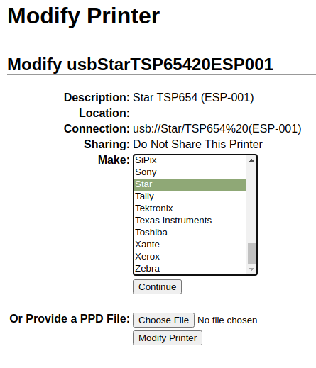

===============
Troubleshooting
===============

IoT Box Connection
==================

I can't find the pairing code to connect my IoT Box
~~~~~~~~~~~~~~~~~~~~~~~~~~~~~~~~~~~~~~~~~~~~~~~~~~~

The pairing code should be printed on receipt printers connected to the
IoT Box and should also be displayed on connected monitors.

The pairing code doesn't show under the following circumstances:

-  The IoT Box is already connected to an Odoo database;

-  The IoT Box is not connected to the Internet;

-  The code is only valid for 5 minutes after the IoT Box has started. It's
   automatically removed from connected displays when this delay has expired;

-  The version of the IoT Box image is too old. It should use version 20.06
   or more recent. If your IoT Box image is from an earlier version, then
   you will have to reflash the SD card of your IoT Box to update the image
   (see :doc:`Flashing your SD Card <flash_sdcard>`)

If you are not in any of the cases listed above, make sure that the IoT Box
has correctly started, by checking that a fixed green LED is showing next to
the micro-USB port.

I've connected my IoT Box but it's not showing in my database
~~~~~~~~~~~~~~~~~~~~~~~~~~~~~~~~~~~~~~~~~~~~~~~~~~~~~~~~~~~~~

When you connect an IoT Box to a database, the IoT Box might restart, if
that is the case, it might take up to one minute before appearing in your
database. If after some time the IoT is still not showing, make sure that
your database can be reached from the IoT Box and that your server doesn't
use a multi-database environment.

My IoT Box is connected to my database, but cannot be reached
~~~~~~~~~~~~~~~~~~~~~~~~~~~~~~~~~~~~~~~~~~~~~~~~~~~~~~~~~~~~~

Make sure that the IoT Box and the device running the browser are located
on the same network as the IoT Box cannot be reached from outside the local
network.

Printer
=======

My printer is not detected
~~~~~~~~~~~~~~~~~~~~~~~~~~

If one of your printers doesn't show up in your devices list, go to the
IoT Box homepage and make sure that it is listed under *Printers*.

.. image:: troubleshooting/troubleshooting_printer_01.png
   :align: center

If your printer is not present on the IoT Box homepage, hit
*Printers Server*, go to the *Administration* tab and click on
*Add Printer*. If you can't find your printer in the list, it's probably
not connected properly.

My printer outputs random text
~~~~~~~~~~~~~~~~~~~~~~~~~~~~~~

For most printers, the correct driver should be automatically detected
and selected. However, in some cases, the automatic detection mechanism
might not be enough, and if no driver is found the printer might print
random characters.

The solution is to manually select the corresponding driver. On the IoT
Box homepage, click on *Printers Server*, go to the *Printers*
tab and select the printer in the list. In the Administration dropdown,
click on *Modify Printer*. Follow the steps and select the Make and Model
corresponding to your printer.

.. note::
   Epson and Star receipt printers and Zebra label printers do not
   need a driver to work. Make sure that no driver is selected for those
   printers.

My Zebra Printer doesn't print anything
~~~~~~~~~~~~~~~~~~~~~~~~~~~~~~~~~~~~~~~

Zebra printers are quite sensitive to the format of the ZPL code that is
printed. If nothing comes out of the printer or blank labels are printed,
try changing the format of the report that is sent to the printer by
accessing :menuselection:`Settings ~~> Technical ~~> Views` in developer
mode and look for the corresponding template.

Barcode Scanner
===============

The characters read by the barcode scanner don't match the barcode
~~~~~~~~~~~~~~~~~~~~~~~~~~~~~~~~~~~~~~~~~~~~~~~~~~~~~~~~~~~~~~~~~~

By default, we assume that your barcode scanner is configured in US
QWERTY. This is the default configuration of most barcode readers.
If your barcode scanner uses a different layout, please go to the
form view of your device and select the correct one.

Nothing happens when a barcode is scanned
~~~~~~~~~~~~~~~~~~~~~~~~~~~~~~~~~~~~~~~~~

Make sure that the correct device is selected in your Point of Sale
configuration and that your barcode is configured to send an ENTER
character (keycode 28) at the end of every barcode.

The barcode scanner is detected as a keyboard
~~~~~~~~~~~~~~~~~~~~~~~~~~~~~~~~~~~~~~~~~~~~~

Some poorly built barcode scanners do not advertise themselves as
barcode scanners but as a USB keyboard instead, and will not be
recognized by the IoT Box.

You can manually change the device type by going to its form view and
activating the *Is scanner* option.

.. image:: troubleshooting/troubleshooting_barcode_01.png
   :align: center

Cashdrawer
==========

The cashdrawer does not open
~~~~~~~~~~~~~~~~~~~~~~~~~~~~

The cashdrawer should be connected to the printer and the *Cashdrawer*
checkbox should be ticked in the POS configuration.
