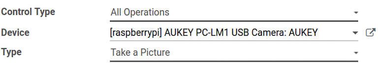

================
Connect a camera
================

A camera can be connected to an :abbr:`IoT (Internet of Things)` box with an Odoo database in just a
few steps. Once a camera is connected to an :abbr:`IoT (Internet of Things)` box, it can be used in
a manufacturing process, or it can be linked to a quality control point/quality check. Doing so
allows for the taking of pictures when a chosen quality control point/check has been reached, or
when a specific key is pressed during manufacturing.

Connection
==========

To connect a camera to an :abbr:`IoT (Internet of Things)` box, simply connect the two via cable.
This is usually done with a :abbr:`USB (Universal Serial Bus)` cable of some sort.

If the camera is `supported <https://www.odoo.com/page/iot-hardware>`_, there is no need to set up
anything, as it'll be detected as soon as it's connected.

.. image:: camera/camera-dropdown.png
   :align: center
   :alt: Camera recognized on the IoT box.

Link camera to quality control point in manufacturing process
=============================================================

In the :menuselection:`Quality app`, a device can be set up on a :guilabel:`Quality Control Point`.
To do that, navigate to the :menuselection:`Quality app --> Quality Control --> Control Points` and
open the desired :guilabel:`Control Point` that'll be linked to the camera.

On the control point form, edit the control point by selecting the :guilabel:`Type` field, and
clicking on :guilabel:`Take a Picture` from the drop-down menu. Doing so reveals a field called
:guilabel:`Device`, wherein the attached *device* can be selected. :guilabel:`Save` the changes, if
required.

The camera is now useable with the selected quality control point. When the quality control point
is reached during the manufacturing process, the database prompts the operator to take a picture.

.. image:: camera/serial-number-picture.png
   :align: center
   :alt: Graphic user interface of the device on the quality control point.

.. note::
   Quality control points can also be accessed by navigating to :menuselection:`IoT App -->
   Devices`. From here, select the device. There is a :guilabel:`Quality Control Points` tab, where
   they can be added with the device.

.. tip::
   On a quality check form, the :guilabel:`Type` of check can also be specified to :guilabel:`Take a
   Picture`. Navigate to :menuselection:`Quality app --> Quality Control --> Quality Checks --> New`
   to create a new quality check from the :guilabel:`Quality Checks` page.

.. seealso::
   - :doc:`/applications/inventory_and_mrp/quality/quality_management/quality_control_points`
   - :doc:`/applications/inventory_and_mrp/quality/quality_management/quality_alerts`

Link camera to a work center in the Manufacturing app
=====================================================

To link a camera to an action, it first needs to be configured on a work center. Navigate to
:menuselection:`Manufacturing app --> Configuration --> Work Centers`. Next, go to the desired
:guilabel:`Work Center` in which a camera will be used to reveal that specific work center's detail
form. From here, add the device in the :guilabel:`IoT Triggers` tab, in the :guilabel:`Device`
column, by clicking :guilabel:`Add a Line`.

Now, the camera device can be linked to the :guilabel:`Action` column drop-down option labeled
:guilabel:`Take a Picture`. A key can also be added to trigger the action.

.. important::
   The first trigger listed is chosen first. The order of triggers matters, and they can be dragged
   into any desired order.

.. note::
   On the :guilabel:`Work Order` screen, a status graphic indicates whether the database is
   correctly connected to the camera.

.. seealso::
   :ref:`workcenter_iot`
