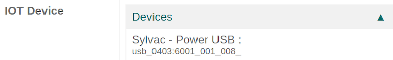

==========================
Connect a measurement tool
==========================

.. _iot/devices/measurement-tool:

With Odoo's :abbr:`IoT (Internet of Things)` box, it is possible to connect measurement tools to the
Odoo database for use in the *Quality app* on a quality control point/quality check, or for use in a
work center during the manufacturing process.

Find the list of supported devices here: `Supported devices
<https://www.odoo.com/page/iot-hardware>`_.

Connect with universal serial bus (USB)
=======================================

To add a device connected by :abbr:`USB (Universal Serial Bus)`, plug the :abbr:`USB (Universal
Serial Bus)` cable into the :abbr:`IoT (Internet of Things)` box, and the device appears in the Odoo
database.

Connect with bluetooth
======================

Activate the Bluetooth functionality on the device (see the device manual for further explanation),
and the :abbr:`IoT (Internet of Things)` box automatically connects to the device.

Link a measurement tool to a quality control point in the manufacturing process
===============================================================================

In the *Quality app*, a device can be set up on a quality control point. To do that, navigate to
:menuselection:`Quality app --> Quality Control --> Control Points`, and open the desired control
point to which the measurement tool should be linked.

From here, edit the control point, by selecting the :guilabel:`Type` field, and clicking
:guilabel:`Measure` from the drop-down menu. Doing so reveals a field called :guilabel:`Device`,
where the attached device can be selected.

Additionally, :guilabel:`Norm` and :guilabel:`Tolerance` can be configured. :guilabel:`Save` the
changes, if required.

At this point, the measurement tool is linked to the chosen quality control point. The value, which
usually needs to be changed manually, is automatically updated while the tool is being used.

.. image:: measurement_tool/measurement-control-point.png
   :align: center
   :alt: Measurement tool input in the Odoo database.

.. tip::
   Quality control points can also be accessed by navigating to :menuselection:`IoT App -->
   Devices`, then select the device. There is a :guilabel:`Quality Control Points` tab, where they
   can be added with the device.

.. note::
   On a quality check detail form, the :guilabel:`Type` of check can also be specified to
   :guilabel:`Measure`. Access a new quality check detail page, by navigating to
   :menuselection:`Quality app --> Quality Control --> Quality Checks --> New`.

.. seealso::
   - :doc:`../../../inventory_and_mrp/quality/quality_management/quality_control_points`
   - :doc:`../../../inventory_and_mrp/quality/quality_management/quality_alerts`

Link a measurement tool to a work center in the Manufacturing app
=================================================================

To link a measurement tool to an action, it first needs to be configured on a work center. To do
that, navigate to :menuselection:`Manufacturing app --> Configuration --> Work Centers`. Then,
select the desired work center in which the measurement tool will be used.

On the work center page, add the device in the :guilabel:`IoT Triggers` tab, under the
:guilabel:`Device` column, by selecting :guilabel:`Add a Line`. Then, the measurement tool can be
linked to the :guilabel:`Action` drop-down menu option labeled :guilabel:`Take Measure`. A key can
be added to trigger the action.

.. important::
   It should be noted that the first listed trigger is chosen first. The order matters, and these
   triggers can be dragged into any order.

.. note::
   On the :guilabel:`Work Order` screen, a status graphic indicates whether the database is
   correctly connected to the measurement tool.

.. seealso::
   :ref:`workcenter_iot`
