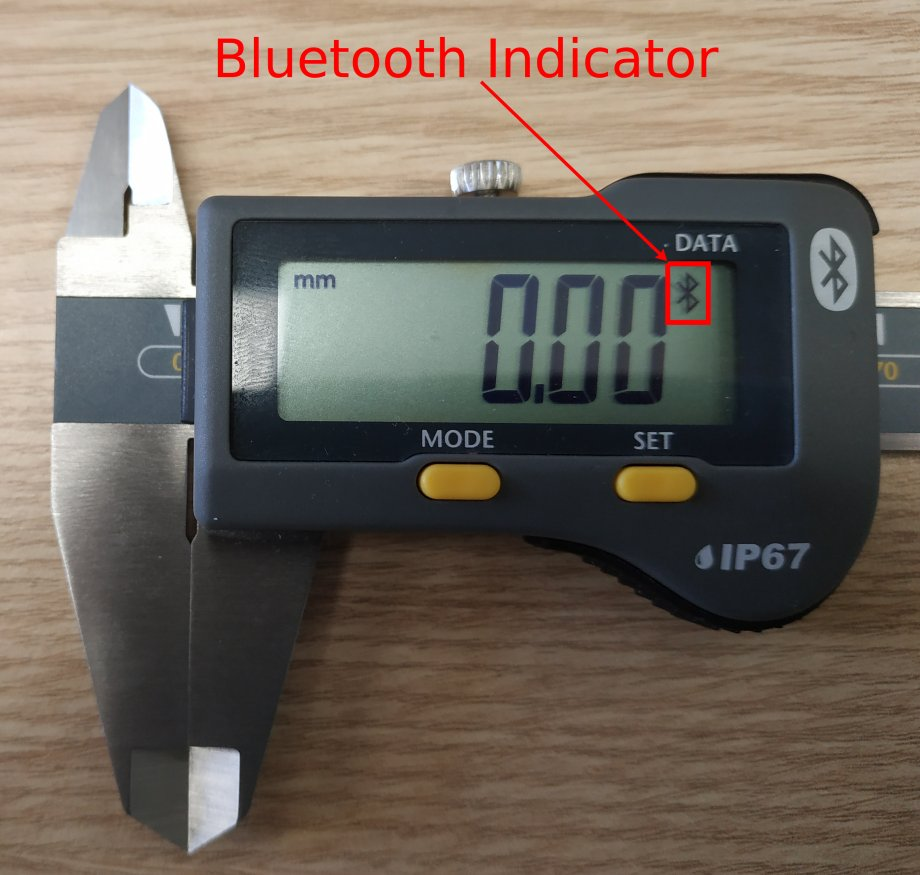
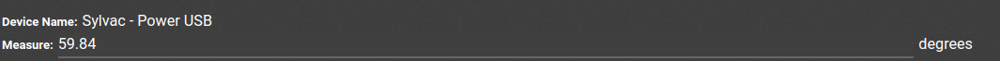

==========================
Connect a Measurement Tool
==========================

With Odoo’s *IoT Box*, it is possible to connect measurement tools to
your database. Find the list of supported devices here: `Supported
devices <https://www.odoo.com/page/iot-hardware>`__,.

Connect in USB
==============

To add a device connected by USB, just plug the USB cable in the *IoT
Box*, and the device should appear in your Odoo database.

.. image:: measurement_tool/measurement_tool_01.png
   :align: center

Connect in Bluetooth
====================

Activate the Bluetooth on your device (see your device manual for
further explanation) and the IoT Box will automatically try to connect
to the device.

Here is an example of what it should look like:

Link a measurement tool to a quality control point
==================================================

With the Manufacturing app
--------------------------

In your *Quality app*, you can setup a device on your *Quality
Control Points*. To do so, go to the *Control Points* menu, under
*Quality Control* and open the control point to which you want to
assign a measurement tool.

Now, you can edit the control point and choose the device from the
dropdown list. Then, hit save.

.. image:: measurement_tool/measurement_tool_04.png
   :align: center

Now, your measurement tool is linked to the chosen *Control Point*.
The value, which needs to be changed manually, will be automatically
updated while the tool is being used.

