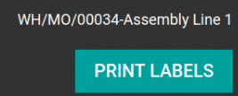

=================
Connect a printer
=================

Printer installation can be done in a few easy steps. The printer can be used to print receipts,
labels, orders, or even reports from the different Odoo apps. In addition, printer actions can be
assigned as an *action on a trigger* during the manufacturing process, or added onto a quality
control point or a quality check.

Connection
==========

The :abbr:`IoT (Internet of Things)` box supports printers connected through :abbr:`USB (Universal
Serial Bus)`, network connection, or Bluetooth. `Supported printers
<https://www.odoo.com/page/iot-hardware>`__ are detected automatically, and appear in the
:guilabel:`Devices` list of the *IoT app*.

.. image:: printer/printer-detected.png
   :align: center
   :alt: The printer as it would appear in the IoT app devices list.

.. note::
   The printer can take up to two minutes to appear in the *IoT app* devices list.

Link printer
============

Link printer to work orders
---------------------------

*Work Orders* can be linked to printers, via a quality control point, to print labels for
manufactured products.

In the *Quality app*, a device can be set up on a quality control point. To do that, go to the
:menuselection:`Quality app --> Quality Control --> Control Points`, and open the desired control
point to which the printer will be linked.

.. important::
   A *Manufacturing Operation* and *Work Order Operation* need to be attached to a quality control
   point before the :guilabel:`Type` field allows for the :guilabel:`Print Label` option to be
   selected.

From here, edit the control point, by selecting the :guilabel:`Type` field, and selecting
:guilabel:`Print Label` from the drop-down menu of options. Doing so reveals a field called
:guilabel:`Device`, where the attached *device* can be selected. :guilabel:`Save` the changes, if
required.

.. image:: printer/printer-controlpoint.png
   :align: center
   :alt: This is the quality control point setup.

The printer can now be used with the selected quality control point. When the quality control point
is reached during the manufacturing process, the database presents the option to print labels for a
specific product.

.. tip::
   Quality control points can also be accessed by navigating to :menuselection:`IoT App -->
   Devices`, then select the device. There is a :guilabel:`Quality Control Points` tab, where they
   can be added with the device.

.. note::
   On a quality check detail form, the :guilabel:`Type` of check can also be specified to
   :guilabel:`Print Label`. To create new quality checks, navigate to :menuselection:`Quality app
   --> Quality Control --> Quality Checks --> New`.

.. seealso::
   - :doc:`/applications/inventory_and_mrp/quality/quality_management/quality_control_points`
   - :doc:`/applications/inventory_and_mrp/quality/quality_management/quality_alerts`

Link a printer to a work center in the Manufacturing app
--------------------------------------------------------

To link a printer to an action, it first needs to be configured on a work center. To do that,
navigate to :menuselection:`Manufacturing app --> Configuration --> Work Centers`. From here, select
the desired work center in which the printer will be used. Next, add the device in the
:guilabel:`IoT Triggers` tab, under the :guilabel:`Device` column, by selecting :guilabel:`Add a
Line`.

Then, the printer can be linked to either of the following options in the :guilabel:`Actions`
drop-down menu: :guilabel:`Print Labels`, :guilabel:`Print Operation`, or :guilabel:`Print Delivery
Slip`. A key can also be added to trigger the action.

.. important::
   The first listed trigger on the form will be chosen first. So, the order matters, and these
   triggers can be dragged into any order.

.. note::
   On the :guilabel:`Work Order` screen, a status graphic indicates whether the database is
   correctly connected to the printer.

.. seealso::
   :ref:`workcenter_iot`

Link printer to reports
-----------------------

It's also possible to link a type of report to a certain printer. In the *IoT app*, go to the
:guilabel:`Devices` menu, and select the desired printer that needs to be configured.

From here, click :guilabel:`Edit`, go to the :guilabel:`Printer Reports` tab, and select
:guilabel:`Add a line`. In the window that appears, check all the types of :guilabel:`Reports` that
should be linked to this printer.

.. image:: printer/printers-listed.png
   :align: center
   :alt: The printer devices listed in the IoT Devices menu.

Now, each time :guilabel:`Print` is selected in the control panel, instead of downloading a PDF, a
pop-up appears which displays all the printer(s) linked to the report. Then Odoo sends the report to
the selected printer(s), and automatically prints it.

.. seealso::
   :doc:`POS Order Printing <../../../sales/point_of_sale/restaurant/kitchen_printing>`

.. tip::
   Reports can also be configured in the :guilabel:`Technical Menu` while in :ref:`debug mode
   <developer-mode>`. To do that, navigate to :menuselection:`Settings App --> Technical Menu -->
   Actions --> Reports`. From here, the individual report can be found in this list, where the
   :guilabel:`IoT Device` can be set on the report.
