=================
Connect a Printer
=================

When using your *IoT Box* in Odoo, you could need to use a printer.
Doing so is easy and convenient as it can be done in a few steps. Then,
you can use it to print receipts, orders or even reports in different
Odoo apps.

Connection
==========

To connect the printer to the *IoT Box*, you just have to combine the
two by cable.

.. note::
         Sometimes, a serial to USB adapter may be needed.

If your printer is a `supported
one <https://www.odoo.com/page/iot-hardware>`__, there is no need to set up anything
because it will be automatically detected as soon as it is connected.

.. note::
         The printer can take up to two minutes to appear in your devices list.

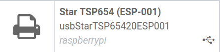

In some cases, you may need to restart the box and download your
printer’s drivers from the box. To do so, go to the *IoT Box Home
Page* and click on *drivers list*. Then, click on load drivers.

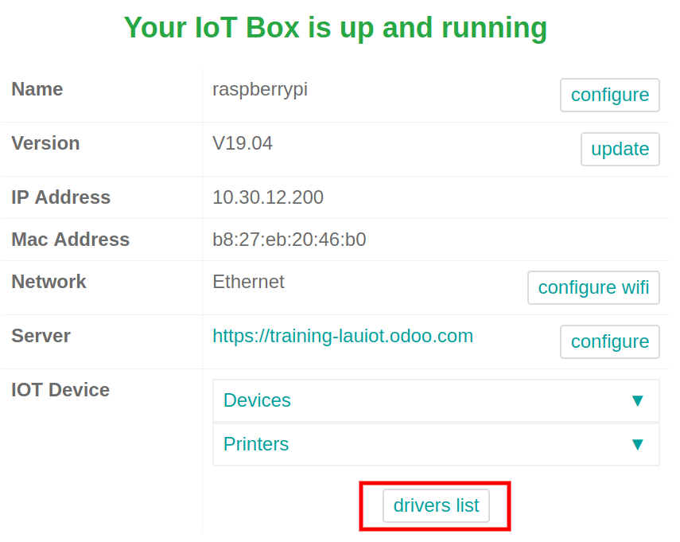

Link the Printer
================

To Work Orders
--------------

You can link *Work Orders* to printers via a *Quality Control Point*
to print labels for manufactured products.

To do so, you need to create a *Quality Control Point* from the
*Quality* app. Then, you can select the correct manufacturing
operation and the work order operation. In type, choose *Print Label*
and hit save.

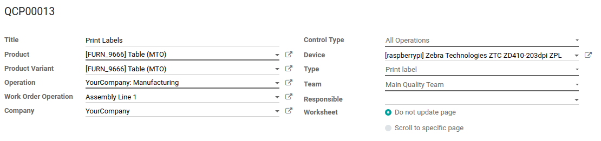

Now, each time you reach the quality control point for the chosen
product, a *Print Label* button will appear.

To Reports
----------

You can also link a type of report to a certain printer. In the *IoT*
app, go to the *Devices* menu and select the printer you want to set
up.

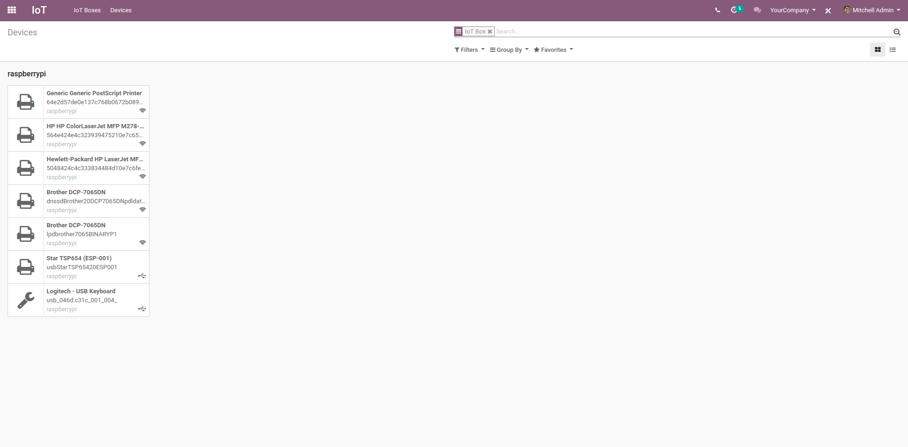

Now, go to the *Printer Reports* tab.

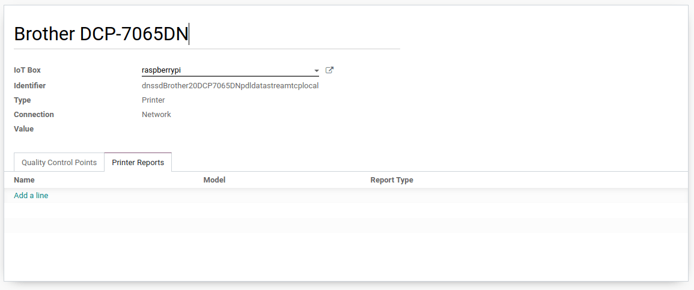

Hit edit and then, click on *Add a line*. In the window that shows up,
check all the types of reports that should be linked to this printer.
Click on select and save.

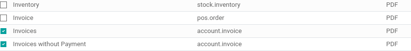

Now, each time you click on *Print* in the control panel, instead of
downloading a PDF, it will send it to the selected printer and
automatically print it.

Print Receipts from the PoS
---------------------------

You can link a printer to your *Point of Sale* app so you can print
receipts directly from your *PoS*.

Doing so is really easy. Go to your *Point of Sale* app and open your
*PoS* settings, under *Configuration*. There, click on *Edit* and
check the *IoT Box* feature. Then, enable the *Receipt Printer*.

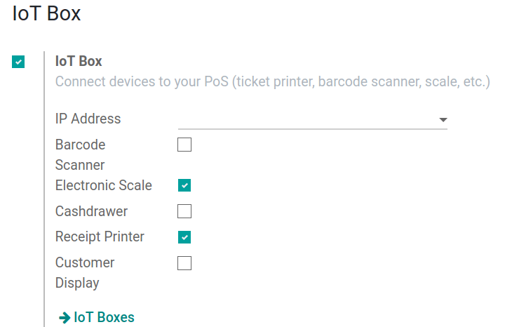

Now, on your *PoS* view, you will be able to print different kinds of
tickets: **receipts**, **sale details** and **bills**.

For the receipt, it will be printed once the order is validated. The
process is automated when you enable the feature in your *PoS*.

Sales details can be printed by clicking on the printer icon on the
navbar at the top of the *PoS*. It will print the details of the sales
of the current day.

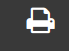

As for the bill, it is only available in restaurant mode. In your
restaurant settings, activate bills and a *Bill* button will appear in
the left panel. Click on it and it will print the bill.

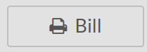

Print Orders in the kitchen
---------------------------

In restaurant mode, you can send order tickets to the kitchen.

To do so, go to the *PoS* app and open your *PoS* settings. Then,
tick *Order Printer*.

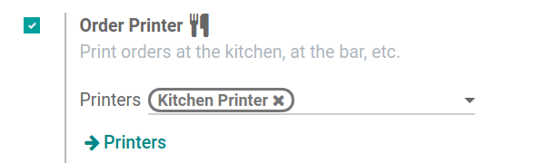

Now, go to the *Printers* menu. Hit create and select the *IoT Box*
with all the categories of product that should be printed in the
*Printer Product Categories* field.

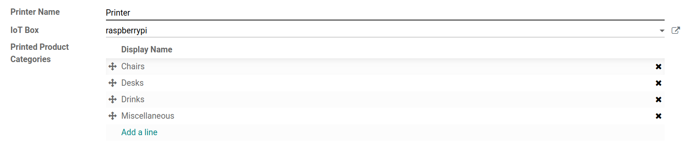

In the *PoS*, when you add or remove a product from one of the
selected categories, the button *Order* will be green. If you click on
it, a ticket will be printed.