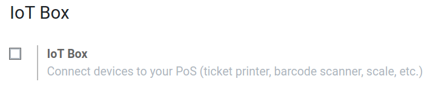

===============
Connect a Scale
===============

When using your **IoT Box** in Odoo, you could need to use a scale. Doing so is easy and convenient
as it can be done in a few steps. Then, you can use it in your **Point of Sale app** to weigh your
products, which is helpful if their price are based on it.

Connection
==========

To link the scale to the **IoT Box**, connect them with a cable.

.. note::
   In some cases, a serial to USB adapter may be needed.

If your scale is `compatible with Odoo IoT Box <https://www.odoo.com/page/iot-hardware>`_, there
is no need to set up anything because it will be automatically detected as soon as it is connected.

.. image:: scale/iot-choice.png
   :align: center
   :alt: IOT box auto detection.

You may need to restart the box and download your scales’ drivers from the box in some cases. To do
so, go to the *IoT Box Home Page* and click on *drivers list*. Then, click on load drivers.

.. image:: scale/driver-list.png
   :align: center
   :alt: View of the IoT box settings and driver list.

Use a Scale in Point of Sale
============================

To use the scale in your *Point of Sale* app, go to :menuselection:`Point of Sale --> Configuration
--> Point of Sale`, open the one you want to configure, then click on *Edit* and enable the *IoT
Box* feature.

Now, choose the *IoT Box* in the dropdown menu and check the *Electronic Scale* option. Then, you
hit save.

.. image:: scale/electronic-scale-feature.png
   :align: center
   :alt: List of the external tools that can be used with PoS and the IoT box.

The scale is now available in all your *PoS* sessions. Then, if a product has a price per weight
set, clicking on it on the *PoS* screen opens the scale screen, where the cashier can weigh the
product and add the correct price to the cart.

.. image:: scale/scale-view.png
   :align: center
   :alt: Electronic Scale dashboard view when no items are being weighed.