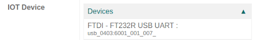
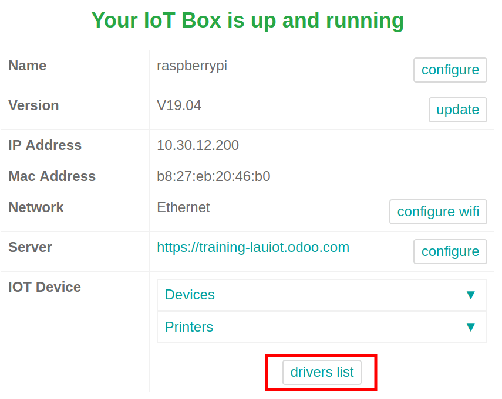
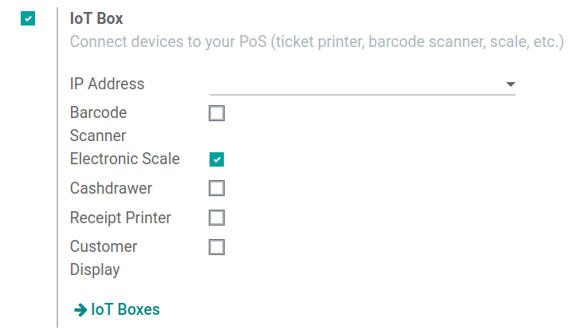
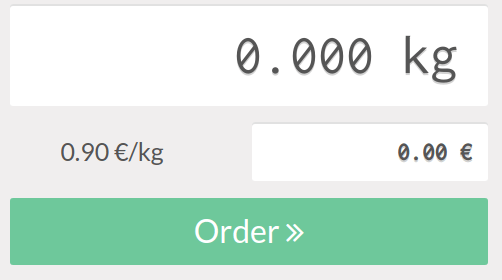

===============
Connect a scale
===============

A scale can be connected to the :abbr:`IoT (Internet of Things)` box on an Odoo database in a few
easy steps. After setup, the *Point of Sale* app can be used to weigh products, which is helpful if
their prices are calculated based on weight.

Connection
==========

To link the scale to the :abbr:`IoT (Internet of Things)` box, connect it with a :abbr:`USB
(Universal Serial Bus)` cable.

.. note::
   In some cases, a serial port to :abbr:`USB (Universal Serial Bus)` adapter may be needed.

If the scale is `compatible with Odoo IoT Box <https://www.odoo.com/page/iot-hardware>`_, there is
no need to set up anything because it will be automatically detected as soon as it is connected.

The :abbr:`IoT (Internet of Things)` box may need to be restarted and the scale's drivers may need
to be downloaded to the box in some cases. To update the drivers, go to the :abbr:`IoT (Internet of
Things)` box homepage and click on :guilabel:`Drivers List`. Then, click on :guilabel:`Load
Drivers`.

If loading the drivers still doesn't allow for the scale to function, it may be that the scale is
not compatible with the Odoo :abbr:`IoT (Internet of Things)` box. In this case, a different scale
will need to be used.

Use a scale in a point of sale (POS) system
===========================================

To use the scale in the *Point of Sale app*, go to :menuselection:`PoS app --> 3-Dot Menu on the PoS
--> Settings`, then enable the :abbr:`IoT (Internet of Things)` box feature. After this is complete,
the scale device can be set.

Select the scale from the :guilabel:`Electronic Scale` drop-down menu. Then click :guilabel:`Save`
to save the changes, if required.

The scale is now available in all the :abbr:`PoS (Point of Sale)` sessions. Now, if a product has a
price per weight set, clicking on it on the :guilabel:`PoS` screen opens the scale screen, where the
cashier can weigh the product and add the correct price to the cart.

