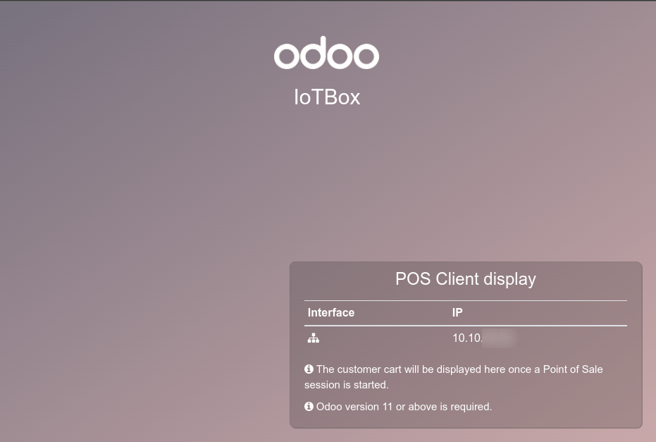
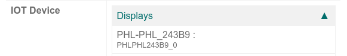
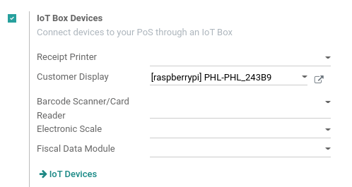

================
Connect a screen
================

In Odoo, an :abbr:`IoT (Internet of Things)` box can be connected to a screen display. After being
configured, the screen can be used to display a Point of Sale (PoS) order to a client.

.. figure:: screen/screen-pos-client-display.png

   An example of a PoS (point of sale) order on a screen display.

Access the customer display by going to the :abbr:`IoT (Internet of Things)` box homepage and
clicking on the :guilabel:`PoS Display` button. To get to the :abbr:`IoT (Internet of Things)` box
homepage, navigate to :menuselection:`IoT app --> IoT Boxes` and click on the :abbr:`IoT (Internet
of Things)` box homepage link.

Connection
==========

The way to connect the screen display to the :abbr:`IoT (Internet of Things)` box differs depending
on the model.

.. tabs::

   .. tab:: IoT Box model 4

      Connect up to two screens with micro-HDMI cables on the side of the :abbr:`IoT (Internet of
      Things)` box. If two screens are connected, they can display distinct content (see
      :ref:`Screen Usage <iot/usage_screen>`).

   .. tab:: IoT Box model 3

      Connect the screen with an HDMI cable on the side of the :abbr:`IoT (Internet of Things)` box.

.. seealso::
   :ref:`See the Raspberry Pi Schema <iot/connect_schema>`.

.. important::
   Screen(s) should be connected before the :abbr:`IoT (Internet of Things)` box is switched on. If
   it is already on, connect the screen(s), and then restart the :abbr:`IoT (Internet of Things)`
   box by unplugging it for ten seconds and plugging it back into its power source.

.. warning::
   The usage of HDMI/micro-HDMI adapters may cause issues which will result in a blank, black screen
   on the screen display. Using the specific cable for the display connection is recommended.

If the connection was successful, the screen should display the :guilabel:`POS Client display`
screen.

         connected to an IoT box.

The screen should also appear in the list of :guilabel:`Displays` on the :abbr:`IoT (Internet of
Things)` box homepage. Alternatively, the display can be seen by accessing :menuselection:`IoT app
--> Devices`.

.. note::
   If no screen is detected, a default display named :guilabel:`Distant Display` will be displayed
   instead. This indicates that there is no hardware screen connected.

    .. image:: screen/screen-no-screen.png
       :align: center
       :alt: The "Distant Display" screen name will be used if no screen is detected.

.. _iot/usage_screen:

Usage
=====

Show Point of Sale orders to customers
--------------------------------------

To use the screen in the *Point of Sale app*, go to :menuselection:`Point of Sale -->
Configuration --> Point of Sale`, select a :abbr:`PoS (Point of Sale)`, click :guilabel:`Edit` if
necessary, and enable the :guilabel:`IoT Box` feature.

Next, select the screen from the :guilabel:`Customer Display` drop-down menu. Then click
:guilabel:`Save`, if required.

The screen is now available for :abbr:`PoS (Point of Sale)` sessions. A screen icon will appear in
the menu at the top of the screen to indicate the screen's connection status.

.. image:: screen/screen-pos-icon.png
   :align: center
   :alt: The "screen" icon on the Point of Sale display shows the connection status with the
         screen.

The screen will automatically show the :abbr:`PoS (Point of Sale)` orders and update when changes
are made to the order.

.. image:: screen/screen-pos-client-display.png
   :align: center
   :alt: An example of a PoS order on a screen display.

Display a website on the screen
-------------------------------

Open the screen form view by accessing :menuselection:`IoT app --> Devices --> Customer Display`.
This allows the user to choose a particular website URL to display on the screen using the
:guilabel:`Display URL` field.
