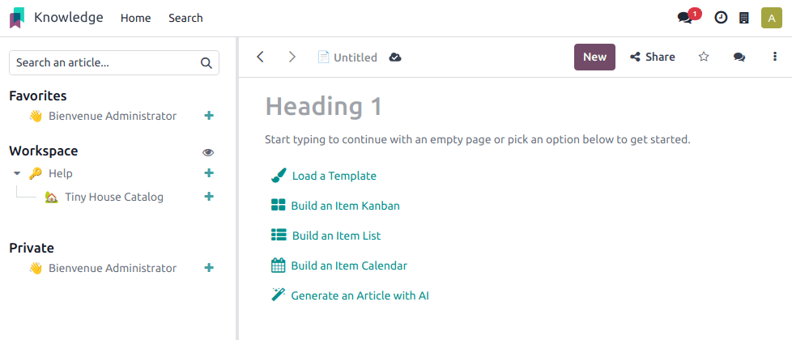
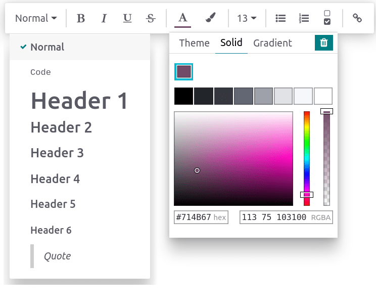

================
Articles editing
================

Add and style content
=====================

To start adding content, click anywhere on the page. Your cursor is automatically set to write the
article's first-level header. Once you are done writing the title, press **enter** on your keyboard
to move to the next line.

.. tip::
   Click :guilabel:`Untitled` on the left side of the top bar to automatically match your h1
   :dfn:`(First-level header)` title and the article's name. To change the name of your article
   later, you must do it manually. To do so, click the name on the top bar and proceed to the
   modification.

Text editor
-----------

To stylize the text using the text editor, select the text to format.

Then, you can:

- Change the style by clicking :guilabel:`Normal`. Doing so opens a dropdown menu with multiple
  styles to choose from (:guilabel:`Normal, Code, Header 1 → Header 6, Quote`);
- Format the text. Click :guilabel:`B` to put it in bold, :guilabel:`I` to put it in italic,
  :guilabel:`U` to underline, and :guilabel:`S` to strikethrough;
- Change the font color by clicking :guilabel:`A` or the background color by clicking the **pencil**
  icon:

  - To choose from a predefined theme color, click :guilabel:`Theme` and select the desired color.
  - To customize, click :guilabel:`Solid` and define a color using the wheel, by typing its hex
    code, or its RGBA values.
  - To use a gradient, click :guilabel:`Gradient`, choose a predefined gradient or click
    :guilabel:`Custom` to create a personalized gradient.

- To change the text's size, click the **size number** and select the desired size;
- Click the **lists** icons to turn the paragraph into an unordered list, an ordered list, or a
  checklist;
- Click the **chain** icon to insert or edit an URL link.

To format a whole paragraph, type `/` anywhere in the text. Doing so opens the **powerbox**, which
allows:

- Changing a paragraph into lists (unordered, ordered, checklists).
- Changing a paragraph into a header (1 → 6), normal text, `code`, or *quotes*.

Cover pictures
--------------

You can customize your article by adding a cover picture and an icon. Hover above the h1 title and
click :guilabel:`Add Cover`. A pop-up window opens to set a cover picture.

If your database and your Unsplash account are associated, the cover picture is automatically
selected based on the article's name. To modify it, hover over the picture to make the buttons
appear, click :guilabel:`Change Cover`, and select another image.

Retrieve images from different sources:

- Search the **Unsplash** database.
- Enter a picture's **URL**.
- **Upload** an image from a computer.

To remove the cover, hover over it to make the buttons appear and click :guilabel:`Remove Cover`.

.. note::
   - To associate Unsplash with your database, please refer to
     :doc:`../../websites/website/configuration/unsplash`.
   - The articles are responsive, and so are the cover pictures. As a result, the images cannot
     be repositioned manually to fit a particular screen, as they automatically resize
     depending on the device.

Icons
-----

To add an icon, hover above the h1 title and click :guilabel:`Add Icon`. Doing this sets a random
emoji automatically. To change it, click it and select one from the emoji window. To remove it,
proceed equally and click the red-circled :guilabel:`x`.

.. note::
   - The emoji is also displayed before the corresponding article in the side panel hierarchic tree.
   - Click the emoji on the side panel to change it without opening the related article.

Commands
========

To use a command, type `/` and open the **powerbox**. Type the command's name or select from
multiple features to insert blocks, images, files, etc. Some of them, such as `/Image` or `/Article`
are common to all the apps, but others are inherent to the knowledge app and cannot be found or used
in any other application.

List of commands
----------------

Commands are divided into multiple categories depending on their use.

.. tabs::
   .. tab:: Structure

      .. list-table::
         :widths: 20 80
         :header-rows: 1
         :stub-columns: 1

         * - Command
           - Use
         * - :guilabel:`Bulleted list`
           - Create a bulleted list.
         * - :guilabel:`Numbered list`
           - Create a list with numbering.
         * - :guilabel:`Checklist`
           - Track tasks with a checklist.
         * - :guilabel:`Table`
           - Insert a table.
         * - :guilabel:`Separator`
           - Insert an horizontal rule separator.
         * - :guilabel:`Quote`
           - Add a blockquote section.
         * - :guilabel:`Code`
           - Add a code section.
         * - :guilabel:`2 columns`
           - Convert into 2 columns.
         * - :guilabel:`3 columns`
           - Convert into 3 columns.
         * - :guilabel:`4 columns`
           - Convert into 4 columns.

   .. tab:: Format

      .. list-table::
         :widths: 20 80
         :header-rows: 1
         :stub-columns: 1

         * - Command
           - Use
         * - :guilabel:`Heading 1`
           - Big section heading.
         * - :guilabel:`Heading 2`
           - Medium section heading.
         * - :guilabel:`Heading 3`
           - Small section heading.
         * - :guilabel:`Switch direction`
           - Switch the text's direction.
         * - :guilabel:`Text`
           - Paragraph block.

   .. tab:: Media

      .. list-table::
         :widths: 20 80
         :header-rows: 1
         :stub-columns: 1

         * - Command
           - Use
         * - :guilabel:`Image`
           - Insert an image.
         * - :guilabel:`Article`
           - Link an article.

   .. tab:: Navigation

      .. list-table::
         :widths: 20 80
         :header-rows: 1
         :stub-columns: 1

         * - Command
           - Use
         * - :guilabel:`Link`
           - Add a link.
         * - :guilabel:`Button`
           - Add a button.
         * - :guilabel:`Appointment`
           - Add a specific appointment.
         * - :guilabel:`Calendar`
           - Schedule an appointment.

   .. tab:: Widget

      .. list-table::
         :widths: 20 80
         :header-rows: 1
         :stub-columns: 1

         * - Command
           - Use
         * - :guilabel:`3 Stars`
           - Insert a rating over 3 stars.
         * - :guilabel:`5 Stars`
           - Insert a rating over 5 stars.

   .. tab:: Knowledge

      .. list-table::
         :widths: 20 80
         :header-rows: 1
         :stub-columns: 1

         * - Command
           - Use
         * - :guilabel:`Table of Content`
           - Add a table of content with the article's headings.
         * - :guilabel:`Index`
           - Show the first level of nested articles.
         * - :guilabel:`Outline`
           - Show all nested articles.
         * - :guilabel:`Item Kanban`
           - Insert a kanban view of article items.
         * - :guilabel:`Item List`
           - Insert a list view of article items.
         * - :guilabel:`File`
           - Embed a file that can be downloaded.
         * - :guilabel:`Template`
           - Add a template section that can be inserted in messages, terms & conditions, or
             description in other applications.

   .. tab:: Basic Blocks

      .. list-table::
         :widths: 20 80
         :header-rows: 1
         :stub-columns: 1

         * - Command
           - Use
         * - :guilabel:`Signature`
           - Insert your signature.

Content from other apps
=======================

Knowledge allows to retrieve content views from other applications. To do so, go to the targeted app
and create the desired view. Then, click :menuselection:`Favorite --> Insert view in article` and
select an article. The view is inserted at the bottom of the selected article.

.. example::
   To retrieve the view below, we created it by going to :menuselection:`Sales --> Graph icon -->
   Pie Chart icon` and inserted it by clicking :menuselection:`Favorite --> Insert view in article`
   and selecting the *Sales Playbook* article.

   .. image:: articles_editing/inserted-view.png
      :align: center
      :alt: article view from the Sales app

.. important::
   Users who do **not** have access to the view will **not** be able to access it in **Knowledge**
   even though they have access to the article containing the view.
